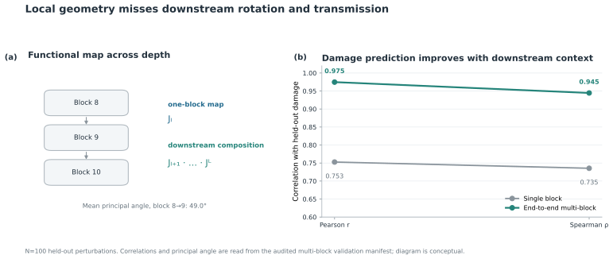
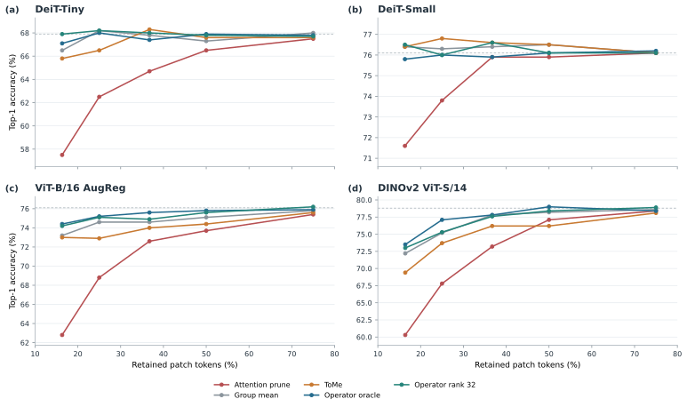
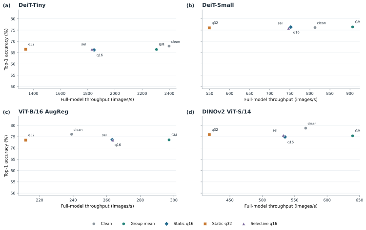

# Patch-Content Fungibility: Geometry, Functional Transmission, and Operator-Aware Token Compression

**Anonymous Authors**  
*Under review*

## Abstract

We study when a vision transformer (ViT) requires the image-specific content of an intermediate patch token and how token perturbations transmit to the final readout. In controlled interventions, we causally remove selected image-specific late-patch content and replace it with class-agnostic calibration surrogates while keeping token slots, sequence length, model weights, and the downstream computation path fixed. Unlike pruning or merging, this changes content while leaving the sequence intact. In the tested settings, some late-layer content is replaceable, subject to geometric and token-diversity constraints. Mechanistic audits identify strongly anisotropic functional transmission: token coherence and the attention Value path shape whether perturbations add or cancel, while downstream functional subspaces rotate across blocks. We use the end-to-end Jacobian to define operator-aware token compression and evaluate it in a strict confirmatory study on 1,000 held-out images per architecture. Against pruning baselines, operator-aware compression improves accuracy by approximately 4.2–17.3 percentage points at aggressive budgets; strong merging baselines remain close, with frontier gains on three of four tested architectures. Rank-16/32 approximations retain more than 98% of the **full-J oracle compression benefit**, measured relative to the Group-Mean-to-full-J-oracle gain. A separate real-model carrier benchmark finds that compact Feature-PCA corrections can reduce linearized functional error, but this does not consistently improve classification or produce a general measured deployment frontier. Together, the results connect patch-content replaceability to functional geometry and show both the promise and the limits of turning that mechanism into token compression.

## 1. Introduction

Vision transformers process images as sequences of patch tokens \citep{dosovitskiy2020image,touvron2021training,oquab2024dinov2}. Token pruning and merging use this sequence structure to reduce computation, but changing the sequence also changes attention interactions \citep{rao2021dynamicvit,liang2022evit,bolya2022tome}. We instead causally remove selected image-specific late-patch activations and replace them with class-agnostic calibration surrogates, while holding token slots, sequence length, model weights, and the downstream computation path fixed. This content-level intervention tests whether a patch's particular activation is required by the remaining network, unlike pruning or merging, which changes the sequence presented to later layers.

These results form a sequence of tests rather than a blanket claim of redundancy. Fixed-slot replacement isolates patch content and shows a late-layer regime in which some content is tolerated; geometry and diversity controls then identify conditions under which replacement fails. The transmission studies explain why equal-sized perturbations need not have equal consequences: sensitivity is anisotropic, and coherent patch changes can accumulate through the attention Value path while sign-varying changes partly cancel. Finally, a separate multi-block audit shows that the composed end-to-end operator predicts held-out perturbation damage better than a one-block map in the tested settings. This mechanistic chain motivates operator-aware compression, which we evaluate separately on 1,000 held-out images per architecture.

This contribution is deliberately narrow. Jacobians, singular-value decompositions, anisotropy, and token reduction are established tools. The contribution is their connected ViT-specific empirical chain: causal patch-content replacement, geometry and diversity constraints, attention-mediated cancellation, downstream-persistent functional transmission, and operator-aware token compression. Prior token pruning and merging work changes the sequence, whereas our intervention isolates activation content; our compression result is evaluated separately against those methods.\

*Figure 1. Conceptual intervention and analysis path. The schematic is not a quantitative result.*

## 2. Related Work

DynamicViT learns to prune tokens progressively, EViT reorganizes tokens by retaining attentive tokens and fusing less attentive ones, and ToMe merges similar tokens during inference \citep{rao2021dynamicvit,liang2022evit,bolya2022tome}. These methods establish strong sequence-reduction approaches and motivate our compression comparisons. Their interventions change which tokens remain or how tokens are grouped; our mechanistic intervention changes patch activation content while preserving token slots, sequence length, and downstream weights. Work on registers further cautions against treating every patch position as interchangeable: some ViTs develop specialized high-norm background tokens \citep{darcet2023vision}. DINOv2 is one of the pretrained model families in our evaluation, rather than a token-reduction method \citep{oquab2024dinov2}.

The mathematical ingredients for output-sensitive compression are also established. SliceGPT and SVD-LLM reduce language-model dimensions through transformed or truncated subspaces \citep{ashkboos2024slicegpt,wang2025svdllm}; Output-aware Residual Stream Pruning selects residual directions using downstream sensitivity \citep{thrash2026outputaware}. FishBack studies pullback Fisher geometry for activation steering in language models, while UniTAC applies task-weighted distortion to image coding \citep{wang2026fishback,esfahanizadeh2026unitac}. These works share tools or an output-sensitive objective with parts of our analysis, but differ in model family, intervention, or task. We therefore center the contribution on evidence for the connected ViT-specific chain: fixed-slot causal patch-content substitution, geometric and diversity constraints, Value-mediated coherence and cancellation, downstream functional transmission, and a separate confirmatory compression evaluation. We do not claim novelty for Jacobians, SVD, anisotropy in general, token redundancy, pruning, merging, low-rank operators, or generic output-aware compression.

## 3. Experimental Scope and Measurement Units

We keep the sample units for the mechanism, confirmatory compression, and carrier studies distinct. The attention causal audit evaluates **N=100 images**, and the functional-geometry pilot separately evaluates **N=100 images**. The multi-block operator audit evaluates **N=100 held-out perturbations**, not images. Strict operator-compression confirmation uses **N=1,000 held-out images per architecture**; the real classifier-carrier benchmark independently uses **N=1,000 held-out images per architecture** for accuracy, with separate full-model timing runs. Operator-space carrier experiments use a separate **N=100 held-out operator-space image set** and do not measure classification. The source manifests and claim-traceability table record each unit and denominator.

The intervention replaces selected patch activations at depth `l`, leaves the class token and token positions intact, and runs the remaining model. We compare replacement controls and downstream functional error. For compression, the end-to-end operator `J_{l→L}` maps an intermediate perturbation to the readout; an operator oracle is an offline reference and not a deployable inference method.

## 4. Late Patch-Content Fungibility Has Geometric and Diversity Boundaries

Across the audited replacement controls, late-layer patch content is more replaceable than early-layer content, but arbitrary substitutions do not preserve function. The original V1 depthwise validation uses 1,000 images per architecture and reports Top-1 under 25% patch replacement. We subsequently measured the previously unsampled depth 6 in a separately recorded follow-up, using the same split seeds, replacement fraction, controls, and 1,000-image calibration and evaluation sets for ViT-B/16 AugReg and DINOv2. At depth 6, Centroid/Gaussian reach 73.9%/74.9% for ViT-B and 70.6%/74.6% for DINOv2, compared with Zero at 71.5%/28.8%; Gaussian values are means over three seeds. Figure 2 combines that follow-up with the original depths 5, 7, 8, 9, and 10. These results remain conditional on the tested models, layer, replacement fraction, calibration distribution, and readout.

Geometry and diversity constrain the replacement. In the separate V0.7 activation-replacement experiment (N=1,000 images per model; 50% replacement), coordinate permutation changed Top-1 from 66.3% to 52.2% on DeiT-Tiny and from 75.6% to 62.6% on DeiT-Small; sign inversion reduced it to 0.7% and 1.1%, respectively. These are classifier outcomes from the N=1,000 replacement study. A distinct N=100 DeiT-Small operator-space control found that shuffling PCA feature coordinates increased mean `||J E||` by 1.474 (from 6.602 to 8.076); this is linearized operator-space evidence, not Top-1. Replacing an entire stream with identical replicas can collapse readout behavior; V0.8 diversity tests show that low-dimensional variation does not restore full performance and that the tested setting requires high-dimensional structure. These observations support constrained replaceability, not universal interchangeability and not a direct inference that tokens can be deleted at no cost. The separate V0.9 low-dimensional replacement study at 100% patch replacement (N=1,000 evaluation images and a disjoint N=1,000 calibration set per DeiT model) finds higher Top-1 for learned PCA directions than for energy-matched random one-dimensional directions in its DeiT-Tiny/Small comparisons; this relative advantage is model- and amplitude-dependent and does not establish rank-1 sufficiency.\

*Figure 2. Depth-wise replacement accuracy for ViT-B/16 AugReg and DINOv2 under 25% spatial-patch replacement. Original V1 depths are 5, 7, 8, 9, and 10; depth 6 is a separately recorded follow-up. Each evaluation uses N=1,000 images/model. Error bars show Gaussian seed-level SD; dashed lines mark clean accuracy.*


*Figure 3. (a) V1 geometry controls at 50% replacement for ViT-B/16 AugReg and DINOv2 ViT-S/14 compare a calibration centroid, a coordinate-shuffled centroid, and a sign-inverted centroid. (b) The V0.8 grouped-diversity sweep on DeiT-Tiny and DeiT-Small varies K, the number of distinct replacement vectors across all 196 patch positions. Gray dashed lines mark each model's clean Top-1 accuracy. Bars and line markers show means; dots show recorded runs; error bars show across-seed SD where repeated seeds are available. Each model uses N=1,000 evaluation images and separate calibration data. These are distinct study cohorts, so compare conditions within each panel rather than treating absolute accuracy across panels as a matched-model contrast.*

## 5. Anisotropic Transmission, Value-Path Cancellation, and End-to-End Geometry

Functional transmission is direction-dependent. In the attention causal audit (100 evaluation images), the frozen-attention V-only path explains 70.8% of the defined coherence-gap margin effect in DeiT-Small and 102.2% in ViT-B. V-only also reproduces approximately 97.4% and 99.3% of the immediate readout disturbance, respectively. The ViT-B ratio above 100% is possible because the secondary contribution partially opposes the V-path effect. Under the tested setup, perturbing patch keys does not change the unperturbed `[CLS]` query, so the immediate Q contribution is zero; K-mediated rerouting remains secondary rather than absent. The frozen-attention algebraic parity check is not independent generalization evidence. These finite-sample interventions do not establish a universal transformer law.

Local geometry is not sufficient to characterize later readout damage. In the multi-block operator study, 100 held-out perturbations were evaluated: damage prediction correlation is higher for the multi-block operator (Pearson `r=0.975`, Spearman `ρ=0.945`) than for the single-block operator (`r=0.753`, `ρ=0.735`). The mean principal angle from block 8 to block 9 is 49.0 degrees in the reported comparison. These results motivate use of `J_{l→L}` over a local one-block approximation; they do not imply exact nonlinear invariance. In the separate N=100-image functional-geometry pilot, the threshold-defined downstream functional near-null subspace expands with depth while effective functional rank declines in late layers. This pattern is consistent with greater late-layer replacement tolerance measured in separate interventions, but remains an empirical mechanistic association rather than a theorem or universal explanation. A distinct joint-stream geometry audit (N=100 images per model) finds that downstream damage depends jointly on feature direction and token-space coherence: sensitive feature directions are most damaging under coherent token patterns, whereas functionally near-null directions remain comparatively tolerated across the tested patterns.\

*Figure 4. Audited PC1-to-bottom-PC sensitivity ratio across depths in the N=100 functional-geometry pilot. The vector diagram is explanatory.*


*Figure 5. Immediate readout disturbance for V-only and K+V pathways under coherent, random-sign, and checkerboard patterns in two N=100 attention-audit settings.*

## 6. Confirmatory Operator-Aware Token Compression

We evaluate operator-aware compression on 1,000 held-out images per architecture using the strict confirmatory outputs. It improves substantially over Random, Norm, and Attention pruning at aggressive token budgets, with observed accuracy gains of approximately 4.2–17.3 percentage points. Strong merging methods are more competitive: the measured accuracy-token frontier shifts for operator-aware methods on three of four architectures, while DeiT-Small lies in a near-lossless regime where strong merging methods are statistically tied. The comparison does not support a uniform win over every merging baseline at every budget.

The operator-aware objective uses the end-to-end downstream map to choose a correction that reduces functional damage. Across 30,000 method/budget/seed rows per architecture (the same 1,000 held-out images are reused across conditions), `||J E||` is associated with actual logit-L2 distortion: per-architecture Pearson `r` ranges from 0.739 to 0.866 and Spearman `ρ` from 0.792 to 0.916. These are condition-level associations, not 120,000 independent images. Rank-16/32 approximations retain more than 98% of the full-J oracle compression benefit. Here the denominator is specifically the accuracy/compression benefit from Group Mean to the full-J oracle; it is not the restricted-carrier oracle gain, static-alpha recovery, or retained spectral energy. The full-J oracle is an offline upper bound. Figure 6 compares local and end-to-end damage prediction in the N=100 perturbation study. Figure 7 shows confirmatory accuracy-token curves and the audited low-rank benefit result.\

*Figure 6. Damage-prediction correlation for single-block and end-to-end multi-block operators on 100 held-out perturbations; the diagram summarizes downstream composition, with a 49.0° mean principal angle from block 8 to 9.*


*Figure 7. Confirmatory accuracy versus retained patch-token fraction for four architectures, plus the audited >98% Rank-16/32 result; denominator: Group-Mean-to-full-J-oracle compression benefit, not accuracy ratio or spectral energy. N=1,000 held-out images/model.*

## 7. Carrier-Space Results and Practical Boundary

The separate carrier-space branch tests whether corrections can be amortized in a compact feature basis. In the audited 100-image operator-space experiment, static `ᾱ` on DeiT-Small at `q=16` recovers 54.91% of the restricted-oracle `||J E||` gain. This is supported operator-space evidence. It does not establish better classifier accuracy.

The real-final benchmark evaluates actual model predictions on 1,000 held-out images per architecture. At DeiT-Small budget 98, Group Mean is 76.4% Top-1, compared with 76.3% for static q16 and 76.0% for q32; at budget 49, Group Mean is 75.5% versus 74.0% for both q16 and q32. At DINOv2 budget 42, Group Mean is 61.3%, q16 is 56.8%, and q32 is 57.0%. ViT-B has a limited positive case at budget 49 (q16 71.9%, Group Mean 71.2%). Thus operator-space improvement does not reliably transfer to nonlinear classification, and aggressive DINO compression exposes a material loss.\

*Figure S1. Real-final classification and full-model throughput at BS=64; q16 has a narrow ViT-B frontier contribution.*

Selective risk gating is also bounded. Its historical operator-space AUROC of 0.784 is exploratory; the calibration-frozen real classifier gate does not consistently improve accuracy (DeiT-Small budget 98: 75.8% versus Group Mean 76.4%; DINOv2 budget 42: 58.5% versus 61.3%). For the measured accuracy-throughput frontier, we use only `outputs/fungibility_real_final/real_accuracy_throughput_frontier.csv`: Clean is non-dominated in several regimes, Group Mean is a practical batched baseline, and static q16 adds a narrow ViT-B/16 point at some batch sizes. q32 and selective q16 do not establish a general frontier improvement. Full-call measurements are not isolated operator overhead.

These results distinguish **replaceability from compressibility**. The evidence also bounds several attempted translations: single-token carrier attempts fail; scalar layer prediction does not generalize; a compact shared linear envelope with `K≤64` captures little of the tested operator subspace; dynamic alpha prediction fails out of sample; and dynamic operator prediction is costly. Static Feature-PCA may improve linearized operator error without improving Top-1, while the selective gate has no general deployment-frontier result. These are negative or bounded findings, not another optimization claim.

## 8. Limitations

The mechanism studies are finite: N=100 images for the attention causal audit and functional-geometry pilot, and N=100 held-out perturbations for multi-block operator prediction. Their conclusions should not be generalized beyond the tested architectures, layers, perturbations, or readouts. Confirmatory results cover four pretrained ViT families and a specific ImageNet validation subset of N=1,000 held-out images per architecture; broader model and task coverage remains untested. The Jacobian objective is a local linearization, and the full-J oracle is an offline reference that requires per-image downstream-Jacobian construction. Real carrier classification shows that reducing linearized error is not sufficient for a deployment gain; measured full-call runtime is also specific to the tested hardware, batch sizes, and implementations and does not isolate operator overhead.

## 9. Conclusion

Late patch activations can be replaceable under constrained geometry and diversity, but that property alone does not imply token deletion or practical acceleration. N=100 mechanism audits connect coherent Value-path transmission and downstream subspace rotation to the need for an end-to-end operator. A strict N=1,000-per-architecture evaluation shows that operator-aware token compression improves over pruning and shifts strong-merging frontiers on three of four architectures, with rank-16/32 retaining more than 98% of the full-J oracle compression benefit. Compact carrier corrections improve operator-space metrics but do not reliably improve classifier accuracy or yield a general measured frontier. This evidence supports a mechanistic result and a bounded constructive compression result, with explicit limits on their practical translation.

## References

```bibtex
@inproceedings{dosovitskiy2020image,
  title={An Image is Worth 16x16 Words: Transformers for Image Recognition at Scale},
  author={Dosovitskiy, Alexey and Beyer, Lucas and Kolesnikov, Alexander and Weissenborn, Dirk and Zhai, Xiaohua and Unterthiner, Thomas and Dehghani, Mostafa and Minderer, Matthias and Heigold, Georg and Gelly, Sylvain and Uszkoreit, Jakob and others},
  booktitle={International Conference on Learning Representations}, year={2021}
}
@inproceedings{touvron2021training,
  title={Training data-efficient image transformers and distillation through attention},
  author={Touvron, Hugo and Cord, Matthieu and Douze, Matthijs and Massa, Francisco and Sablayrolles, Alexandre and J{\'e}gou, Herv{\'e}},
  booktitle={International Conference on Machine Learning}, pages={10347--10357}, year={2021}
}
@article{oquab2024dinov2,
  title={DINOv2: Learning Robust Visual Features without Supervision},
  author={Oquab, Maxime and Darcet, Timoth{\'e}e and Moutakanni, Th{\'e}o and Vo, Huy V. and Szafraniec, Marc and Khalidov, Vasil and Fernandez, Pierre and Haziza, Daniel and Massa, Francisco and El-Nouby, Alaaeldin and Assran, Mido and Ballas, Nicolas and Galuba, Wojciech and Howes, Russell and Huang, Po-Yao and Li, Shang-Wen and Misra, Ishan and Rabbat, Michael and Sharma, Vasu and Synnaeve, Gabriel and Xu, Hu and J{\'e}gou, Herv{\'e} and Mairal, Julien and Labatut, Patrick and Joulin, Armand and Bojanowski, Piotr},
  journal={Transactions on Machine Learning Research}, year={2024}, url={https://openreview.net/forum?id=a68SUt6zFt}
}
@inproceedings{rao2021dynamicvit,
  title={DynamicViT: Efficient Vision Transformers with Dynamic Token Sparsification},
  author={Rao, Yongming and Zhao, Wenliang and Liu, Benlin and Lu, Jiwen and Zhou, Jie and Hsieh, Cho-Jui},
  booktitle={Advances in Neural Information Processing Systems}, volume={34}, pages={13937--13949}, year={2021}
}
@inproceedings{liang2022evit,
  title={Expediting Vision Transformers via Token Reorganizations},
  author={Liang, Youwei and Ge, Chongjian and Tong, Zhan and Song, Yibing and Wang, Jue and Xie, Pengtao},
  booktitle={International Conference on Learning Representations}, year={2022}
}
@inproceedings{bolya2022tome,
  title={Token Merging: Your ViT But Faster},
  author={Bolya, Daniel and Fu, Cheng-Yang and Dai, Xiaoliang and Zhang, Peizhao and Feichtenhofer, Christoph and Hoffman, Judy},
  booktitle={International Conference on Learning Representations}, year={2023}
}
@inproceedings{darcet2023vision,
  title={Vision Transformers Need Registers},
  author={Darcet, Timoth{\'e}e and Oquab, Maxime and Mairal, Julien and Bojanowski, Piotr},
  booktitle={International Conference on Learning Representations}, year={2024}
}
@inproceedings{ashkboos2024slicegpt,
  title={SliceGPT: Compress Large Language Models by Deleting Rows and Columns},
  author={Ashkboos, Saleh and Croci, Maximilian and Gennari do Nascimento, Marcelo and Hoefler, Torsten and Hensman, James},
  booktitle={International Conference on Learning Representations}, year={2024}
}
@inproceedings{wang2025svdllm,
  title={SVD-LLM: Truncation-aware Singular Value Decomposition for Large Language Model Compression},
  author={Wang, Xin and Zheng, Yu and Wan, Zhongwei and Zhang, Mi},
  booktitle={International Conference on Learning Representations}, year={2025}
}
@article{thrash2026outputaware,
  title={Output-aware Residual Stream Pruning for Large Language Models},
  author={Thrash, Chayne and Chen, Kevin and Kolouri, Soheil},
  journal={arXiv preprint arXiv:2609.35579}, year={2026}
}
@article{wang2026fishback,
  title={FishBack: Pullback Fisher Geometry for Optimal Activation Steering in Transformers},
  author={Wang, Sihan and Zhao, Jiayi},
  journal={arXiv preprint arXiv:2605.17231}, year={2026}
}
@article{esfahanizadeh2026unitac,
  title={UniTAC: Universal Task-Aware Compression via Weighted Distortion Measures},
  author={Esfahanizadeh, Homa and Mortaheb, Matin and Du, Jinfeng and Viswanathan, Harish},
  journal={arXiv preprint arXiv:2608.16696}, year={2026}
}
```

## Reproducibility and Evidence

The canonical repository is [Patch-Content-Fungibility](https://github.com/nhatminh-115/Patch-Content-Fungibility). Confirmatory compression outputs are in `outputs/fungibility_operator_compression_confirmatory/`; real carrier accuracy and full-call timings are in `outputs/fungibility_real_final/`. The figure and number traceability maps identify exact sources and sample units. The historical final-consolidation accuracy and timing tables are not empirical evidence for this manuscript.
