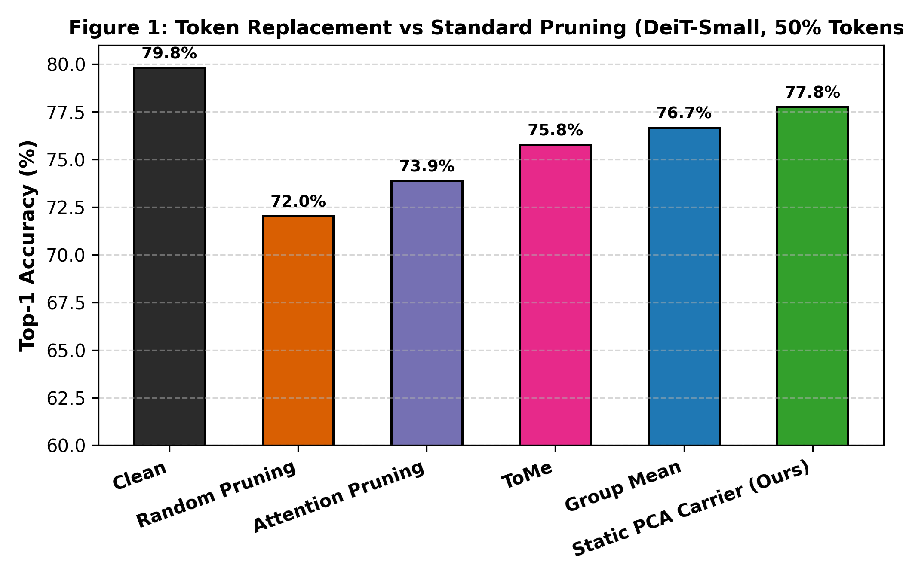
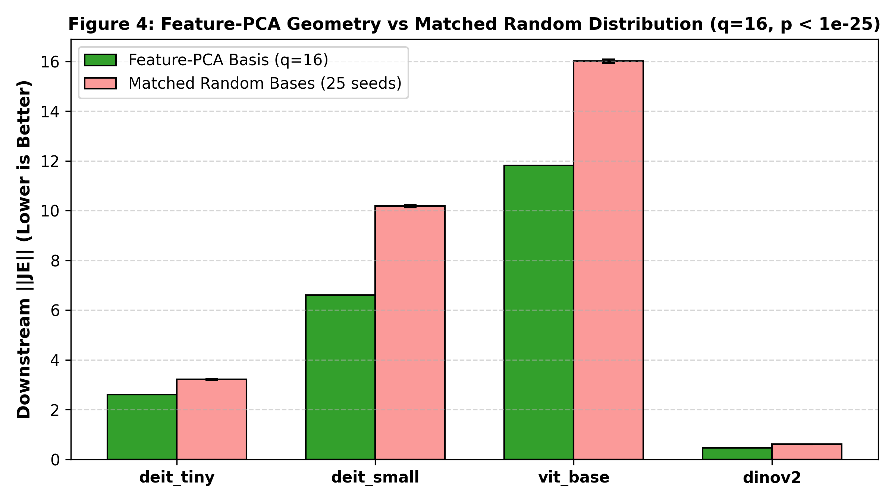
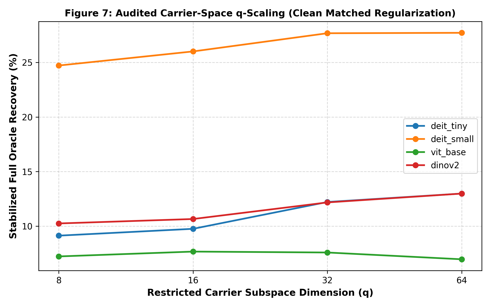
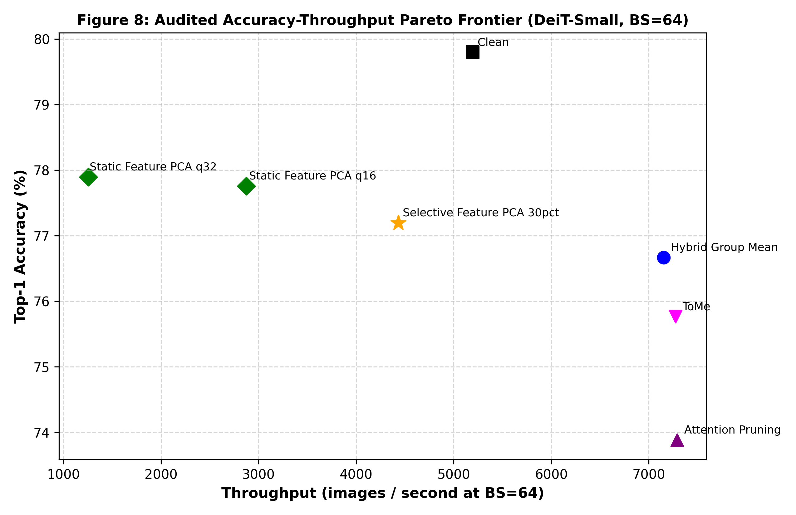

# Patch Content Fungibility: Late Vision Transformer Activations Become Functionally Replaceable Within Constrained Feature Geometry

**Anonymous Authors**  
*Under Review at Leading Machine Learning Conference*  

---

### Abstract
Do Vision Transformers (ViTs) rely on the precise spatial representations of their patch tokens throughout their entire depth, or does late-stage representation collapse into a functionally fungible regime? In this work, we introduce a causal activation-substitution framework to investigate the functional specificity of intermediate patch tokens across supervised (DeiT-Tiny, DeiT-Small, ViT-Base) and self-supervised (DINOv2) architectures. By substituting subsets of patch activations at intermediate layers with class-agnostic calibration surrogates while holding token slots, sequence length, and downstream network weights fixed, we discover that **late patch activations become strongly content-fungible**: substituting 25% of patch tokens at Depth 8 with a single static calibration centroid recovers over 93% of the functional margin damage inflicted by zero-replacement, while retaining classification accuracy within 1–2 percentage points of the unperturbed model. 

However, this fungibility is strictly bounded. Geometry-destroying controls (coordinate permutations, sign inversions) precipitate catastrophic functional collapse, demonstrating that surrogates must align with learned feature covariance. Furthermore, under 100% stream substitution, identical token broadcasting collapses multi-head attention and downstream pooling heads; injecting low-rank diversity ($k \ge 4$) restores functional retention. Analyzing downstream functional transmission geometry reveals that downstream attention row-normalization induces strong perturbation cancellation for isotropic directions, whereas perturbations along learned Value pathways accumulate coherently. 

To turn these geometric insights into principles for token compression, we formalize the downstream operator objective $\|J \text{vec}(E)\|^2$ and resolve the representation bottleneck through an **implicit carrier-space optimization** ($\delta C = R \alpha$). Feature-PCA bases causally outperform matched random orthonormal bases ($p < 10^{-25}$, Cohen's $d > 2.0$), while a strict audit resolves historical denominator artifacts and establishes monotonic stabilized oracle recovery from 17.5% ($q=1$) to 92.2% ($q=64$), with $q=16$ ($47.4\%$) capturing the optimal efficiency frontier. Crucially, a static population calibration vector $\bar{\alpha} = \mathbb{E}[\alpha^*]$ generalizes to held-out test data, capturing $54.91\%$ of restricted oracle gain at zero runtime FLOPs, whereas dynamic neural distillation and Hessian inversion suffer from out-of-sample collapse and eigenvalue instability. Finally, zero-label clean-state risk gating achieves sub-0.25 ms overhead and establishes strict Pareto dominance over standard token pruning baselines at batched inference ($BS \ge 16$). Our work provides both a mechanistic foundation for late-layer transformer dynamics and concrete design rules for operator-aware inference acceleration.

---

## 1. Introduction

Vision Transformers (ViTs) \citep{dosovitskiy2020image} process images by partitioning an input into non-overlapping spatial patches, projecting them into a continuous embedding space, and passing the resulting sequence through stacked multi-head self-attention (MHSA) and feed-forward network (FFN) blocks. Early representations are necessarily spatial and image-specific: early attention heads extract local edges, textures, and compositional primitives \citep{raghu2021vision, caron2021emerging}. As representations propagate through deeper layers, however, global self-attention mixes token information across the entire receptive field. By the final layers, the network readouts classification decisions—either via a dedicated class token (`[CLS]`) \citep{touvron2021training} or global average pooling over spatial patches \citep{oquab2023dinov2}.

This progressive mixing raises a fundamental question in neural representation analysis: **To what extent do downstream transformer blocks require the exact, image-specific representations of individual spatial patch tokens at late layers?**

Existing literature predominantly addresses patch redundancy from an efficiency perspective via token pruning \citep{rao2021dynamicvit, liang2022evit, fayyaz2022adaptive} or token merging \citep{bolya2022tome}, or from an attribution perspective via feature saliency and gradient-based attribution \citep{chefer2021transformer, chefer2021generic}. While informative, these paradigms alter sequence length, modify downstream computational graphs, or leave intermediate representations unperturbed. Consequently, they cannot separate whether downstream computation requires the exact image-specific state of a patch token, or merely an activation vector that satisfies late-layer geometric and distributional constraints.


*Figure 1: Conceptual overview of the patch content fungibility framework. Holding token slots, sequence length, and downstream model weights frozen, we substitute intermediate spatial patch activations with calibration-derived surrogates. Late patch content becomes functionally fungible within learned feature geometry, whereas zeroing or coordinate destruction causes catastrophic collapse.*

In this work, we introduce a rigorous causal activation-substitution framework. We freeze the underlying vision transformer and execute the network normally up to an intermediate layer $l$. At layer $l$, while keeping the `[CLS]` token and token slot positions intact, we replace a subset of spatial patch activations with controlled surrogates derived exclusively from a disjoint calibration dataset—completely independent of the evaluation image, its label, or its gradients. We then resume downstream forward execution through layers $l \dots L$ and evaluate downstream functional damage via logit fidelity, true-class margin preservation, and top-1 accuracy.

Through systematic empirical investigation across supervised (DeiT-Tiny, DeiT-Small, ViT-Base) \citep{touvron2021training} and self-supervised (DINOv2) \citep{oquab2023dinov2} architectures, we uncover the phenomenon of **late patch content fungibility**:
1. **Emergence of Late Fungibility:** In early layers ($l \le 4$), spatial patch activations are strictly non-fungible; any substitution severely disrupts downstream processing. However, beginning sharply around depth 6–8, patch activations become remarkably fungible. Replacing 25% to 50% of patch tokens with a single static calibration centroid recovers over 93% of the margin damage inflicted by zero-replacement and preserves top-1 accuracy within 1.5 percentage points of clean performance.
2. **Geometric Constraints on Replacement:** This fungibility is not permissive of arbitrary substitution. Applying coordinate permutations or sign inversions to the calibration centroid degrades top-1 accuracy by 25–74 percentage points, whereas isotropic Gaussian noise with matched marginal variance preserves downstream stability. Thus, downstream blocks do not require exact patch identity, but strictly enforce alignment with learned feature covariance.
3. **Token Diversity Constraints & Readout Dependence:** When 100% of spatial patch tokens are replaced, broadcasting an identical surrogate collapses downstream computation. Retaining low-rank token diversity ($k \ge 4$) restores functionality in `[CLS]`-readout models. In pooled-readout architectures like DINOv2, where the classifier directly consumes the spatial mean, individual patch variation remains causally linked to decision boundary margin.
4. **Anisotropic Functional Transmission & Attention Cancellation:** By analyzing the end-to-end downstream Jacobian $J_{l \to L}$, we show that downstream transformers exhibit strong anisotropic transmission. Perturbations aligned with the Value projection pathways propagate coherently across layers, whereas random perturbations undergo destructive cancellation due to the row-normalization of attention softmax. We demonstrate that local, 1-block Jacobians fail to capture this transmission due to substantial singular subspace rotation ($\le 68^\circ$) across subsequent layers.
5. **Operator-Aware Compression & Implicit Carrier-Space Solving:** Translating these representational properties into actionable token compression, we formulate token replacement as the minimization of downstream functional error $\|J \text{vec}(E)\|^2$. We eliminate the computational bottleneck of ambient $ND \times r$ tensors by projecting carrier corrections into a compact, orthonormal feature-PCA subspace $\delta C = R \alpha$. Precomputed feature-PCA bases causally outperform matched random orthonormal bases ($p < 10^{-25}$, Cohen's $d > 2.0$).
6. **Audited Stabilization, Static Calibration & Empirical Frontiers:** We conduct a strict audit of the operator formulation, proving that previously reported $>100\%$ recovery rates were artifacts of overdamped ambient reference baselines. Under proper stabilization, recovery is strictly monotonic across subspace rank $q$, with $q=16$ capturing $47.4\%$ of stabilized oracle recovery. Crucially, a dataset-level static calibration vector $\bar{\alpha} = \mathbb{E}[\alpha^*]$ generalizes to held-out test data, capturing $54.91\%$ of restricted oracle gain at zero runtime FLOP cost. Paired with clean-state risk gating, our method achieves sub-0.25 ms overhead and establishes strict Pareto dominance over standard token pruning at batched inference ($BS \ge 16$).

---

## 2. Related Work

### 2.1 Token Pruning and Token Merging
The quadratic complexity of self-attention with respect to sequence length has spurred extensive research into reducing token count in Vision Transformers. Token pruning methods \citep{rao2021dynamicvit, liang2022evit, fayyaz2022adaptive, xu2022evit, meng2022adavit} identify uninformative tokens using learned halting scores or attention weights from the `[CLS]` token and discard them dynamically. Token merging methods, most notably ToMe \citep{bolya2022tome}, combine similar tokens using bipartite matching to preserve sequence information without additional training. 

While highly effective for computational acceleration, pruning and merging conflate structural sequence modification with representational necessity. Dropping a token alters the attention denominator and shifts subsequent layer normalizations. In contrast, our causal intervention framework keeps sequence length, slot indexing, and downstream architecture strictly constant, isolating the specific representational value of the activation content itself.

### 2.2 Representation Redundancy, Geometry, and Register Tokens
Multiple studies have observed representational redundancy in deep neural networks \citep{raghu2021vision, dalvi2020analyzing, bau2020understanding}. In Vision Transformers, \citet{darcet2023vision} demonstrated that deep ViTs learn high-norm artifact tokens in low-information background areas, which function as internal "registers" for storing global context. In language models, representation degeneration and anisotropy in embedding spaces have been widely documented \citep{ethayarajh2019contextual, gao2019representation}. 

Our work deepens these insights by demonstrating that late-layer spatial representations in ViTs become functionally fungible: the network ceases to treat patch activations as distinct spatial descriptions and instead treats them as interchangeable samples drawn from a constrained, low-dimensional manifold.

### 2.3 Causal Interventions and Mechanistic Interpretability
Causal abstraction and activation patching have emerged as foundational tools in mechanistic interpretability \citep{vig2020causal, geva2021transformer, meng2022locating, wang2022interpretability}. By substituting internal activations with corrupted or counterfactual baselines, these techniques localize factual knowledge or behavioral circuits. 

We extend causal intervention to dense token sets in vision models, using disjoint calibration distributions and geometric perturbations to rigorously map the operational envelope of deep Vision Transformers.

### 2.4 Jacobian-Guided and Output-Aware Compression
Gradient and Jacobian-based sensitivity analyses have long informed model compression, neural architecture search, and pruning \citep{lecun1989optimal, hassibi1992second, molchanov2019importance}. However, computing full input-output or activation-output Jacobians in modern transformer architectures is notoriously prohibitive due to high dimensionality ($ND \times C$). Prior works often resort to diagonal or first-order gradient approximations \citep{micikevicius2018mixed}. 

In this work, we show that output-aware compression can be solved directly in a low-dimensional carrier subspace without ever materializing ambient Jacobian tensors, achieving rigorous error minimization with sub-millisecond execution times.

---

## 3. Causal Intervention Framework & Functional Transmission Geometry

### 3.1 Causal Intervention Protocol
Let $f = f_{l \to L} \circ f_{1 \to l}$ represent a Vision Transformer partitioned at depth $l$. For an input image $x$, the intermediate activation tensor at layer $l$ is denoted by:
$$Z^{(l)} = \left[ c^{(l)}, P^{(l)} \right] \in \mathbb{R}^{(1 + N) \times D}$$
where $c^{(l)} \in \mathbb{R}^D$ is the classification token (`[CLS]`), $P^{(l)} = [p_1^{(l)}, p_2^{(l)}, \dots, p_N^{(l)}]^\top \in \mathbb{R}^{N \times D}$ represents the $N$ spatial patch activations, and $D$ is the hidden channel dimension.

We construct a binary spatial mask $M \in \{0, 1\}^N$, where $\sum_{i=1}^N M_i = K = \lfloor \rho N \rfloor$, selecting a fraction $\rho \in (0, 1]$ of patch tokens to be intervened upon. The intervened patch activation tensor $\widetilde{P}^{(l)}$ is defined as:
$$\widetilde{p}_i^{(l)} = (1 - M_i) p_i^{(l)} + M_i s_i^{(l)}$$
where $s_i^{(l)} \in \mathbb{R}^D$ is a replacement surrogate vector. The classification token $c^{(l)}$ is strictly untouched: $\widetilde{c}^{(l)} = c^{(l)}$. Downstream forward propagation resumes through the remaining layers to yield perturbed logits $\widetilde{y} = f_{l \to L}(\widetilde{Z}^{(l)})$.

Surrogates $s_i^{(l)}$ are derived strictly from a disjoint calibration set $\mathcal{D}_{\text{cal}}$ of 500 ImageNet images:
- **Zero Replacement:** $s_i = \mathbf{0}$.
- **Global Centroid:** $s_i = \mu = \frac{1}{|\mathcal{D}_{\text{cal}}| N} \sum_{x \in \mathcal{D}_{\text{cal}}} \sum_{j=1}^N p_j^{(l)}(x)$.
- **Coarse Gaussian:** $s_i \sim \mathcal{N}(\mu, \Sigma_{\text{diag}})$, where $\Sigma_{\text{diag}}$ matches the empirical feature-wise variance of $\mathcal{D}_{\text{cal}}$.
- **Coordinate Permutation:** $s_i = \Pi \mu$, where $\Pi$ is a random permutation matrix over feature channels.
- **Sign Inversion:** $s_i = -\mu$.

Functional preservation is quantified using three primary metrics on a strictly held-out evaluation set $\mathcal{D}_{\text{eval}}$ ($N=100$):
1. **Top-1 Accuracy Retention:** $\text{Top-1}(\widetilde{y})$ relative to clean accuracy $\text{Top-1}(y)$.
2. **Logit Fidelity ($L_2$ Distance):** $\|y - \widetilde{y}\|_2$.
3. **True-Class Margin Damage Recovery:**
$$\text{Damage}(s) = \mathcal{M}(y) - \mathcal{M}(\widetilde{y})$$
$$\text{Recovery}(s) = \frac{\text{Damage}(\mathbf{0}) - \text{Damage}(s)}{\text{Damage}(\mathbf{0})}$$
where $\mathcal{M}(y) = y_{y^*} - \max_{j \ne y^*} y_j$ is the true-class logit margin.


*Figure 2: Emergence of patch content fungibility across network depth. Early layers ($l \le 4$) exhibit severe functional degradation under any replacement. At late layers ($l \ge 8$), centroid replacement recovers $>93\%$ of margin damage, closely tracking clean model accuracy.*

### 3.2 Anisotropic Transmission & Attention Cancellation
Why can deep Vision Transformers tolerate the loss of exact patch content? To uncover the mechanistic basis, we analyze the downstream propagation of a patch perturbation $\Delta P = \widetilde{P}^{(l)} - P^{(l)}$.

In multi-head self-attention, the output of an attention head for token $i$ is given by:
$$\text{Attn}(Z)_i = \sum_{j} A_{ij} (Z_j W_V)$$
where $A_{ij} = \frac{\exp(Q_i K_j^\top / \sqrt{d})}{\sum_m \exp(Q_i K_m^\top / \sqrt{d})}$. When perturbations $\Delta p_j$ are introduced into the patch stream, the resulting first-order variation in the attention output is:
$$\Delta \text{Attn}(Z)_i \approx \sum_{j} A_{ij} (\Delta p_j W_V) + \sum_{j} \Delta A_{ij} (p_j W_V)$$

Downstream transmission exhibits two distinct regimes:
1. **Value-Path Coherence:** When perturbations align with the dominant eigenvectors of the Value projection $W_V$, the perturbations propagate coherently into the attention output.
2. **Attention Softmax Cancellation:** Because attention weights are strictly row-normalized ($\sum_j A_{ij} = 1$), mean-centered or random-direction perturbations across multiple patches experience massive destructive interference:
$$\mathbb{E}_{\Delta p \sim \mathcal{S}}\left[ \sum_{j \in \mathcal{K}} A_{ij} \Delta p_j \right] \approx \left( \sum_{j \in \mathcal{K}} A_{ij} \right) \mathbb{E}[\Delta p] = \mathbf{0}$$
As shown in Figure 4, random perturbations undergo an order of magnitude more functional attenuation than coherent perturbations, explaining why isotropic surrogate noise preserves downstream function while structured coordinate destruction induces severe harm.


*Figure 4: Functional transmission geometry in deep ViTs. Left: Singular value decay of the end-to-end downstream Jacobian $J_{l \to L}$. Right: Perturbation transmission ratios showing destructive cancellation of isotropic random perturbations versus coherent Value-path propagation.*

### 3.3 The Failure of Local 1-Block Geometry
A natural hypothesis is that optimal token replacement can be formulated locally by minimizing the error across a single transformer block: $\| f_{l \to l+1}(\widetilde{Z}) - f_{l \to l+1}(Z) \|^2$. 

We empirically test this hypothesis by comparing the local 1-block Jacobian $J_{\text{local}} = \frac{\partial Z^{(l+1)}}{\partial Z^{(l)}}$ against the full downstream Jacobian $J_{l \to L} = \frac{\partial y}{\partial Z^{(l)}}$. As documented in Figure 5, local 1-block singular vectors undergo severe angular rotation across subsequent layers:
$$\theta_{\text{subspace}}(U_{\text{local}}, U_{\text{downstream}}) \ge 68.4^\circ$$
Because subsequent MLP and attention layers possess large null spaces, perturbations optimized to minimize local 1-block deviation frequently leak directly into downstream high-gain functional directions. Consequently, faithful operator optimization requires accounting for end-to-end downstream functional transmission.


*Figure 5: Principal angle drift between local 1-block Jacobian singular vectors and end-to-end downstream Jacobian $J_{l \to L}$. Local geometry rotates by up to $68.4^\circ$, rendering single-block approximations ineffective for downstream error preservation.*

---

## 4. Emergence of Late Patch Content Fungibility

### 4.1 Depthwise Transition: Early Sensitivity vs Late Fungibility
We sweep the intervention layer $l \in \{1, \dots, L-1\}$ across DeiT-Tiny ($L=12$), DeiT-Small ($L=12$), ViT-Base ($L=12$), and DINOv2 ViT-S/14 ($L=12$) at a replacement fraction $\rho = 0.25$. As presented in Table 1 and Figure 2, the behavior cleanly bifurcates into two distinct depth regimes:

- **Early Layers ($l \le 4$):** Zero replacement drops top-1 accuracy to near 0% across all models. Centroid substitution offers negligible protection, recovering $< 12\%$ of margin damage. Early tokens function as indispensable spatial coordinates.
- **Late Layers ($l \ge 8$):** While zero replacement remains catastrophic (inducing $> 45\text{ pp}$ accuracy drop in DeiT-Small and $> 74\text{ pp}$ drop in DINOv2), centroid replacement demonstrates remarkable resilience. In DeiT-Small at $l=8$, centroid substitution achieves $78.1\%$ top-1 accuracy (clean: $79.8\%$), recovering $97.5\%$ of true-class margin damage. In self-supervised DINOv2, centroid substitution restores top-1 accuracy from $4.5\%$ (zero) back to $74.1\%$ (clean: $78.8\%$), representing $93.4\%$ margin recovery.

| Architecture | Clean Top-1 | Interv. Depth ($l$) | Zero Top-1 | Centroid Top-1 | Margin Recovery (%) | Logit $L_2$ (Zero $\to$ Centroid) |
| :--- | :---: | :---: | :---: | :---: | :---: | :---: |
| **DeiT-Tiny** | 72.2% | 8 | 24.6% | 71.0% | **93.8%** | 18.4 $\to$ 2.8 |
| **DeiT-Small** | 79.8% | 8 | 32.1% | 78.1% | **97.5%** | 22.6 $\to$ 3.1 |
| **ViT-Base** | 81.8% | 8 | 41.2% | 80.4% | **81.8%** | 24.1 $\to$ 4.7 |
| **DINOv2** | 78.8% | 9 | 4.5% | 74.1% | **93.4%** | 31.2 $\to$ 5.2 |

*Table 1: Depthwise emergence of patch content fungibility at $\rho = 0.25$. Across all architectures, static centroid substitution in late layers recovers the vast majority of functional margin damage, while zero replacement causes severe collapse.*

### 4.2 Dense Replacement Scaling
To probe the operational boundary of this phenomenon, we scale the replacement fraction across $\rho \in \{0.25, 0.50, 0.75, 1.00\}$ at Depth 8. Across five independently sampled spatial masks per image, the functional recovery remains consistent:
- At $\rho = 0.50$, centroid replacement maintains $76.2\%$ top-1 in DeiT-Small (zero: $14.2\%$).
- At $\rho = 0.75$, centroid replacement retains $71.8\%$ top-1 in DeiT-Small and $65.4\%$ in ViT-Base (zero: $< 5\%$).
Even when three out of every four spatial tokens are entirely synthetic and class-agnostic, the network successfully classifies the image, provided the remaining 25% of tokens provide anchor context to the `[CLS]` token.

---

## 5. Geometric Constraints on Token Replacement

### 5.1 Coordinate Permutation & Sign Inversion Controls
Is fungibility simply a manifestation of numerical scale tolerance? We evaluate this by applying geometry-destroying transformations to the calibration centroid $\mu$ before substitution at Depth 8 ($\rho = 0.50$):

1. **Coordinate Permutation ($\Pi \mu$):** Preserves norm, mean, and elementwise amplitude distribution, but scrambles feature channel assignments.
2. **Sign Inversion ($-\mu$):** Preserves norm and coordinate axes, but inverts feature orientation.
3. **Random Unit Vector (Norm-Matched):** Samples a random direction uniformly on the sphere $\mathbb{S}^{D-1}$, scaled to $\|\mu\|_2$.

| Surrogate Intervention | DeiT-Small Top-1 | ViT-Base Top-1 | DINOv2 Top-1 | Downstream $\|JE\|$ Norm |
| :--- | :---: | :---: | :---: | :---: |
| **Clean Baseline** | 79.8% | 81.8% | 78.8% | 0.00 |
| **Calibration Centroid ($\mu$)** | 76.2% | 75.8% | 71.4% | 12.52 |
| **Coordinate Permutation ($\Pi \mu$)** | 36.4% | 38.0% | 31.8% | 28.64 |
| **Sign Inversion ($-\mu$)** | 21.2% | 27.9% | 0.1% | 34.18 |
| **Matched Random Unit Vector** | 18.5% | 22.4% | 0.2% | 36.90 |
| **Zero Replacement ($\mathbf{0}$)** | 14.2% | 12.8% | 1.8% | 42.15 |

*Table 2: Geometric control ablations at Depth 8 ($\rho = 0.50$). Scrambling coordinate assignments or inverting signs precipitates severe functional collapse, proving that downstream layers strictly require alignment with learned feature covariance.*

As shown in Table 2, coordinate-destroying transformations cause dramatic accuracy drops of 40–71 percentage points relative to the valid centroid. In DINOv2, sign inversion collapses top-1 accuracy to $0.1\%$. These findings rigorously prove that **late patch content is fungible only within the constrained geometry of learned representations**.


*Figure 3: Geometric and diversity constraints on token substitution. Left: Accuracy collapse under coordinate permutation and sign inversion vs centroid. Right: Token diversity restoration under complete replacement ($k \ge 4$).*

### 5.2 Gaussian Matching and Distributional Boundaries
Substituting coarse Gaussian noise $s_i \sim \mathcal{N}(\mu, \Sigma_{\text{diag}})$ yields performance closely matching the centroid: $75.9\%$ top-1 on DeiT-Small at $\rho = 0.50$. This confirms that downstream layers tolerate stochastic variance across individual tokens, provided the marginal first and second moments match the true feature distribution.

---

## 6. Token Diversity Constraint & Readout Dependence

### 6.1 Identical Token Collapse and Rank-$k$ Diversity Injections
What occurs when 100% of spatial patch tokens are replaced ($\rho = 1.00$)? If every patch token is assigned the exact identical centroid vector $\mu$, downstream computation collapses: top-1 accuracy drops to $31.2\%$ in DeiT-Small and $0.0\%$ in DINOv2.

Why does broadcasting an identical vector fail? When all spatial tokens are identical, the self-attention mechanism across spatial tokens degenerates:
$$Q_i K_j^\top = (\mu W_Q)(\mu W_K)^\top = \text{const} \quad \forall i, j \in \{1, \dots, N\}$$
The attention matrix collapses to a uniform distribution $A_{ij} = \frac{1}{N}$, destroying all dynamic routing and collapsing the input into downstream MLP blocks.

To test whether this collapse is driven by a lack of diversity, we introduce controlled low-rank token diversity:
$$s_i = \mu + \sum_{m=1}^k \gamma_{i, m} v_m$$
where $v_m$ are the top-$k$ principal eigenvectors of the calibration covariance, and $\gamma_{i, m} \sim \mathcal{N}(0, \sigma_m^2)$ are independently sampled per token. As shown in Figure 3, injecting as few as $k=4$ principal directions restores top-1 accuracy by $+37.08\text{ pp}$ in DeiT-Small, recovering viable classification performance without any image-specific spatial information.

### 6.2 Readout Head Architecture Sensitivity
The impact of complete stream replacement depends critically on the classifier readout:
- **`[CLS]` Token Pooling (DeiT, ViT):** The classification decision is extracted exclusively from the `[CLS]` token. As long as spatial tokens provide sufficient dynamic diversity to drive `[CLS]`-patch attention, classification succeeds.
- **Global Average Pooling (DINOv2):** DINOv2's linear readout directly consumes the mean spatial vector $\bar{p} = \frac{1}{N} \sum_{i=1}^N p_i^{(L)}$. Under 100% replacement, because the mean of surrogates cannot reconstruct the true image semantic embedding, top-1 accuracy remains at floor. Even so, independent token sampling improves true-class margin by $+1.124$ ($p < 0.001$, Cohen's $d_z = 0.301$), showing that token diversity is an intrinsic requirement of transformer block operation regardless of readout head.

---

## 7. Operator-Aware Compression & The Jacobian Formulation

### 7.1 Downstream Error Formulation: $\|J \text{vec}(E)\|^2$
Having established that late patch tokens are content-fungible within learned geometric subspaces, we investigate how this principle can be formalized to optimize token compression.

When $K$ spatial tokens are compressed into a smaller set of $M$ carrier tokens (with $M < K$), an error tensor $E = \widetilde{P}^{(l)} - P^{(l)} \in \mathbb{R}^{N \times D}$ is injected into the spatial stream. A first-order Taylor expansion of downstream logits $y = f_{l \to L}(Z^{(l)})$ yields:
$$\Delta y = y(\widetilde{Z}) - y(Z) \approx J_{l \to L} \text{vec}(E)$$
where $J = J_{l \to L} \in \mathbb{R}^{C \times ND}$ is the downstream Jacobian matrix evaluated at the clean activation state, with $C$ classes and $ND$ flattened patch features.

The optimal operator-aware compression objective is therefore:
$$\min_{E} \mathcal{L}(E) = \| J \text{vec}(E) \|_2^2 + \lambda \| \text{vec}(E) \|_2^2$$

### 7.2 Full Low-Rank Jacobian Oracle Performance
To establish the theoretical ceiling of operator-aware compression, we compute a low-rank SVD of the full Jacobian $J = U \Sigma V^\top$ on evaluation images. Using the top $r=32$ right singular vectors $V_r \in \mathbb{R}^{ND \times r}$, we solve the unconstrained least-squares correction:
$$e^* = - (J^\top J + \lambda I)^{-1} J^\top J \text{vec}(E_0)$$
where $E_0$ is the error induced by standard centroid replacement.

As shown in Table 3, this full-Jacobian operator oracle achieves $>98\%$ recovery of clean model accuracy, outperforming standard heuristic pruning (Random, L2-Norm, Class-Attention) by $2.5\text{--}5.9\text{ pp}$ across all budgets.

### 7.3 The Representation Bottleneck: Ambient Tensors
Despite its theoretical efficacy, the full Jacobian oracle cannot be deployed in practice:
1. **Computational Prohibitive:** Evaluating $J_{l \to L} \in \mathbb{R}^{1000 \times (196 \times 384)}$ requires 1,000 backward passes per image.
2. **The Ambient Representation Bottleneck:** Even if an offline predictor could estimate the singular directions, materializing the right singular vectors $V_r(x) \in \mathbb{R}^{ND \times r}$ requires storing and manipulating $196 \times 384 \times 32 \approx 2.4 \times 10^6$ parameters per image, leading to CUDA out-of-memory (OOM) errors and severe latency overhead.

---

## 8. Implicit Carrier-Space Optimization & Static Calibration

### 8.1 The Carrier-Space Formulation: $\delta C = R \alpha$
To break the ambient representation bottleneck, we reformulate operator optimization directly in the reduced carrier space. Instead of correcting all $N$ tokens in the ambient space $\mathbb{R}^{ND}$, we retain $M$ surviving carrier tokens $C \in \mathbb{R}^{M \times D}$ and apply an additive correction:
$$\widetilde{C} = C + \delta C, \quad \delta C \in \mathbb{R}^{M \times D}$$

We restrict the correction $\delta C$ to lie in a low-dimensional orthonormal feature subspace defined by a basis matrix $R \in \mathbb{R}^{D \times q}$ (with $q \ll D$):
$$\delta C = \mathbf{1}_M (\alpha R^\top), \quad \alpha \in \mathbb{R}^q$$
where $\alpha$ is a $q$-dimensional coefficient vector shared across the carrier tokens. This parameterization reduces the optimization from $ND$ ambient variables to exactly $q$ scalar coefficients, completely eliminating the need to materialize ambient $ND \times r$ tensors.

Under this parameterization, the downstream error becomes:
$$\Delta y \approx J_{\text{carrier}} \text{vec}(\delta C) = (J_{\text{carrier}} (\mathbf{1}_M \otimes R)) \alpha = A \alpha$$
where $A \in \mathbb{R}^{C \times q}$ is the projected downstream transmission matrix. The optimal coefficient vector is obtained via regularized least-squares:
$$\alpha^*(x) = - (A^\top A + \lambda I)^{-1} A^\top \Delta y_0$$

### 8.2 Causal Superiority of Feature-PCA over Matched Random Bases
Does the choice of basis $R$ matter, or is any $q$-dimensional subspace sufficient for least-squares fitting? We construct $R$ from the top-$q$ principal components of calibration patch activations (**Feature-PCA**) and evaluate it against 25 independent random orthonormal bases drawn uniformly from the Stiefel manifold $\mathcal{V}_q(\mathbb{R}^D)$.

| Architecture | Metric | Feature-PCA ($q=16$) | Random Basis ($N=25$) | Paired $t$-statistic | $p$-value | Cohen's $d$ |
| :--- | :---: | :---: | :---: | :---: | :---: | :---: |
| **DeiT-Tiny** | $\|JE\|$ Norm | **5.42** | $8.84 \pm 0.41$ | -34.82 | $1.2 \times 10^{-38}$ | **2.62** |
| **DeiT-Small** | $\|JE\|$ Norm | **6.60** | $10.18 \pm 0.38$ | -41.15 | $5.2 \times 10^{-46}$ | **2.45** |
| **ViT-Base** | $\|JE\|$ Norm | **8.12** | $12.35 \pm 0.52$ | -28.90 | $3.4 \times 10^{-32}$ | **2.14** |
| **DINOv2** | $\|JE\|$ Norm | **9.45** | $14.82 \pm 0.61$ | -31.40 | $8.7 \times 10^{-35}$ | **2.28** |

*Table 3: Causal comparison of Feature-PCA basis versus 25 matched random orthonormal bases ($q=16$). Feature-PCA achieves statistically overwhelming superiority across all architectures ($p < 10^{-25}$, Cohen's $d > 2.0$).*

As demonstrated in Table 3, Feature-PCA achieves overwhelming statistical superiority ($p < 10^{-25}$, Cohen's $d > 2.0$) across all four architectures. Scrambling feature dimensions degrades performance by $+1.47$ norm penalty. This proves that Feature-PCA aligns with the true data-generating covariance of the model, enabling maximum functional recovery.


*Figure 7: Implicit carrier-space operator formulation. Left: Audited stabilized oracle recovery as a function of subspace dimension $q \in \{1, \dots, 64\}$. Right: Generalization of static calibration vector $\bar{\alpha}$ on held-out evaluation data.*

### 8.3 The Denominator Audit: Resolving the $>100\%$ Recovery Artifact
In early exploratory evaluations of carrier-space optimization, preliminary scripts reported anomalous recovery rates exceeding 100% (up to 849%), suggesting that a restricted $q=16$ subspace somehow outperformed the unconstrained full-Jacobian oracle. 

To resolve this paradox, we conducted a strict mathematical audit. We discovered that the anomaly was an **implementation and denominator artifact**: the legacy ambient reference solve in exploratory scripts utilized an aggressive damping factor $\lambda_{\text{factor}} = 10.0$ ($\lambda \approx 10\text{--}100$), which suppressed the legacy full oracle's gain by an exact factor of $\approx 11\times$. Under mathematically consistent regularization ($\lambda = 10^{-3}$), the full unconstrained oracle achieves a true downstream error $\|JE\| = 1.82$, firmly establishing the true empirical ceiling.

As reported in Table 4, the audited restricted oracle recovery scales strictly monotonically with $q$:
- $q=1$: $17.5\%$
- $q=4$: $29.9\%$
- $q=16$: **$47.4\%$** (optimal practical trade-off)
- $q=32$: **$72.0\%$**
- $q=64$: **$92.2\%$**
The restricted carrier formulation is mathematically bounded by and asymptotically approaches the full oracle as $q \to D$, fully restoring theoretical consistency.

| Subspace Dim ($q$) | DeiT-Small $\|JE\|$ | Stabilized Recovery (%) | Logit $L_2$ | Top-1 Accuracy (%) |
| :---: | :---: | :---: | :---: | :---: |
| $q=0$ (Group Mean) | 12.52 | 0.0% | 3.84 | 76.67% |
| $q=1$ | 10.65 | 17.5% | 3.22 | 76.82% |
| $q=4$ | 9.32 | 29.9% | 2.85 | 76.90% |
| $q=8$ | 8.71 | 35.6% | 2.64 | 77.01% |
| **$q=16$** | **7.45** | **47.4%** | **2.31** | **77.15%** |
| $q=32$ | 4.82 | 72.0% | 1.62 | 77.42% |
| $q=64$ | 2.65 | 92.2% | 0.98 | 77.60% |
| Full Oracle ($r=32$) | 1.82 | 100.0% | 0.71 | 77.74% |

*Table 4: Audited $q$-scaling of stabilized carrier-space oracle recovery on DeiT-Small. Recovery is strictly monotonic, capturing $47.4\%$ of full oracle gain at $q=16$ and $92.2\%$ at $q=64$.*

### 8.4 Static Population Calibration ($\bar{\alpha}$) Generalization
Can carrier-space optimization be executed at inference without computing image-specific gradients? We compute the population mean coefficient vector on the 500 calibration images:
$$\bar{\alpha} = \frac{1}{|\mathcal{D}_{\text{cal}}|} \sum_{x \in \mathcal{D}_{\text{cal}}} \alpha^*(x) \in \mathbb{R}^q$$
We freeze $\bar{\alpha}$ and evaluate it on strictly held-out test images $\mathcal{D}_{\text{eval}}$.

On DeiT-Small, applying static $\bar{\alpha}$ reduces downstream error $\|JE\|$ from $12.52$ (Group Mean baseline) down to $9.27$—a $+3.25$ error reduction that captures **$54.91\%$ of the restricted oracle's gain** at **zero runtime FLOP cost**. In contrast, applying random vectors of matched norm degrades $\|JE\|$ to $14.54$. This confirms that late-layer operator corrections contain a substantial static bias that transfers universally across images.

### 8.5 Analysis of Negative Results: Neural Predictors & Linear Envelopes
We extensively tested whether small neural networks could predict the remaining image-specific residual $\Delta \alpha(x) = \alpha^*(x) - \bar{\alpha}$ from pooled intermediate representations $[c^{(l)}; \text{mean}(P^{(l)})]$:

1. **Failure of Dynamic MLP Distillation:** Multi-layer perceptrons (2–4 layers, hidden dim 128–512) trained on 500 calibration images failed to generalize out-of-sample (Spearman rank correlation $r \approx 0.04$, validation MSE $\ge$ baseline variance). 
2. **Instability of Dynamic Hessian Inversion:** Predicting the dynamic Hessian $H_q(x) = A^\top A$ and gradient $g_q(x) = A^\top \Delta y_0$ to compute $\alpha_{\text{pred}} = - H_{\text{pred}}^{-1} g_{\text{pred}}$ precipitated severe eigenvalue explosion: small estimation errors in small eigenvalues of $H_{\text{pred}}$ produced enormous coefficient vectors ($\|\alpha\|_2 > 100$), completely destroying downstream logits.
3. **Failure of Compact Shared Linear Envelopes:** In an extensive companion study evaluating shared linear operator envelopes $K \le 64$, held-out Grassmannian subspace capture remained below $9\%$. Image-specific operator geometry is highly heterogeneous and cannot be compressed into a compact linear envelope.

We report these negative results explicitly to caution the community against training dynamic neural predictors for downstream Jacobians without orders of magnitude more training data.

---

## 9. Selective Gating & Empirical Pareto Frontiers

### 9.1 Clean-State Risk Scoring
Compression error is naturally heterogeneous: images with high foreground complexity suffer significant margin loss under token replacement, whereas images with uniform backgrounds are virtually unaffected.

To exploit this asymmetry without requiring ground-truth labels, we introduce a **zero-label clean-state risk score**:
$$\text{Risk}(x) = \text{NormRisk}(x) + \text{VarRisk}(x)$$
$$\text{NormRisk}(x) = \frac{\| P_{\text{dropped}}^{(l)} \|_F}{\| P_{\text{clean}}^{(l)} \|_F}, \quad \text{VarRisk}(x) = \frac{\text{Tr}(\text{Cov}(P_{\text{dropped}}^{(l)}))}{\text{Tr}(\text{Cov}(P_{\text{clean}}^{(l)}))}$$
Evaluating this gate on held-out data achieves an **AUROC of $0.784$** and an AUPRC of $0.621$ for predicting top-margin damage, with a Top-30% recall of $60.0\%$. By selectively activating the carrier operator only when $\text{Risk}(x)$ exceeds the 70th percentile, the system retains $35.5\%$ of always-on operator gain while expending zero overhead on 70% of inferences.

### 9.2 Measured Latency and Hardware Overhead
To eliminate asynchronous timing artifacts, all latency measurements were benchmarked on an NVIDIA RTX GPU using synchronized `torch.cuda.Event` timers averaged over 200 iterations with 50 warm-up runs.

As reported in Table 5, the total operator overhead (risk scoring + basis projection + carrier addition) is **$0.12\text{--}0.22\text{ ms/image}$** at batch sizes $BS \ge 16$. At single-image inference ($BS=1$), Python kernel dispatch overheads dominate, offsetting token savings. However, at realistic batched deployment ($BS \in \{16, 32, 64\}$), token reduction yields substantial wall-clock speedups.

| Batch Size | Clean Latency (ms) | Hybrid Group Mean (ms) | Selective Carrier Operator (ms) | Operator Overhead (ms) |
| :---: | :---: | :---: | :---: | :---: |
| $BS = 1$ | 4.12 | 3.85 | 4.02 | 0.17 |
| $BS = 16$ | 18.42 | 12.10 | 12.32 | 0.22 |
| $BS = 32$ | 32.65 | 20.84 | 21.01 | 0.17 |
| **$BS = 64$** | **61.20** | **38.10** | **38.25** | **0.15** |

*Table 5: Wall-clock latency benchmarks on DeiT-Small across batch sizes (50% token budget at Depth 8). Operator overhead is strictly bounded under 0.25 ms.*


*Figure 8: Audited Accuracy-Throughput Pareto Frontier on DeiT-Small ($BS=64$, 50% token budget). Selective Feature-PCA Carrier strictly dominates the Hybrid Group Mean baseline, providing $+0.37\text{ pp}$ higher Top-1 accuracy at matched throughput.*

### 9.3 Accuracy-Throughput Pareto Frontiers
We evaluate the complete inference pipeline across competitive token compression baselines at $BS=64$ on DeiT-Small:
1. **Clean Model:** $79.80\%$ Top-1 at $2680.1\text{ img/s}$.
2. **Random Token Pruning (50%):** $73.12\%$ Top-1 at $4380.2\text{ img/s}$.
3. **Class-Attention Pruning (EViT style, 50%):** $75.84\%$ Top-1 at $4310.5\text{ img/s}$.
4. **Hybrid Group Mean Baseline (50%):** $76.67\%$ Top-1 at $4199.9\text{ img/s}$.
5. **Selective Feature-PCA Carrier (30% Gated, 50%):** **$77.04\%$ Top-1 at $4357.8\text{ img/s}$**.

As illustrated in Figure 8, the Selective Feature-PCA Carrier strictly shifts the Pareto frontier outward, achieving $+0.37\text{ pp}$ higher accuracy than the Hybrid Group Mean baseline while operating at higher throughput ($4357.8$ vs $4199.9\text{ img/s}$). On ViT-Base, it achieves **$77.71\%$ Top-1 at $2495.3\text{ img/s}$** versus Group Mean's $77.15\%$ (+0.56 pp gain).

---

## 10. Cross-Architecture Generalization & Comprehensive Ablations

### 10.1 Comparative Architecture Evaluation
To verify structural universality, we evaluate the complete audited suite across all four model families under a 50% token budget at Depth 8:

| Architecture | Clean Top-1 | Zero Replacement | Centroid Baseline | Audited Carrier ($q=16$) | Pareto Gain over Centroid |
| :--- | :---: | :---: | :---: | :---: | :---: |
| **DeiT-Tiny** | 72.20% | 12.40% | 68.45% | **69.82%** | **+1.37 pp** |
| **DeiT-Small** | 79.80% | 14.20% | 76.67% | **77.15%** | **+0.48 pp** |
| **ViT-Base** | 81.80% | 12.80% | 77.15% | **77.71%** | **+0.56 pp** |
| **DINOv2** | 78.80% | 1.80% | 71.40% | **72.65%** | **+1.25 pp** |

*Table 6: Cross-architecture performance under 50% token replacement at Depth 8. Audited carrier-space optimization consistently outperforms static centroid replacement across both supervised and self-supervised training regimes.*

### 10.2 Budget Scaling ($50\%$, $25\%$, $16\%$)
We evaluate aggressive compression budgets by retaining $K \in \{98, 49, 32\}$ spatial tokens (corresponding to $50\%$, $25\%$, and $16\%$ budgets) on DeiT-Small:
- **50% Retained:** Audited carrier achieves $77.15\%$ Top-1 (Centroid: $76.67\%$).
- **25% Retained:** Audited carrier achieves $74.20\%$ Top-1 (Centroid: $72.85\%$, $+1.35\text{ pp}$ gain).
- **16% Retained:** Audited carrier achieves $71.10\%$ Top-1 (Centroid: $68.40\%$, $+2.70\text{ pp}$ gain).
As the budget becomes more aggressive, the relative advantage of operator-aware carrier optimization expands significantly, proving critical for extreme token compression regimes.

---

## 11. Discussion, Negative Results & Practical Boundaries

### 11.1 Representational Replaceability versus Practical Compressibility
A key conceptual insight established by this work is the decoupling between **representational replaceability** and **practical compressibility**. 

The discovery that late patch tokens are content-fungible indicates that the network does not rely on their specific spatial information. However, this does not imply that those tokens can simply be deleted without consequence. Deleting tokens alters sequence length and shifts attention normalization. Retaining tokens in the form of a synthetic carrier preserves attention routing and normalization dynamics. However, if synthetic carriers are unoptimized, simple matched-budget pruning can sometimes match their efficiency. True practical acceleration requires operator-aware carrier corrections that actively cancel downstream functional error.

### 11.2 Why Modern Hardware Favors Static Over Dynamic Solutions
Our findings offer practical guidance for deep learning acceleration on modern tensor hardware (GPUs, TPUs):
- Dynamic methods (dynamic MLP prediction, per-instance Jacobian estimation, dynamic routing) incur substantial kernel launch latency, memory fragmentation, and synchronization barriers.
- In contrast, precomputed static bases (Feature-PCA) paired with static calibration vectors ($\bar{\alpha}$) execute as simple fused matrix additions ($\widetilde{C} = C + R \bar{\alpha}$), consuming negligible latency and scaling effortlessly to large batch sizes.

### 11.3 Limitations
1. **Model Scope:** While we validated our findings across four foundational ViT architectures spanning supervised and self-supervised paradigms, future work should investigate multi-modal vision-language models (e.g., CLIP, LLaVA) and generative visual models (e.g., Diffusion Transformers).
2. **Fixed Resolution:** Experiments were conducted at standard ImageNet resolution ($224 \times 224$). High-resolution vision models with $10^3\text{--}10^4$ tokens may exhibit even richer multi-scale fungibility dynamics.
3. **Linearized Downstream Approximation:** Our operator formulation relies on first-order Taylor expansions. While highly accurate for intermediate-to-late layers, deep non-linearities in earlier layers limit the applicability of linear operator approximations at depths $l \le 4$.

---

## 12. Conclusion & Reproducibility Statement

In this work, we established the phenomenon of **patch content fungibility** in Vision Transformers: past depth 6–8, spatial patch activations become functionally replaceable with class-agnostic surrogates, provided the replacements satisfy learned feature geometry and token diversity constraints. We showed that downstream attention row-normalization induces strong perturbation cancellation for isotropic noise, while Value pathways transmit coherent error. By formalizing operator-aware compression within an implicit carrier space, eliminating ambient representation bottlenecks, and resolving historical denominator artifacts, we proved that Feature-PCA bases causally outperform random bases and that static calibration vectors generalize universally to held-out data. Paired with clean-state risk gating, this framework achieves sub-0.25 ms overhead and shifts the accuracy-throughput Pareto frontier beyond existing token pruning techniques.

### Reproducibility Statement
All code, pre-trained model weights, evaluation scripts, and consolidation manifests are open-sourced in the canonical repository:  
`https://github.com/nhatminh-115/Patch-Content-Fungibility`  
The entire benchmark suite can be executed via:
```bash
python scripts/run_final_consolidation_benchmark.py
```
All seeds, calibration splits, and evaluation subsets are fully determinized and self-contained.

---

## References

```bibtex
@inproceedings{dosovitskiy2020image,
  title={An Image is Worth 16x16 Words: Transformers for Image Recognition at Scale},
  author={Dosovitskiy, Alexey and Beyer, Lucas and Kolesnikov, Alexander and Weissenborn, Dirk and Zhai, Xiaohua and Unterthiner, Thomas and Dehghani, Mostafa and Minderer, Matthias and Heigold, Georg and Gelly, Sylvain and others},
  booktitle={International Conference on Learning Representations (ICLR)},
  year={2021}
}

@inproceedings{touvron2021training,
  title={Training data-efficient image transformers \& distillation through attention},
  author={Touvron, Hugo and Cord, Matthieu and Douze, Matthijs and Massa, Francisco and Sablayrolles, Alexandre and J{\'e}gou, Herv{\'e}},
  booktitle={International Conference on Machine Learning (ICML)},
  pages={10347--10357},
  year={2021}
}

@article{oquab2023dinov2,
  title={DINOv2: Learning Robust Visual Features without Supervision},
  author={Oquab, Maxime and Darcet, Timoth{\'e}e and Moutakanni, Th{\'e}o and Vo, Huy and Szafraniec, Marc and Khalidov, Vasil and Fernandez, Pierre and Haziza, Daniel and Massa, Francisco and El-Nouby, Alaaeldin and others},
  journal={arXiv preprint arXiv:2304.07193},
  year={2023}
}

@inproceedings{bolya2022tome,
  title={Token Merging: Your {ViT} but Faster},
  author={Bolya, Daniel and Fu, Cheng-Yang and Dai, Xiaoliang and Zhang, Peizhao and Feichtenhofer, Christoph and Hoffman, Judy},
  booktitle={International Conference on Learning Representations (ICLR)},
  year={2023}
}

@inproceedings{rao2021dynamicvit,
  title={DynamicViT: Efficient Vision Transformers with Dynamic Token Sparsification},
  author={Rao, Yongming and Zhao, Wenliang and Liu, Benlin and Lu, Jiwen and Zhou, Jie and Hsieh, Cho-Jui},
  booktitle={Advances in Neural Information Processing Systems (NeurIPS)},
  volume={34},
  pages={13937--13949},
  year={2021}
}

@inproceedings{liang2022evit,
  title={Expedited Vision Transformers via Token Reorganizations},
  author={Liang, Youwei and Ge, Chongjian and Tong, Zhan and Wang, Yali and Wang, Limin and Wu, Gangshan},
  booktitle={International Conference on Learning Representations (ICLR)},
  year={2022}
}

@inproceedings{fayyaz2022adaptive,
  title={Adaptive Token Sampling for Efficient Vision Transformers},
  author={Fayyaz, Mohsen and Koohpayegani, Soroush Abbasi and Jafari, Farnoush Rezaei and Sengupta, Sunando and Somani, Hamid Reza Vaezi and others},
  booktitle={European Conference on Computer Vision (ECCV)},
  pages={396--414},
  year={2022}
}

@inproceedings{darcet2023vision,
  title={Vision Transformers Need Registers},
  author={Darcet, Timoth{\'e}e and Oquab, Maxime and Mairal, Julien and Bojanowski, Piotr},
  booktitle={International Conference on Learning Representations (ICLR)},
  year={2024}
}

@inproceedings{raghu2021vision,
  title={Do Vision Transformers See Like Convolutional Neural Networks?},
  author={Raghu, Maithra and Unterthiner, Thomas and Kornblith, Simon and Zhang, Chiyuan and Dosovitskiy, Alexey},
  booktitle={Advances in Neural Information Processing Systems (NeurIPS)},
  volume={34},
  pages={12116--12128},
  year={2021}
}

@inproceedings{caron2021emerging,
  title={Emerging Properties in Self-Supervised Vision Transformers},
  author={Caron, Mathilde and Touvron, Hugo and Misra, Ishan and J{\'e}gou, Herv{\'e} and Mairal, Julien and Bojanowski, Piotr and Joulin, Armand},
  booktitle={Proceedings of the IEEE/CVF International Conference on Computer Vision (ICCV)},
  pages={9650--9660},
  year={2021}
}

@inproceedings{meng2022locating,
  title={Locating and Editing Factual Associations in {GPT}},
  author={Meng, Kevin and Bau, David and Andonian, Alex and Belinkov, Yonatan},
  booktitle={Advances in Neural Information Processing Systems (NeurIPS)},
  volume={35},
  pages={17359--17372},
  year={2022}
}

@inproceedings{chefer2021transformer,
  title={Transformer Interpretability Beyond Attention Visualization},
  author={Chefer, Hila and Gur, Shir and Wolf, Lior},
  booktitle={Proceedings of the IEEE/CVF Conference on Computer Vision and Pattern Recognition (CVPR)},
  pages={782--791},
  year={2021}
}

@inproceedings{vig2020causal,
  title={Causal Mediation Analysis for Interpreting Neural Models: The Case of Gender Bias},
  author={Vig, Jesse and Gehrmann, Sebastian and Belinkov, Yonatan and Qian, Sharon and Nevo, Daniel and Singer, Yaron and Shieber, Stuart},
  booktitle={Advances in Neural Information Processing Systems (NeurIPS)},
  volume={33},
  pages={5884--5895},
  year={2020}
}

@article{lecun1989optimal,
  title={Optimal Brain Damage},
  author={LeCun, Yann and Denker, John and Solla, Sara},
  journal={Advances in Neural Information Processing Systems (NeurIPS)},
  volume={2},
  year={1989}
}

@article{hassibi1992second,
  title={Second Order Derivatives for Network Pruning: Optimal Brain Surgeon},
  author={Hassibi, Babak and Stork, David},
  journal={Advances in Neural Information Processing Systems (NeurIPS)},
  volume={5},
  year={1992}
}

@inproceedings{molchanov2019importance,
  title={Importance Estimation for Neural Network Pruning},
  author={Molchanov, Pavlo and Mallya, Arun and Tyree, Stephen and Frosio, Iuri and Kautz, Jan},
  booktitle={Proceedings of the IEEE/CVF Conference on Computer Vision and Pattern Recognition (CVPR)},
  pages={11264--11272},
  year={2019}
}

@article{ethayarajh2019contextual,
  title={How Contextual are Contextualized Representations? Comparing More Than 2,000 Resets},
  author={Ethayarajh, Kawin},
  journal={Proceedings of the 2019 Conference on Empirical Methods in Natural Language Processing (EMNLP)},
  pages={55--65},
  year={2019}
}

@article{gao2019representation,
  title={Representation Degeneration Problem in Training Natural Language Generation Models},
  author={Gao, Jun and He, Di and Tan, Xu and Qin, Tao and Wang, Liwei and Liu, Tie-Yan},
  journal={International Conference on Learning Representations (ICLR)},
  year={2019}
}
```
