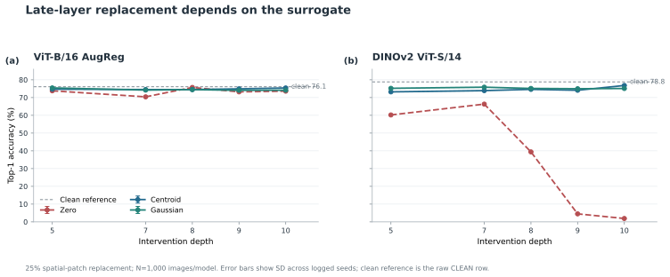
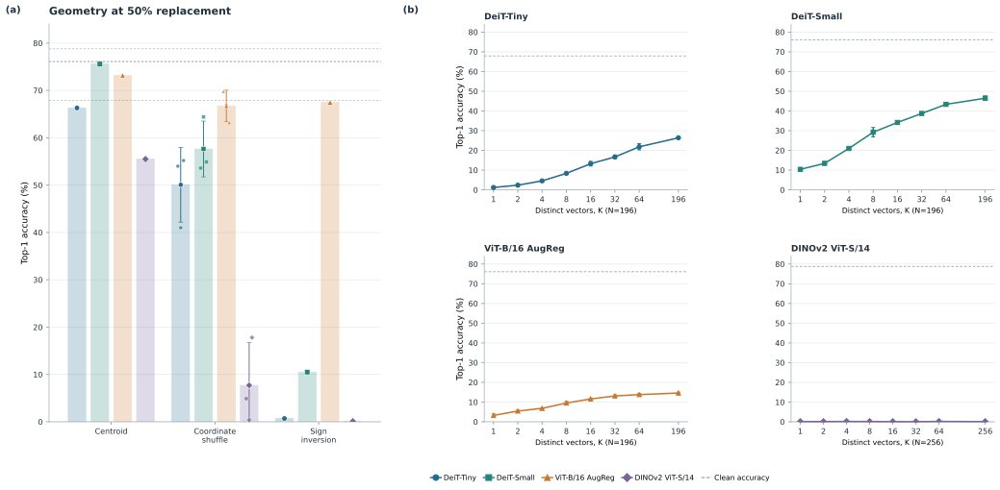
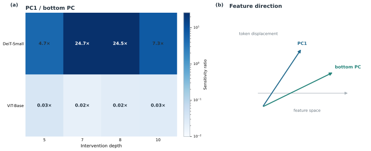
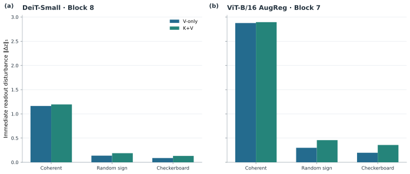
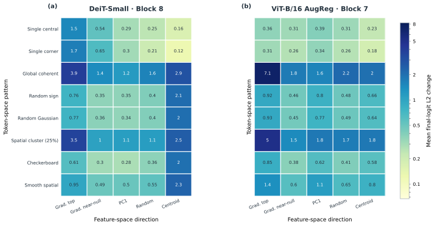
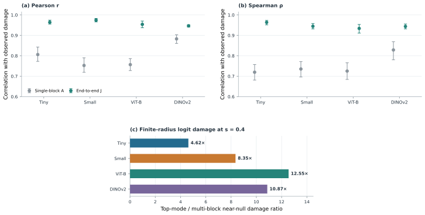
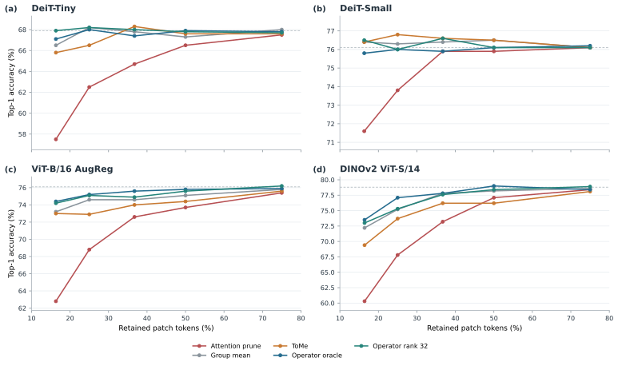

# Patch-Content Fungibility: Geometry, Functional Transmission, and Operator-Aware Token Compression

**Anonymous Authors**  
*Under review*

## Abstract

Vision transformers represent an image as a fixed sequence of patch slots, yet the role of each slot’s image-specific content in late layers remains unclear. We causally replace selected late-layer patch activations with class-agnostic calibration surrogates while preserving token slots, sequence length, model weights, and all subsequent computation. In the tested models, this fixed-slot content replacement reveals conditional fungibility bounded by feature geometry and token diversity, distinct from token pruning or merging. Mechanistic audits associate replaceability with anisotropic functional sensitivity, coherent accumulation and sign-dependent cancellation through the attention Value path, and declining normalized effective rank across all four tested models; near-null expansion at the primary threshold is evident in three models but small in DINOv2. For compression, an end-to-end downstream Jacobian serves as an offline, per-image oracle for the operator-aware objective; we evaluate the resulting variants on 1,000 held-out images per architecture. At the most aggressive tested budgets, operator-aware variants improve classification accuracy by 4.2–12.0 percentage points over the strongest pruning baseline for each architecture; the accuracy-token frontier shifts on three of four architectures, while a strong merging baseline remains competitive. Together, these findings provide a mechanistic account of late-layer patch-content fungibility through downstream functional geometry and attention-mediated cancellation, and demonstrate how this understanding can guide operator-aware token compression.

## 1. Introduction

Transformers use self-attention to mix token representations \citep{vaswani2017attention}, while vision transformers (ViTs) represent an image as a sequence of patch embeddings \citep{dosovitskiy2021vit}. Published ViT families include data-efficient supervised training \citep{touvron2021deit}, self-supervised representations \citep{caron2021dino, oquab2024dinov2}, hierarchical attention \citep{liu2021swin}, masked pretraining \citep{he2022mae}, scaling \citep{zhai2022scaling}, training regularization \citep{steiner2022augreg}, and register tokens \citep{darcet2024registers}. Token-reduction methods lower computation by changing which tokens are processed or how they are combined. We ask a different question: when does the remaining network require the image-specific content carried by a late patch slot?

We answer with a controlled content intervention. At a selected late layer, image-specific patch activations are causally removed and replaced with class-agnostic calibration surrogates while token slots, sequence length, model weights, and all downstream computation are held fixed. The intervention isolates content dependence while preserving the structure of the sequence received by later layers. Replaceability is conditional on feature geometry and token diversity; the intervention tests content substitution with fixed token slots rather than token deletion. Figure 1 summarizes the fixed-slot intervention, geometric and diversity constraints, and selective transmission through anisotropic sensitivity and Value-path cancellation.

*Figure 1. Fixed-slot late-layer patch-content substitution (a), geometric and diversity constraints (b), and anisotropic sensitivity with Value-path cancellation (c).*

We develop a connected ViT-specific account of Patch-Content Fungibility (PCF): fixed-slot substitution is constrained by feature geometry and token diversity, while Value-mediated coherence and cancellation shape downstream functional transmission. We then use this structure to formulate operator-aware token compression and evaluate it on confirmatory classification benchmarks. A separate carrier study tests how far operator-space corrections translate to nonlinear classification and measured throughput.

## 2. Related Work

Token-reduction methods change the sequence or the computation applied to it. DynamicViT and Expediting Vision Transformers via Token Reorganizations (EViT) score or reorganize tokens \citep{rao2021dynamicvit, liang2022evit}; Token Merging (ToMe) combines similar tokens \citep{bolya2023tome}; A-ViT (Adaptive Tokens for Efficient Vision Transformer) and AdaViT (Adaptive Vision Transformers for Efficient Image Recognition) use adaptive token computation \citep{yin2022avit, meng2022adavit}; and TokenLearner and Token Pooling form smaller, learned or pooled representations \citep{ryoo2021tokenlearner, marin2023tokenpool}. Adaptive Token Sampling (ATS) and Interpretability-Aware Redundancy Reduction (IA-RED<sup>2</sup>) select tokens using sampling or redundancy criteria \citep{fayyaz2022ats, pan2021iared}. Other approaches include PatchDropout, X-Pruner, and global structural pruning \citep{liu2023patchdropout, yu2023xpruner, yang2023globalvitprune}; joint pruning and squeezing \citep{wei2023tps}; and early-exit pruning for dense prediction \citep{tang2023dtop}. Evo-ViT, Dynamic Grained Encoder, and SPViT adapt token computation or selection \citep{xu2022evovit, song2021dge, kong2022spvit}, while Patch Slimming, Dynamic Transformers, end-to-end sparsity, activation sparsity, and structure-aware pruning explore complementary efficiency settings \citep{tang2022patchslimming, wang2021notallimages, chen2021chasing, chen2023sparsevit, zheng2022savit}. These methods provide strong efficiency baselines through token selection, token merging, or adaptive computation. PCF asks a complementary causal question: whether image-specific late patch content can be replaced while token slots, sequence length, model weights, and downstream computation remain fixed.

Compression by weight or structure pruning has a longer history. Optimal Brain Damage and Optimal Brain Surgeon use sensitivity-based approximations to remove parameters \citep{lecun1989obd, hassibi1993obs}. Later work studies connection pruning, resource-aware pruning, sparse trainable subnetworks, and movement-based pruning \citep{han2015weights, molchanov2017pruning, frankle2019lottery, sanh2020movement}. SparseGPT and Wanda study one-shot pruning of large language models (LLMs), while SliceGPT removes dimensions. Singular value decomposition (SVD) is also used for large-language-model compression in the published SVD-LLM method, which applies a truncation-aware variant \citep{frantar2023sparsegpt, sun2024wanda, ashkboos2024slicegpt, wang2025svdllm}. PCF complements these methods by using the downstream pre-classifier readout Jacobian to evaluate and optimize fixed-slot patch carriers while preserving the token sequence structure.

Interpretability research cautions that attention weights alone need not explain a model’s decision. Controlled studies examine whether attention is explanation and how explanation changes under interventions \citep{jain2019attentionnotexplanation, serrano2019attentioninterp, wiegreffe2019attentionnotnot}. Attention flow, Integrated Gradients, saliency-map sanity checks, and transformer-specific relevance propagation provide complementary methods for tracing or attributing model behavior \citep{abnar2020attentionflow, sundararajan2017ig, adebayo2018sanity, chefer2021transformerinterp}. Causal abstraction offers a framework for connecting interventions to model-level causal structure \citep{geiger2022causal}. Our evidence uses direct activation interventions and held-out prediction of perturbation damage; it is bounded to the tested models, readouts, and cohorts. A close methodological precedent is Parodi et al.’s zero-ablation study of specialized DINO register tokens: mean, noise, and cross-image register-shuffling substitutions preserve frozen-feature task performance within 1 percentage point of the unmodified baseline. We study ordinary spatial patch slots and characterize how replacement validity varies with depth, replacement fraction, learned feature geometry, and token diversity \citep{parodi2026zeroablation}.

## 3. Experimental Setup and Interventions

Image-based studies use frozen pretrained models on ImageNet-1k validation data. Calibration and evaluation sets are disjoint, and calibration-derived moments, prototypes, and replacement quantities are estimated using calibration data only. N denotes the sampling unit shown in Table I; image, operator-space, and perturbation cohorts remain distinct and are never pooled. The strict confirmatory benchmark evaluates DeiT-Tiny and DeiT-Small at block 8, ViT-B/16 AugReg at block 7, and DINOv2 ViT-S/14 at block 8. It uses 1,000 held-out images per architecture, one per class (evaluation seed 9201), and a disjoint 1,000-image calibration set (seed 9101); no tuning uses held-out images.

**TABLE I**

**PRIMARY RESULTS AND EVIDENCE SCOPE**

| Study family | Evaluation unit | Key controls | Main finding |
|---|---|---|---|
| Fixed-slot patch replacement | N=1,000 images/model per study; cohorts separate | 25%, 50%, and 100% replacement; study-specific calibration | Tolerance varies with depth, surrogate geometry, diversity, and feature direction; directions derived by principal component analysis (PCA) of calibration activations outperform energy-matched random directions in tested settings. |
| Functional and joint-stream geometry | Functional geometry: N=100 images per model; joint-stream geometry: N=100 images per model (separate cohort) | Margin-gradient feature metric; coherent and sign-varying token patterns | Normalized effective rank declines across four models; near-null expansion at the primary threshold is strong in three and small for DINOv2. Damage varies with feature direction and token coherence. |
| Attention Value-path audit | N=100 images per model | Frozen-attention comparison across coherent and sign-varying patterns | Coherent Value contributions accumulate; sign-varying contributions partially cancel. |
| Multi-block operator prediction | N=100 held-out perturbations (vectors; per model) | Single-block vs. end-to-end prediction on a fixed four-family mixture | End-to-end Jacobian predictions are more strongly associated with measured damage than single-block predictions under the tested mixture. |
| Strict confirmatory compression | N=1,000 held-out images per architecture | Frozen protocol and architecture-specific budgets | At the most aggressive tested budgets, operator-aware methods beat the strongest pruning baselines by 4.2–12.0 pp; ToMe remains competitive. |
| Practical carrier evaluation | Classifier: N=1,000 held-out images per architecture; operator-space: N=100 held-out operator-space images (separate cohort) | Separate classifier/throughput and operator-space protocols | Classifier and throughput gains are mixed; operator-space gains do not establish reliable classification or general deployment improvement. |

*Table I. Rows group related analyses to summarize the main findings without pooling their cohorts or endpoints. The multi-block unit counts held-out perturbations; classifier and operator-space carrier results use separate units and endpoints.*

**Statistical reporting.** Where conditions share a cohort, paired image-level comparisons use the same image under each condition. Seeded results are summarized at the run level; means and sample standard deviations are reported across runs where shown, and seed–image rows are not treated as independent images. For the grouped-diversity extension, each image’s outcome is first averaged across five seeds, then paired t and Wilcoxon tests are applied. Where specified by protocol, Top-1 differences use exact McNemar tests; margin contrasts use paired Student’s t and Wilcoxon tests, with study-specific bootstrap or t-based intervals and Cohen’s d<sub>z</sub> where reported. Benjamini–Hochberg correction is applied only within protocol-defined comparison families. Multi-block analyses use perturbations as the sample unit, and operator-space outcomes remain distinct from classifier-image outcomes; Supplementary Section S10 gives the study-specific procedures and seed IDs.

In the equations, N<sub>img</sub> denotes the number of image samples, n_p the number of spatial patch slots, and D the feature dimension; Table I reports N alongside each study's sampling unit. For the fixed-slot intervention, let P_ℓ∈ℝ^{n_p×D} contain the patch activations at layer ℓ, with p_{ℓ,i}∈ℝ^D as row i and r_{ℓ,i} its class-agnostic calibration surrogate. The binary indicator u_i selects the slots to replace:
$$
p̃_{ℓ,i}=(1−u_i)p_{ℓ,i}+u_i r_{ℓ,i}, u_i∈{0,1}, i=1,…,n_p.
\tag{1}
$$
Thus, when u_i=0 the original activation remains, and when u_i=1 it is replaced by the corresponding surrogate. The class token, position indices, number of rows, model weights, and subsequent computation remain unchanged. The intervention isolates dependence on image-specific content while keeping token slots fixed.

Surrogate values and replacement masks are protocol-specific: audited controls include calibration centroids, diagonal-Gaussian samples, and geometry or PCA-aligned variants. The mask identifies the selected patch positions and replacement fraction; calibration-derived quantities are estimated only from calibration data. Section 4 reports the layer, fraction, and control used in each replacement study.

For compression, the end-to-end Jacobian maps a patch-matrix perturbation at layer ℓ to the pre-classifier readout u defined in Section 6, not directly to Top-1 accuracy. Evaluated at the unperturbed activation, its product with a flattened perturbation predicts the readout change to first order; classification outcomes are measured by applying the actual classifier to the compressed model output. The full-J oracle uses a per-image Jacobian as an offline reference, not a deployable inference procedure. Section 6 defines the operator objective and grouping variables.

For practical carrier evaluation, q counts directions from the centered calibration activation covariance Σ<sub>act,ℓ</sub>; a separate low-rank subspace of calibration-derived downstream-Jacobian targets estimates a fixed coefficient vector α. The basis and coefficients are frozen before held-out classification, which uses no evaluation labels or per-image Jacobian. The operator-space audit and classifier evaluation use separate cohorts (Table I); the latter uses 500 calibration and 1,000 held-out images per architecture. Throughput measurements include the complete model call, with 50 warm-up and 100 timed iterations per row.

## 4. Geometric and Diversity Constraints on Patch-Content Fungibility

### 4.1 Depth-Dependent Replacement Tolerance

Figure 2 shows a pronounced distinction between zeroing patch activations and replacing their image-specific content with calibration-derived surrogates. On DINOv2 ViT-S/14, zero replacement reduces accuracy to 60.2% at depth 5 and 4.5% at depth 9, whereas centroid replacement retains 73.2% and 74.1%, respectively. The contrast also appears at depth 8 in DeiT-Tiny (59.1% vs. 67.2%) and DeiT-Small (69.6% vs. 76.1%), and at depth 7 in ViT-B/16 AugReg (70.4% vs. 74.5%). Gaussian replacement exhibits similar preservation in several settings, achieving 75.3% accuracy on DeiT-Small at depth 8.

Together, these results distinguish the functional consequences of removing patch activations from those of replacing image-specific content with compatible surrogate representations. The magnitude and depth profile of this distinction vary across architectures, with no common transition depth or uniformly monotonic trend across the tested models. Thus, sensitivity to zero ablation does not necessarily imply that downstream classification requires the original image-specific patch content.

*Figure 2. Depth-wise Top-1 accuracy under 25% spatial-patch replacement across four architectures. Each model uses 1,000 held-out evaluation images and a disjoint 1,000-image calibration set. Panels (a,b) show DeiT-Tiny and DeiT-Small, with calibration-derived global-mean centroids and Gaussian results averaged over five seeds. Panels (c,d) show ViT-B/16 AugReg and DINOv2 ViT-S/14, including a post hoc depth-6 follow-up, with Gaussian results averaged over three seeds. Error bars indicate sample standard deviation across Gaussian seeds; gray dashed lines indicate clean accuracy.*

### 4.2 Geometric and Diversity Constraints

**Geometry.** At Block 8 with 50% replacement, coordinate-permuted calibration centroids yield mean Top-1 accuracy ± sample SD of 50.1% ± 7.9% (DeiT-Tiny), 57.6% ± 5.9% (DeiT-Small), 66.7% ± 3.3% (ViT-B/16 AugReg), and 7.7% ± 8.9% (DINOv2 ViT-S/14). The corresponding calibration-centroid controls are 66.3%, 75.6%, 73.2%, and 55.5%; sign-inverted controls are 0.7%, 10.5%, 67.5%, and 0.1% (Figure 3(a)). Coordinate permutation preserves the centroid’s norm and coordinate-value multiset while changing channel assignment; sign inversion preserves its norm while reversing direction. These contrasts show that feature geometry matters in the tested settings, with architecture-dependent effects.

**Token diversity.** Under complete grouped-Gaussian replacement at Block 8, mean Top-1 rises at every tested K for DeiT-Tiny, DeiT-Small, and ViT-B/16 AugReg (Figure 3(b)). From K=1 to K=196, accuracy increases from 1.2% to 26.4%, 10.4% to 46.5%, and 3.24% to 14.58%, respectively. For ViT-B, the paired image-level endpoint gain is 11.34 percentage points (95% CI 9.55–13.13; N=1,000 paired images). This graded pattern appears in three architectures; it does not imply that every adjacent K increment is significant. K counts distinct surrogate vectors across token positions, not feature-space dimensionality.

DINOv2 ViT-S/14 differs: Top-1 remains between 0.06% and 0.18% across K, with a paired K=1-to-256 change of −0.02 percentage points (95% CI −0.16 to 0.12; N=1,000). Its official readout includes a mean normalized-patch representation, so we report the true-class margin alongside accuracy. The mean margin changes from −9.233 to −7.982 (paired change +1.250, 95% CI 1.091–1.410; Supplementary Figure S10); this margin shift is not Top-1 recovery.

*Figure 3. (a) Top-1 accuracy for centroid, coordinate-permuted, and sign-inverted replacement at Block 8 (50% of spatial patches) across four architectures. Coordinate-permutation bars show three-seed means ± sample SD with individual outcomes; centroid and sign-inversion are single runs. Gray dashed lines mark clean accuracy. (b) Top-1 accuracy under complete grouped-Gaussian replacement as K distinct surrogate vectors across token positions varies (196 positions for DeiT/ViT-B; 256 for DINOv2). Points show seed means ± sample SD (three seeds for DeiT; five for ViT-B/DINOv2); dashed lines mark clean accuracy. (c) Top-1 accuracy under complete replacement at Block 8 for calibration-derived PC1 and an energy-matched random one-dimensional direction. Bars show seed means with individual outcomes (five seeds for DeiT; three for ViT-B/DINOv2). DINOv2 remains near the accuracy floor (0.17% vs. 0.00%). All panels use 1,000 held-out images and disjoint 1,000-image calibration sets per architecture.*

**PCA-aligned variation.** Under complete replacement at Block 8, calibration-derived PC1 outperforms an energy-matched random one-dimensional direction in the tested settings with measurable Top-1 (Figure 3(c)): 18.64% versus 10.80% for DeiT-Tiny and 28.08% versus 20.78% for DeiT-Small (five seeds each), and 40.10% versus 6.70% for ViT-B/16 AugReg (three seeds). Figure 3(b) varies diversity across token positions by changing K, the number of distinct surrogate vectors; Figure 3(c) holds the variation one-dimensional and tests its feature-space direction. In both PC1 and random-direction conditions, independently sampled scalar coefficients allow variation across token positions. DINOv2 remains near the Top-1 floor (0.17% versus 0.00%), with mean true-class margins of −8.438 for PC1 and −8.654 for the random direction. PC1 is the leading eigenvector of centered calibration-activation covariance, not a learned model parameter. These results show that feature-space direction and token-position diversity are distinct constraints; they do not establish rank-1 sufficiency or full accuracy recovery. Together, the controls motivate the directional functional-sensitivity analysis in Section 5.1.

## 5. Functional Geometry and Attention-Mediated Transmission

### 5.1 Anisotropy and Functional Geometry

Equal-norm feature perturbations can have different functional effects because margin sensitivity depends on direction. For image \(s\), let \(y_s\) and \(r_s\) denote its clean predicted and runner-up classes, held fixed at the unperturbed input, and let \(p_{\ell,s,i}\) denote the activation at spatial-patch position \(i\) in layer \(\ell\). We use \(g_{s,i}\) for the gradient of this clean margin with respect to \(p_{\ell,s,i}\) and define \(M_\ell\) as the empirical uncentered second moment of scalar margin gradients:
$$
g_{s,i}=∇_{p_{ℓ,s,i}}(z_{s,y_s}−z_{s,r_s}), M_ℓ=(1/(N_{img}n_p))Σ_{s=1}^{N_{img}}Σ_{i=1}^{n_p}g_{s,i}g_{s,i}ᵀ.
\tag{2}
$$

As defined in Section 3, N<sub>img</sub> denotes the number of image samples. For a unit feature direction \(v\), \(v^\top M_\ell v=(N_{\mathrm{img}}n_p)^{-1}\sum_{s,i}(g_{s,i}^\top v)^2\) is the average squared directional derivative of the clean classification margin across images and patch positions. Activation covariance measures feature variation, whereas \(M_\ell\) measures local functional sensitivity. The full downstream Jacobian \(J_{\ell\to L}\), introduced in Section 5.3, is a different object that maps perturbations across all patch positions to the pre-classifier readout.

Figure 4 characterizes two complementary properties of \(M_\ell\): (a) its directional sensitivity along the highest- and lowest-variance activation principal components, and (b) the depth-wise evolution of its threshold-defined near-null eigenvalue fraction.


*Figure 4. (a) Ratio of squared-margin sensitivity along the leading-variance PC to that along the lowest-variance PC at depths 5, 7, 8, and 10; color encodes the ratio on a log scale, with values above 1 indicating greater sensitivity along PC1. PCs come from centered calibration-activation covariance. (b) Fraction of \(M_\ell\) eigenvalues at or below \(10^{-3}\lambda_{\max}\) across depth. Each architecture uses the same \(N=100\)-image calibration cohort. DINOv2 sensitivities use its official linear classifier on the concatenated normalized CLS and mean-patch readout. The lowest-variance covariance direction is weakly separated in ViT-B, so its ratio is a cohort-level directional estimate.*

At depth 8, the corrected PC1-to-lowest-variance-PC sensitivity ratios are 0.089 for DeiT-Tiny, 0.041 for DeiT-Small, 65.2 for ViT-B/16 AugReg, and 0.199 for DINOv2 ViT-S/14. PC1 is less sensitive than the selected lowest-variance direction in three models but more sensitive in ViT-B. The ViT-B lowest-variance covariance eigengap is only \(1.53\times10^{-5}\) of the largest covariance eigenvalue, so its large ratio describes sensitivity along the selected sample eigenvector rather than a stable ranking of the full low-variance subspace. Activation variance therefore does not provide a model-independent proxy for margin sensitivity.

The entropy-based effective rank of \(M_\ell\), normalized by feature dimension \(D\), declines from depth 5 to depth 10 in all four architectures: 0.541 to 0.125 for DeiT-Tiny, 0.467 to 0.114 for DeiT-Small, 0.383 to 0.140 for ViT-B, and 0.453 to 0.323 for DINOv2. At the operational cutoff \(\lambda_k\le10^{-3}\lambda_{\max}\), the near-null fraction rises from 0.52% to 31.77% in DeiT-Tiny, 0.26% to 57.03% in DeiT-Small, and 0.26% to 49.61% in ViT-B. DINOv2 changes only from 0.26% to 1.56% at this cutoff. Its depth-10 fraction is 64.84% at the looser \(10^{-2}\lambda_{\max}\) cutoff, showing that this threshold summary is particularly cutoff-sensitive for DINOv2. The effective-rank decline is shared across models, while threshold-defined near-null expansion is architecture-dependent. These depth-wise associations are consistent with increasing late-layer fungibility in several models but do not establish an exact nonlinear invariance subspace or a causal explanation.

The spectra, cutoff sensitivity, directional sensitivities, normalized effective ranks, and positive-semidefinite checks are reported in Supplementary Table S2. Because \(M_\ell\) contains no cross-token terms, Section 5.2 examines how attention-mediated Value aggregation combines perturbations across patch positions.

### 5.2 Value-Path Coherence and Cancellation

Across the four architectures, the frozen-attention condition reproduces nearly all of the full-perturbation immediate readout-change magnitude for coherent perturbations: frozen/full ratios are 97.4% for DeiT-Small (Block 8), 99.4% for ViT-B/16 AugReg (Block 7), 100.1% for DeiT-Tiny (Block 8), and 100.8% for DINOv2 ViT-S/14 (Block 8). Random-sign and checkerboard patterns produce smaller absolute changes in both conditions, although their relative agreement varies by model; for example, the frozen/full ratio is 98.3% for DINOv2 random-sign perturbations but 70.7% for its checkerboard pattern, and 48.1% for DeiT-Tiny checkerboard. Full perturbation changes \(Q\), \(K\), \(V\), and the residual stream and recomputes attention. The frozen-attention condition holds clean \(Q\), \(K\), and attention fixed while perturbing \(V\) and the residual, so its difference from the full condition is not a pure Value-only causal effect or an additive attribution.

The primary projection-path audit remains limited to DeiT-Small and ViT-B/16 AugReg and is reported separately in Supplementary Figure S12. With the residual stream clean, the V-only immediate-readout norm is 97.4% and 99.4% of the corresponding \(K+V\) norm, respectively; here \(K+V\) is the denominator, distinct from the full-perturbation denominator above. A separate signed true-class logit-drop contrast ratio—coherent-minus-random-sign contrast under frozen-attention V-only with perturbed residual, divided by the corresponding full-block contrast—is 70.8% for DeiT-Small and 102.2% for ViT-B/16 AugReg (Supplementary Table S4). Both ViT-B contrasts are negative; because the interventions are not additive causal components, a ratio above 100% is not a causal contribution percentage. Signed-logit outcomes for the reduced DeiT-Tiny and DINOv2 replications are reported separately in Supplementary Figure S11; Figure 5 uses the immediate-readout norm for every architecture.


*Figure 5. Mean per-image Euclidean \(L_2\) change in the immediate readout under full perturbation and frozen-attention V-only with perturbed residual: (a) DeiT-Small, Block 8; (b) ViT-B/16 AugReg, Block 7; (c) DeiT-Tiny, Block 8; and (d) DINOv2 ViT-S/14, Block 8. Each panel shows coherent, random-sign, and checkerboard patterns in that order and uses its own y-axis scale. Full perturbation changes \(Q,K,V\) and the residual and recomputes attention; frozen attention keeps clean \(Q,K,A\) and perturbs \(V\) and the residual. Bars are means over \(N=100\) outcome images. Panels (c,d) are reduced replications, not full Q/K/V decompositions. DINOv2’s immediate-readout vector concatenates the CLS and mean-patch representations; the other models use the CLS representation.*

For one image, let \(w_{h,i}^{\mathrm{clean}}\) be the clean attention weight from spatial patch \(i\) to the CLS query in head \(h\). The signed attention-weighted token pattern and frozen-attention Value-context change are
$$
\Gamma_h(a)=\sum_{i=1}^{n_p}w_{h,i}^{\mathrm{clean}}a_i,\qquad
\Delta c_h^{(V)}=\sum_{i=1}^{n_p}w_{h,i}^{\mathrm{clean}}\Delta v_{h,i}∈ℝ^{d_h}.
\tag{3}
$$
Here \(\Delta v_{h,i}\) is the measured change in the post-normalization Value projection for patch \(i\). \(\Gamma_h(a)\) summarizes how the token pattern aligns with clean attention weights; the second expression retains token-specific Value changes and gives the pre-output-projection head context audited in code. This equation describes the CLS-attention branch; DINOv2’s classifier readout also includes mean normalized patch features, so (3) does not represent every component of its readout. With attention frozen, coherent signed contributions can accumulate, whereas varying signs can partially cancel. This decomposition isolates frozen-attention Value-path transmission while leaving nonlinear attention rerouting and other paths outside its scope.

### 5.3 End-to-End Functional Transmission

**Joint token–feature perturbation.** The effect of a patch-stream intervention depends on both its feature direction and how that direction is distributed across token positions. We represent the joint-stream probe at layer \(\ell\) as
$$
ΔP_{ℓ}=αavᵀ, a∈ℝ^{n_p}, v∈ℝ^{D}, ‖a‖₂=‖v‖₂=1, α=sσ_{ℓ}≥0, ‖ΔP_{ℓ}‖_{F}=α.
\tag{4}
$$
Here \(a\) encodes the token-position pattern, \(v\) the feature-space direction, and \(s\) is a dimensionless scale. In this joint-stream protocol, \(σ_{ℓ}\) is the square root of the trace of \(Σ_{ℓ}\), where \(Σ_{ℓ}\) is the sample covariance of all patch activations pooled across calibration images and spatial positions and centered by their pooled feature mean (with denominator \(N_{\mathrm{img}}n_p-1\)). Thus \(\sigma_\ell\) is the square root of the summed feature variances, and \(α\) is the Frobenius norm of the injected perturbation. This scale is specific to the joint-stream experiment.

The joint-stream heatmaps show that final-logit response varies with both feature direction and token pattern in the tested conditions: the selected sensitive direction generally produces larger changes for coherent or spatially clustered patterns than the selected near-null direction. Figure 6 summarizes the DeiT-Small Block-8 and ViT-B/16 AugReg Block-7 grids; Supplementary Figure S14 shows the full depth grid for these two models. DeiT-Tiny and DINOv2 have reduced Block-8 replications and are not part of that six-panel grid. Each model uses the same \(N=100\)-image cohort to estimate directions and score outcomes, so these results are not held-out evaluations. The direction-by-pattern regression is saturated and has no residual degrees of freedom; it therefore supports no inferential significance claim. The joint-stream audit selects its feature directions using its own per-image mean patch-margin-gradient metric, distinct from \(M_\ell\) in Section 5.1 and the end-to-end readout Jacobian \(J_{\ell\to L}\) below. The heatmaps display mean final-logit \(L_2\) change, not either gradient metric.


*Figure 6. Mean per-image final-logit \(L_2\) change at \(s=1\) under the norm-matched perturbations in Eq. (4), across eight token-space patterns and five feature-space directions: (a) DeiT-Small, Block 8; (b) ViT-B/16 AugReg, Block 7. Cell values are annotated and both panels use the same logarithmic color scale as Supplementary Figure S14. “Grad. top” and “Grad. near-null” denote the largest- and smallest-eigenvalue directions of the joint-stream audit’s per-image mean patch-margin-gradient metric; PC1 is the leading activation-covariance direction, Random is an isotropic unit direction, and Centroid is the normalized calibration mean. For each model, the same \(N=100\)-image cohort is used to estimate directions and score outcomes; the display is descriptive, not a held-out or inferential interaction test.*

**End-to-end transmission operator.** To describe propagation through the remaining blocks, let \(u\) denote the pre-classifier readout vector. We define the clean-state Jacobian from all spatial patch activations at layer \(\ell\) to \(u\) by
$$
J_{ℓ→L}=∂u/∂rvec(P_{ℓ})∈ℝ^{d_u×n_pD}, Δu≈J_{ℓ→L}rvec(ΔP_{ℓ}), rvec(X)=vec(Xᵀ).
\tag{5}
$$
For an \(n_p\times D\) patch matrix, \(\operatorname{rvec}\) uses row-major order.  For DeiT-Tiny, DeiT-Small, and ViT-B/16 AugReg, \(u\) is the normalized CLS readout and \(d_u=D\); for DINOv2, \(u\) concatenates normalized CLS and mean normalized patch features, so \(d_u=2D\). The Jacobian is defined through the pre-classifier readout, excluding the linear classification head; measured Top-1 and logit damage use the complete downstream model and classifier. The Jacobian is evaluated at the unperturbed activation, so its product is a local first-order readout prediction rather than an exact finite-perturbation identity. Unlike the feature-space margin metric \(M_\ell\), \(J_{\ell\to L}\) maps perturbations across all patch positions to a downstream readout.

**Predictive validation.** The four-model comparison evaluates 100 designed perturbation vectors per architecture, with 25 vectors from each of four families: end-to-end top modes, middle modes, end-to-end near-null modes, and isotropic Gaussian controls. Each vector is scored on the same fixed 20-image reference batch, and the perturbation vector—not an image or token—is the correlation unit. Here \(A_8\) is the clean-state, single-block attention/Value transmission map from the patch perturbation to the immediate readout, estimated over the reference images. We compare the measured final-logit \(L_2\) damage from the full downstream computation with predictions from \(A_8\) and end-to-end \(J_{8\to L}\) (Figure 7(a,b)). Across models, Pearson correlations are 0.753–0.883 for \(A_8\) and 0.946–0.975 for \(J_{8\to L}\); Spearman correlations are 0.720–0.829 and 0.934–0.964, respectively (model-specific estimates and stratified-bootstrap intervals are in Supplementary Table S3). The bootstrap resamples perturbation vectors within each family. Within-family correlations can be weak or negative. Moreover, \(A_8\) averages over the 20-image reference batch, whereas \(J_{8\to L}\) is linearized at its first image. The higher aggregate correlations therefore indicate stronger predictive association for this prescribed mixture, not general superiority over arbitrary perturbations or independent image batches.

**Directional transmission contrast.** A separate finite-radius comparison shows greater final-logit \(L_2\) damage for the multi-block top mode than for the multi-block near-null mode at \(s=0.4\): the top-to-near-null damage ratios are 4.62 for DeiT-Tiny, 8.35 for DeiT-Small, 12.55 for ViT-B/16 AugReg, and 10.87 for DINOv2 (Figure 7(c)). These ratios compare two finite-radius outcomes and are distinct from the prediction correlations above. In the original DeiT-Small Block-8 analysis, the mean principal angle from Block 8 to Block 9 was 49.0°.


*Figure 7. (a,b) Pearson and Spearman correlations of predicted and measured final-logit \(L_2\) damage for single-block \(A_8\) and end-to-end \(J_{8\to L}\), by architecture. Each estimate uses 100 designed perturbation vectors scored on a fixed 20-image reference batch; perturbation vectors are the sample unit. Error bars show stratified percentile-bootstrap 95% intervals (2,000 replicates, resampling 25 vectors within each of four families). \(A_8\) averages over the reference batch, whereas \(J\) is linearized at its first image. (c) Ratio of mean finite-radius final-logit \(L_2\) damage under the multi-block top mode to that under the multi-block near-null mode at \(s=0.4\). DINOv2 uses its official CLS-plus-mean-patch readout.*

**Mechanistic synthesis.** The three analyses measure complementary parts of the same pathway: \(M_\ell\) characterizes local feature-direction sensitivity, token-position coherence shapes attention-mediated accumulation or cancellation, and \(J_{\ell\to L}\) captures downstream multi-block transmission to the pre-classifier readout. Together, they show that feature direction, token coherence, and downstream transmission jointly constrain perturbation damage in the tested settings, motivating the operator-aware compression analysis in Section 6.

## 6. Operator-Aware Token Compression

### 6.1 Carrier Grouping and Optimization

For each image, n_p patch tokens are assigned to B carriers. Let S∈{0,1}^{n_p×B} be the assignment matrix, with exactly one nonzero per row, and let C∈ℝ^{B×D} contain the carrier vectors. The reconstructed patch matrix is P̂=SC. The set G_j contains the patch indices assigned to carrier j, and m_j=|G_j| is its membership count. The Group Mean baseline sets each carrier to the average of the patches assigned to that group:
$$
c_j^{mean}=(1/m_j)Σ_{i∈G_j}p_i, m_j=|G_j|.
\tag{6}
$$
The residual matrix E=P−SC is the difference between the original and reconstructed patch features. **Low-rank operator approximation.** The full-J oracle uses J_s=J_{ℓ→L}; for a rank-r approximation, the solver instead uses J_s=U_rᵀJ_{ℓ→L}, where U_r contains the leading left singular vectors. In either case, the solver minimizes
$$
C^*=arg min_C ‖J_s rvec(P−SC)‖_2^2 + λ‖P−SC‖_F^2.
\tag{7}
$$
The first term penalizes the readout change predicted by the selected operator, while the second is a trace-scaled Tikhonov penalty. Let d_s be the row dimension of J_s (d_u for the full operator and r for a rank-r solve), and let (J_s)_i be its D-column block for patch i. The solver constructs the readout-space Gram matrix and regularization scale
$$
K_j=Σ_{i∈G_j}(J_s)_i, H_J=Σ_{j=1}^{B}(1/m_j)K_jK_jᵀ, λ=10·tr(H_J)/d_s.
\tag{8}
$$
H_J is a positive-semidefinite Gram matrix of grouped Jacobian blocks, not a feature-activation covariance. It is distinct from the centered calibration-activation covariance that defines PCA directions. The per-image closed-form carrier update is
$$
r_{mean}=J_s rvec(E_{mean}), c_j^*=c_j^{mean}+(1/m_j)K_jᵀ(H_J+λI_{d_s})^{-1}r_{mean}.
\tag{9}
$$
Because the Group Mean residual sums to zero within each group, these normal equations give the exact minimizer of the stated quadratic objective. This exactness applies to the local linearized objective, not to the nonlinear classifier loss. The full-J solution is computed per image and is an offline oracle; low-rank solves are evaluated against the full J on the same confirmatory cohort.

Each compressed key also carries the number s_t of original tokens represented by that key. With T=B+1 compressed tokens and d_h dimensions per head, the compressed attention adds log multiplicity to each key's attention logit:
$$
A^{(h)}=softmax_{key}(Q^{(h)}K^{(h)ᵀ}/√d_h+1_T(log s)ᵀ), s_0=1, s_j=m_j.
\tag{10}
$$
The vector s includes multiplicity one for the class token and m_j=|G_j| for patch carriers; 1_T broadcasts the log-size bias over query positions. This proportional-attention correction is used in Token Merging (ToMe) to account for merged-token size \citep{bolya2023tome}. The implementation applies the same key bias in each compressed downstream attention block.

### 6.2 Confirmatory Compression Results

At each architecture’s most aggressive tested token budget, Table II reports the exact Top-1 comparison among the best pruning baseline, Group Mean, ToMe, the full-J oracle, and its rank-16 and rank-32 approximations. The selected budgets differ by architecture (32 retained tokens for DeiT-Tiny, DeiT-Small, and ViT-B/16 AugReg; 42 for DINOv2 ViT-S/14), so the rows are within-architecture comparisons rather than a matched token-count experiment. Figure 8 presents the full accuracy-token curves.

**TABLE II**

**STRICT CONFIRMATORY TOP-1 ACCURACY AT THE MOST AGGRESSIVE TESTED BUDGET**

| Architecture | Budget | Best pruning baseline | Group Mean | ToMe | Full-J oracle | Rank-16 | Rank-32 |
|---|---:|---:|---:|---:|---:|---:|---:|
| DeiT-Tiny | 32 | Random, 58.6% | 66.5% | 65.8% | 67.1% | 67.1% | 67.9% |
| DeiT-Small | 32 | Attention, 71.6% | 76.4% | 76.4% | 75.8% | 76.5% | 76.5% |
| ViT-B/16 AugReg | 32 | Random, 69.2% | 73.2% | 73.0% | 74.4% | 73.7% | 74.2% |
| DINOv2 ViT-S/14 | 42 | Random, 61.5% | 72.2% | 69.4% | 73.5% | 73.2% | 73.0% |

*Table II. Top-1 accuracy on N=1,000 held-out images per architecture. The pruning entry is the strongest among Random, Norm, and Attention Pruning at the listed budget. The architecture-specific budgets are the lowest budgets evaluated in the strict confirmatory sweep.*

Across the evaluated method, budget, and seed conditions, operator residual ‖J E‖ is associated with measured logit-L2 distortion: per-architecture Pearson r ranges from 0.739 to 0.866, and Spearman ρ ranges from 0.792 to 0.916. Because the same held-out cohort is reused across conditions, this is a condition-level association rather than an image-level generalization estimate. Rank-16 and rank-32 outcomes vary by architecture and budget; the confirmatory data do not support a universal recovery fraction. Figure 8 reports the measured accuracy-token curves, while Table II lists rank-16 and rank-32 Top-1 at each architecture's most aggressive tested budget.

*Figure 8. Confirmatory Top-1 accuracy versus retained patch-token fraction for four architectures. Curves show pruning, Group Mean, ToMe, the full-J oracle, and rank-32; rank-16 Top-1 is listed in Table II at the most aggressive tested budget. Each architecture uses N=1,000 held-out images.*

## 7. Practical Carrier Evaluation

### 7.1 Static Feature-PCA Corrections

In the separate operator-space cohort, static Feature-PCA at q=16 recovers 54.91% of the restricted-oracle ‖J E‖ gain for DeiT-Small. In a separate q=16 ablation, shuffling PCA coordinates raises mean ‖J E‖ from 6.602 to 8.076 (Δ=1.474). Both are linearized operator-space results, not classifier-level recovery rates.

### 7.2 Classification and Throughput Evaluation

Static Feature-PCA does not consistently improve classifier accuracy over Hybrid Group Mean: both DeiT-Small budgets and the aggressive DINOv2 budget are at or below the baseline, while ViT-B/16 AugReg shows a modest positive case (Table III).

**TABLE III**

**CLASSIFIER-CARRIER COUNTS AT REPORTED BUDGETS**

| Architecture | Budget | Hybrid Group Mean | Static Feature-PCA, q=16 | Static Feature-PCA, q=32 |
|---|---:|---:|---:|---:|
| DeiT-Small | 98 | 764/1,000 (76.4%) | 763/1,000 (76.3%; −0.1 pp) | 760/1,000 (76.0%; −0.4 pp) |
| DeiT-Small | 49 | 755/1,000 (75.5%) | 740/1,000 (74.0%; −1.5 pp) | 740/1,000 (74.0%; −1.5 pp) |
| DINOv2 ViT-S/14 | 42 | 613/1,000 (61.3%) | 568/1,000 (56.8%; −4.5 pp) | 570/1,000 (57.0%; −4.3 pp) |
| ViT-B/16 AugReg | 49 | 712/1,000 (71.2%) | 719/1,000 (71.9%; +0.7 pp) | 716/1,000 (71.6%; +0.4 pp) |

*Table III. Correct predictions out of 1,000 held-out images and Top-1 accuracy for the held-out classifier-carrier study. Parenthetical differences are percentage-point (pp) changes from Hybrid Group Mean at the same architecture and budget. The classifier cohort is distinct from the operator-space study.*

The measured held-out classifier-carrier accuracy–throughput boundary at batch size 64 is shown in Supplementary Figure S13.

Calibration-frozen selective risk gating also lacks a consistent classifier benefit: at DeiT-Small budget 98 it reaches 75.8% versus 76.4% for Hybrid Group Mean, and at DINOv2 budget 42 it reaches 58.5% versus 61.3%. The exploratory operator-space gate has area under the receiver operating characteristic curve (AUROC) 0.784. On the measured accuracy-throughput frontier, Clean is non-dominated in several regimes, Group Mean is a practical batched baseline, and q=16 adds a narrow ViT-B/16 AugReg point at some batch sizes; q=32 and selective q=16 do not establish a general frontier improvement. These timings cover the full model call rather than isolated operator overhead.

Additional exploratory correction variants are summarized in Supplementary Section S8; they do not change the distinction between operator-space performance and classifier or deployment benefit.

## 8. Limitations

Mechanistic evidence comes from the finite cohorts in Table I and four pretrained vision-transformer families evaluated on one ImageNet validation subset; broader model and task coverage remains untested. The margin-gradient and readout-Jacobian analyses characterize local, first-order behavior, and a threshold-defined near-null fraction does not establish exact nonlinear invariance. The full-J compression objective is an offline oracle requiring per-image Jacobian construction. Classifier-carrier results show that reducing linearized error alone is not sufficient for a deployment gain; measured full-model runtime is specific to the tested hardware, batch sizes, and implementations and does not isolate operator overhead.

## 9. Conclusion

Across four tested ViT families, late-layer patch content is conditionally replaceable under feature-geometry and token-position-diversity constraints. The mechanism studies associate this tolerance with architecture-dependent functional sensitivity and coherent Value-path accumulation and cancellation. Normalized effective rank declines with depth in all four models, while near-null expansion at the \(10^{-3}\lambda_{\max}\) threshold is strong in three and small in DINOv2. For the tested four-family mixture of 100 perturbation vectors per model, end-to-end Jacobian predictions are more strongly associated with measured damage than single-block predictions. At the most aggressive tested budgets, operator-aware compression improves on the strongest pruning baseline by 4.2–12.0 percentage points and shifts the accuracy-token frontier in three of four architectures, while ToMe remains competitive and rank-16/32 outcomes vary by architecture and budget. The per-image Jacobian remains an offline oracle, and the practical carrier results do not establish a general deployment gain. Together, these findings link fixed-slot patch-content fungibility to downstream functional geometry and attention-mediated cancellation and show how these mechanisms can guide operator-aware token compression.

## Reproducibility and Evidence

Code and audited data supporting the confirmatory compression and real classifier-carrier benchmarks are available in the [Patch-Content-Fungibility repository](https://github.com/nhatminh-115/Patch-Content-Fungibility).

## References

```bibtex
@inproceedings{vaswani2017attention, author={Vaswani, Ashish and Shazeer, Noam and Parmar, Niki and Uszkoreit, Jakob and Jones, Llion and Gomez, Aidan N. and Kaiser, Łukasz and Polosukhin, Illia}, title={Attention is All you Need}, booktitle={Advances in Neural Information Processing Systems}, volume={30}, pages={5998--6008}, year={2017}, url={https://proceedings.neurips.cc/paper_files/paper/2017/hash/3f5ee243547dee91fbd053c1c4a845aa-Abstract.html} }

@inproceedings{dosovitskiy2021vit, author={Dosovitskiy, Alexey and Beyer, Lucas and Kolesnikov, Alexander and Weissenborn, Dirk and Zhai, Xiaohua and Unterthiner, Thomas and Dehghani, Mostafa and Minderer, Matthias and Heigold, Georg and Gelly, Sylvain and Uszkoreit, Jakob and Houlsby, Neil}, title={An Image is Worth 16x16 Words: Transformers for Image Recognition at Scale}, booktitle={International Conference on Learning Representations}, year={2021}, url={https://openreview.net/forum?id=YicbFdNTTy} }

@inproceedings{touvron2021deit, author={Touvron, Hugo and Cord, Matthieu and Douze, Matthijs and Massa, Francisco and Sablayrolles, Alexandre and Jégou, Hervé}, title={Training data-efficient image transformers \& distillation through attention}, booktitle={Proceedings of the 38th International Conference on Machine Learning}, series={Proceedings of Machine Learning Research}, volume={139}, pages={10347--10357}, year={2021}, url={https://proceedings.mlr.press/v139/touvron21a.html} }

@inproceedings{caron2021dino, author={Caron, Mathilde and Touvron, Hugo and Misra, Ishan and Jégou, Hervé and Mairal, Julien and Bojanowski, Piotr and Joulin, Armand}, title={Emerging Properties in Self-Supervised Vision Transformers}, booktitle={Proceedings of the IEEE/CVF International Conference on Computer Vision}, pages={9650--9660}, year={2021}, doi={10.1109/ICCV48922.2021.00951}, url={https://openaccess.thecvf.com/content/ICCV2021/html/Caron_Emerging_Properties_in_Self-Supervised_Vision_Transformers_ICCV_2021_paper.html} }

@article{oquab2024dinov2, author={Oquab, Maxime and Darcet, Timothée and Moutakanni, Théo and Vo, Huy and Szafraniec, Marc and Khalidov, Vasil and Fernandez, Pierre and Haziza, Daniel and Massa, Francisco and El-Nouby, Alaaeldin and Assran, Mido and Ballas, Nicolas and Galuba, Wojciech and Howes, Russell and Huang, Po-Yao and Li, Shang-Wen and Misra, Ishan and Rabbat, Michael and Sharma, Vasu and Synnaeve, Gabriel and Xu, Hu and Jégou, Hervé and Mairal, Julien and Labatut, Patrick and Joulin, Armand and Bojanowski, Piotr}, title={DINOv2: Learning Robust Visual Features without Supervision}, journal={Transactions on Machine Learning Research}, year={2024}, url={https://openreview.net/forum?id=a68SUt6zFt} }

@inproceedings{liu2021swin, author={Liu, Ze and Lin, Yutong and Cao, Yue and Hu, Han and Wei, Yixuan and Zhang, Zheng and Lin, Stephen and Guo, Baining}, title={Swin Transformer: Hierarchical Vision Transformer Using Shifted Windows}, booktitle={Proceedings of the IEEE/CVF International Conference on Computer Vision}, pages={10012--10022}, year={2021}, doi={10.1109/ICCV48922.2021.00986}, url={https://openaccess.thecvf.com/content/ICCV2021/html/Liu_Swin_Transformer_Hierarchical_Vision_Transformer_Using_Shifted_Windows_ICCV_2021_paper.html} }

@inproceedings{he2022mae, author={He, Kaiming and Chen, Xinlei and Xie, Saining and Li, Yanghao and Dollár, Piotr and Girshick, Ross}, title={Masked Autoencoders Are Scalable Vision Learners}, booktitle={Proceedings of the IEEE/CVF Conference on Computer Vision and Pattern Recognition}, pages={16000--16009}, year={2022}, doi={10.1109/CVPR52688.2022.01553}, url={https://openaccess.thecvf.com/content/CVPR2022/html/He_Masked_Autoencoders_Are_Scalable_Vision_Learners_CVPR_2022_paper.html} }

@inproceedings{zhai2022scaling, author={Zhai, Xiaohua and Kolesnikov, Alexander and Houlsby, Neil and Beyer, Lucas}, title={Scaling Vision Transformers}, booktitle={Proceedings of the IEEE/CVF Conference on Computer Vision and Pattern Recognition}, pages={12104--12113}, year={2022}, doi={10.1109/CVPR52688.2022.01179}, url={https://openaccess.thecvf.com/content/CVPR2022/html/Zhai_Scaling_Vision_Transformers_CVPR_2022_paper.html} }

@article{steiner2022augreg, author={Steiner, Andreas and Kolesnikov, Alexander and Zhai, Xiaohua and Wightman, Ross and Uszkoreit, Jakob and Beyer, Lucas}, title={How to Train Your ViT? Data, Augmentation, and Regularization in Vision Transformers}, journal={Transactions on Machine Learning Research}, year={2022}, url={https://openreview.net/forum?id=4nPswr1KcP} }

@inproceedings{darcet2024registers, author={Darcet, Timothée and Oquab, Maxime and Mairal, Julien and Bojanowski, Piotr}, title={Vision Transformers Need Registers}, booktitle={International Conference on Learning Representations}, year={2024}, url={https://openreview.net/forum?id=L6T2bA1sJN} }

@inproceedings{rao2021dynamicvit, author={Rao, Yongming and Zhao, Wenliang and Liu, Benlin and Lu, Jiwen and Zhou, Jie and Hsieh, Cho-Jui}, title={DynamicViT: Efficient Vision Transformers with Dynamic Token Sparsification}, booktitle={Advances in Neural Information Processing Systems}, volume={34}, pages={13937--13949}, year={2021}, url={https://proceedings.neurips.cc/paper/2021/hash/747d3443e319a22747fbb873e8b2f9f2-Abstract.html} }

@inproceedings{liang2022evit, author={Liang, Youwei and Ge, Chongjian and Tong, Zhan and Song, Yibing and Wang, Jue and Xie, Pengtao}, title={Not All Patches Are What You Need: Expediting Vision Transformers via Token Reorganizations}, booktitle={International Conference on Learning Representations}, year={2022}, url={https://openreview.net/forum?id=I90fplp5b3} }

@inproceedings{bolya2023tome, author={Bolya, Daniel and Fu, Cheng-Yang and Dai, Xiaoliang and Zhang, Peizhao and Feichtenhofer, Christoph and Hoffman, Judy}, title={Token Merging: Your ViT But Faster}, booktitle={International Conference on Learning Representations}, year={2023}, url={https://openreview.net/forum?id=JroZRaRw7Eu} }

@inproceedings{yin2022avit, author={Yin, Hongxu and Vahdat, Arash and Alvarez, Jose M. and Mallya, Arun and Kautz, Jan and Molchanov, Pavlo}, title={A-ViT: Adaptive Tokens for Efficient Vision Transformer}, booktitle={Proceedings of the IEEE/CVF Conference on Computer Vision and Pattern Recognition}, pages={10809--10818}, year={2022}, doi={10.1109/CVPR52688.2022.01054}, url={https://openaccess.thecvf.com/content/CVPR2022/html/Yin_A-ViT_Adaptive_Tokens_for_Efficient_Vision_Transformer_CVPR_2022_paper.html} }

@inproceedings{meng2022adavit, author={Meng, Lingchen and Li, Hengduo and Chen, Bor-Chun and Lan, Shiyi and Wu, Zuxuan and Jiang, Yu-Gang and Lim, Ser-Nam}, title={AdaViT: Adaptive Vision Transformers for Efficient Image Recognition}, doi={10.1109/CVPR52688.2022.01199}, booktitle={Proceedings of the IEEE/CVF Conference on Computer Vision and Pattern Recognition}, pages={12309--12318}, year={2022}, url={https://openaccess.thecvf.com/content/CVPR2022/html/Meng_AdaViT_Adaptive_Vision_Transformers_for_Efficient_Image_Recognition_CVPR_2022_paper.html} }

@inproceedings{ryoo2021tokenlearner, author={Ryoo, Michael S. and Piergiovanni, AJ and Arnab, Anurag and Dehghani, Mostafa and Angelova, Anelia}, title={TokenLearner: Adaptive Space-Time Tokenization for Videos}, booktitle={Advances in Neural Information Processing Systems}, volume={34}, pages={12786--12797}, year={2021}, url={https://proceedings.neurips.cc/paper/2021/hash/6a30e32e56fce5cf381895dfe6ca7b6f-Abstract.html} }

@inproceedings{marin2023tokenpool, author={Marin, Dmitrii and Chang, Jen-Hao Rick and Ranjan, Anurag and Prabhu, Anish and Rastegari, Mohammad and Tuzel, Oncel}, title={Token Pooling in Vision Transformers for Image Classification}, booktitle={Proceedings of the IEEE/CVF Winter Conference on Applications of Computer Vision}, pages={12--21}, year={2023}, doi={10.1109/WACV56688.2023.00010}, url={https://openaccess.thecvf.com/content/WACV2023/html/Marin_Token_Pooling_in_Vision_Transformers_for_Image_Classification_WACV_2023_paper.html} }

@inproceedings{fayyaz2022ats, author={Fayyaz, Mohsen and Koohpayegani, Soroush Abbasi and Jafari, Farnoush Rezaei and Sengupta, Sunando and Joze, Hamid Reza Vaezi and Sommerlade, Eric and Pirsiavash, Hamed and Gall, Juergen}, title={Adaptive Token Sampling for Efficient Vision Transformers}, booktitle={Computer Vision -- ECCV 2022}, series={Lecture Notes in Computer Science}, volume={13671}, pages={396--414}, year={2022}, doi={10.1007/978-3-031-20083-0_24}, url={https://link.springer.com/chapter/10.1007/978-3-031-20083-0_24} }

@inproceedings{pan2021iared, author={Pan, Bowen and Panda, Rameswar and Jiang, Yifan and Wang, Zhangyang and Feris, Rogerio and Oliva, Aude}, title={IA-RED²: Interpretability-Aware Redundancy Reduction for Vision Transformers}, booktitle={Advances in Neural Information Processing Systems}, volume={34}, year={2021}, url={https://proceedings.neurips.cc/paper/2021/hash/d072677d210ac4c03ba046120f0802ec-Abstract.html} }

@inproceedings{liu2023patchdropout, author={Liu, Yue and Matsoukas, Christos and Strand, Fredrik and Azizpour, Hossein and Smith, Kevin}, title={PatchDropout: Economizing Vision Transformers Using Patch Dropout}, booktitle={Proceedings of the IEEE/CVF Winter Conference on Applications of Computer Vision}, pages={3953--3962}, year={2023}, doi={10.1109/WACV56688.2023.00394}, url={https://openaccess.thecvf.com/content/WACV2023/html/Liu_PatchDropout_Economizing_Vision_Transformers_Using_Patch_Dropout_WACV_2023_paper.html} }

@inproceedings{yu2023xpruner, author={Yu, Lu and Xiang, Wei}, title={X-Pruner: eXplainable Pruning for Vision Transformers}, booktitle={Proceedings of the IEEE/CVF Conference on Computer Vision and Pattern Recognition}, pages={24355--24363}, year={2023}, doi={10.1109/CVPR52729.2023.02333}, url={https://openaccess.thecvf.com/content/CVPR2023/html/Yu_X-Pruner_eXplainable_Pruning_for_Vision_Transformers_CVPR_2023_paper.html} }

@inproceedings{yang2023globalvitprune, author={Yang, Huanrui and Yin, Hongxu and Shen, Maying and Molchanov, Pavlo and Li, Hai and Kautz, Jan}, title={Global Vision Transformer Pruning With Hessian-Aware Saliency}, booktitle={Proceedings of the IEEE/CVF Conference on Computer Vision and Pattern Recognition}, pages={18547--18557}, year={2023}, doi={10.1109/CVPR52729.2023.01779}, url={https://openaccess.thecvf.com/content/CVPR2023/html/Yang_Global_Vision_Transformer_Pruning_With_Hessian-Aware_Saliency_CVPR_2023_paper.html} }

@inproceedings{wei2023tps, author={Wei, Siyuan and Ye, Tianzhu and Zhang, Shen and Tang, Yao and Liang, Jiajun}, title={Joint Token Pruning and Squeezing Towards More Aggressive Compression of Vision Transformers}, booktitle={Proceedings of the IEEE/CVF Conference on Computer Vision and Pattern Recognition}, pages={2092--2101}, year={2023}, doi={10.1109/CVPR52729.2023.00208}, url={https://openaccess.thecvf.com/content/CVPR2023/html/Wei_Joint_Token_Pruning_and_Squeezing_Towards_More_Aggressive_Compression_of_CVPR_2023_paper.html} }

@inproceedings{tang2023dtop, author={Tang, Quan and Zhang, Bowen and Liu, Jiajun and Liu, Fagui and Liu, Yifan}, title={Dynamic Token Pruning in Plain Vision Transformers for Semantic Segmentation}, doi={10.1109/ICCV51070.2023.00078}, booktitle={Proceedings of the IEEE/CVF International Conference on Computer Vision}, pages={777--786}, year={2023}, url={https://openaccess.thecvf.com/content/ICCV2023/html/Tang_Dynamic_Token_Pruning_in_Plain_Vision_Transformers_for_Semantic_Segmentation_ICCV_2023_paper.html} }

@article{xu2022evovit, author={Xu, Yifan and Zhang, Zhijie and Zhang, Mengdan and Sheng, Kekai and Li, Ke and Dong, Weiming and Zhang, Liqing and Xu, Changsheng and Sun, Xing}, title={Evo-ViT: Slow-Fast Token Evolution for Dynamic Vision Transformer}, journal={Proceedings of the AAAI Conference on Artificial Intelligence}, volume={36}, number={3}, pages={2964--2972}, year={2022}, doi={10.1609/aaai.v36i3.20202}, url={https://ojs.aaai.org/index.php/AAAI/article/view/20202} }

@inproceedings{song2021dge, author={Song, Lin and Zhang, Songyang and Liu, Songtao and Li, Zeming and He, Xuming and Sun, Hongbin and Sun, Jian and Zheng, Nanning}, title={Dynamic Grained Encoder for Vision Transformers}, booktitle={Advances in Neural Information Processing Systems}, volume={34}, year={2021}, url={https://proceedings.neurips.cc/paper/2021/hash/2d969e2cee8cfa07ce7ca0bb13c7a36d-Abstract.html} }

@inproceedings{kong2022spvit, author={Kong, Zhenglun and Dong, Peiyan and Ma, Xiaolong and Meng, Xin and Niu, Wei and Sun, Mengshu and Shen, Xuan and Yuan, Geng and Ren, Bin and Tang, Hao and Qin, Minghai and Wang, Yanzhi}, title={SPViT: Enabling Faster Vision Transformers via Latency-Aware Soft Token Pruning}, booktitle={Computer Vision -- ECCV 2022}, series={Lecture Notes in Computer Science}, volume={13671}, pages={620--640}, year={2022}, doi={10.1007/978-3-031-20083-0_37}, url={https://link.springer.com/chapter/10.1007/978-3-031-20083-0_37} }

@inproceedings{tang2022patchslimming, author={Tang, Yehui and Han, Kai and Wang, Yunhe and Xu, Chang and Guo, Jianyuan and Xu, Chao and Tao, Dacheng}, title={Patch Slimming for Efficient Vision Transformers}, booktitle={Proceedings of the IEEE/CVF Conference on Computer Vision and Pattern Recognition}, pages={12165--12174}, year={2022}, doi={10.1109/CVPR52688.2022.01185}, url={https://openaccess.thecvf.com/content/CVPR2022/html/Tang_Patch_Slimming_for_Efficient_Vision_Transformers_CVPR_2022_paper.html} }

@inproceedings{wang2021notallimages, author={Wang, Yulin and Huang, Rui and Song, Shiji and Huang, Zeyi and Huang, Gao}, title={Not All Images Are Worth 16x16 Words: Dynamic Transformers for Efficient Image Recognition}, booktitle={Advances in Neural Information Processing Systems}, volume={34}, year={2021}, url={https://proceedings.neurips.cc/paper/2021/hash/64517d8435994992e682b3e4aa0a0661-Abstract.html} }

@inproceedings{chen2021chasing, author={Chen, Tianlong and Cheng, Yu and Gan, Zhe and Yuan, Lu and Zhang, Lei and Wang, Zhangyang}, title={Chasing Sparsity in Vision Transformers: An End-to-End Exploration}, booktitle={Advances in Neural Information Processing Systems}, volume={34}, year={2021}, url={https://proceedings.neurips.cc/paper/2021/file/a61f27ab2165df0e18cc9433bd7f27c5-Abstract.html} }

@inproceedings{chen2023sparsevit, author={Chen, Xuanyao and Liu, Zhijian and Tang, Haotian and Yi, Li and Zhao, Hang and Han, Song}, title={SparseViT: Revisiting Activation Sparsity for Efficient High-Resolution Vision Transformer}, booktitle={Proceedings of the IEEE/CVF Conference on Computer Vision and Pattern Recognition}, pages={2061--2070}, year={2023}, doi={10.1109/CVPR52729.2023.00205}, url={https://openaccess.thecvf.com/content/CVPR2023/html/Chen_SparseViT_Revisiting_Activation_Sparsity_for_Efficient_High-Resolution_Vision_Transformer_CVPR_2023_paper.html} }

@inproceedings{zheng2022savit, author={Zheng, Chuanyang and Li, Zheyang and Zhang, Kai and Yang, Zhi and Tan, Wenming and Xiao, Jun and Ren, Ye and Pu, Shiliang}, title={SAViT: Structure-Aware Vision Transformer Pruning via Collaborative Optimization}, booktitle={Advances in Neural Information Processing Systems}, volume={35}, pages={9010--9023}, year={2022}, doi={10.52202/068431-0655}, url={https://proceedings.neurips.cc/paper_files/paper/2022/hash/3b11c5cc84b6da2838db348b37dbd1a2-Abstract.html} }

@inproceedings{lecun1989obd, author={LeCun, Yann and Denker, John S. and Solla, Sara A.}, title={Optimal Brain Damage}, booktitle={Advances in Neural Information Processing Systems}, volume={2}, pages={598--605}, year={1989}, url={https://proceedings.neurips.cc/paper/1989/hash/6c9882bbac1c7093bd25041881277658-Abstract.html} }

@inproceedings{hassibi1993obs, author={Hassibi, Babak and Stork, David G.}, title={Optimal Brain Surgeon and general network pruning}, booktitle={Proceedings of the IEEE International Conference on Neural Networks}, volume={1}, pages={293--299}, year={1993}, doi={10.1109/ICNN.1993.298572} }

@inproceedings{han2015weights, author={Han, Song and Pool, Jeff and Tran, John and Dally, William J.}, title={Learning Both Weights and Connections for Efficient Neural Networks}, booktitle={Advances in Neural Information Processing Systems}, volume={28}, year={2015}, url={https://proceedings.neurips.cc/paper/2015/hash/ae0eb3eed39d2bcef4622b2499a05fe6-Abstract.html} }

@inproceedings{molchanov2017pruning, author={Molchanov, Pavlo and Tyree, Stephen and Karras, Tero and Aila, Timo and Kautz, Jan}, title={Pruning Convolutional Neural Networks for Resource Efficient Inference}, booktitle={International Conference on Learning Representations}, year={2017}, url={https://openreview.net/forum?id=SJGCiw5gl} }

@inproceedings{frankle2019lottery, author={Frankle, Jonathan and Carbin, Michael}, title={The Lottery Ticket Hypothesis: Finding Sparse, Trainable Neural Networks}, booktitle={International Conference on Learning Representations}, year={2019}, url={https://openreview.net/forum?id=rJl-b3RcF7} }

@inproceedings{sanh2020movement, author={Sanh, Victor and Wolf, Thomas and Rush, Alexander M.}, title={Movement Pruning: Adaptive Sparsity by Fine-Tuning}, booktitle={Advances in Neural Information Processing Systems}, volume={33}, pages={20378--20389}, year={2020}, url={https://proceedings.neurips.cc/paper/2020/hash/eae15aabaa768ae4a5993a8a4f4fa6e4-Abstract.html} }

@inproceedings{frantar2023sparsegpt, author={Frantar, Elias and Alistarh, Dan}, title={SparseGPT: Massive Language Models Can Be Accurately Pruned in One-Shot}, booktitle={Proceedings of the 40th International Conference on Machine Learning}, series={Proceedings of Machine Learning Research}, volume={202}, pages={10323--10337}, year={2023}, url={https://proceedings.mlr.press/v202/frantar23a.html} }

@inproceedings{sun2024wanda, author={Sun, Mingjie and Liu, Zhuang and Bair, Anna and Kolter, J. Zico}, title={A Simple and Effective Pruning Approach for Large Language Models}, booktitle={International Conference on Learning Representations}, year={2024}, url={https://openreview.net/forum?id=PxoFut3dWW} }

@inproceedings{ashkboos2024slicegpt, author={Ashkboos, Saleh and Croci, Maximilian L. and Gennari do Nascimento, Marcelo and Hoefler, Torsten and Hensman, James}, title={SliceGPT: Compress Large Language Models by Deleting Rows and Columns}, booktitle={International Conference on Learning Representations}, year={2024}, url={https://openreview.net/forum?id=vXxardq6db} }

@inproceedings{wang2025svdllm, author={Wang, Xin and Zheng, Yu and Wan, Zhongwei and Zhang, Mi}, title={SVD-LLM: Truncation-aware Singular Value Decomposition for Large Language Model Compression}, booktitle={International Conference on Learning Representations}, year={2025}, url={https://proceedings.iclr.cc/paper_files/paper/2025/hash/3104e1ab39875cf54fe1eb4473e7c5a1-Abstract-Conference.html} }

@inproceedings{jain2019attentionnotexplanation, author={Jain, Sarthak and Wallace, Byron C.}, title={Attention Is Not Explanation}, booktitle={Proceedings of the 2019 Conference of the North American Chapter of the Association for Computational Linguistics: Human Language Technologies}, pages={3543--3556}, year={2019}, doi={10.18653/v1/N19-1357}, url={https://aclanthology.org/N19-1357/} }

@inproceedings{serrano2019attentioninterp, author={Serrano, Sofia and Smith, Noah A.}, title={Is Attention Interpretable?}, booktitle={Proceedings of the 57th Annual Meeting of the Association for Computational Linguistics}, pages={2931--2951}, year={2019}, doi={10.18653/v1/P19-1282}, url={https://aclanthology.org/P19-1282/} }

@inproceedings{wiegreffe2019attentionnotnot, author={Wiegreffe, Sarah and Pinter, Yuval}, title={Attention Is Not Not Explanation}, booktitle={Proceedings of the 2019 Conference on Empirical Methods in Natural Language Processing and the 9th International Joint Conference on Natural Language Processing}, pages={11--20}, year={2019}, doi={10.18653/v1/D19-1002}, url={https://aclanthology.org/D19-1002/} }

@inproceedings{abnar2020attentionflow, author={Abnar, Samira and Zuidema, Willem}, title={Quantifying Attention Flow in Transformers}, booktitle={Proceedings of the 58th Annual Meeting of the Association for Computational Linguistics}, pages={4190--4197}, year={2020}, doi={10.18653/v1/2020.acl-main.385}, url={https://aclanthology.org/2020.acl-main.385/} }

@inproceedings{sundararajan2017ig, author={Sundararajan, Mukund and Taly, Ankur and Yan, Qiqi}, title={Axiomatic Attribution for Deep Networks}, booktitle={Proceedings of the 34th International Conference on Machine Learning}, series={Proceedings of Machine Learning Research}, volume={70}, pages={3319--3328}, year={2017}, url={https://proceedings.mlr.press/v70/sundararajan17a.html} }

@inproceedings{adebayo2018sanity, author={Adebayo, Julius and Gilmer, Justin and Muelly, Michael and Goodfellow, Ian and Hardt, Moritz and Kim, Been}, title={Sanity Checks for Saliency Maps}, booktitle={Advances in Neural Information Processing Systems}, volume={31}, pages={9505--9515}, year={2018}, url={https://proceedings.neurips.cc/paper/2018/hash/294a8ed24b1ad22ec2e7efea049b8737-Abstract.html} }

@inproceedings{chefer2021transformerinterp, author={Chefer, Hila and Gur, Shir and Wolf, Lior}, title={Transformer Interpretability Beyond Attention Visualization}, doi={10.1109/CVPR46437.2021.00084}, booktitle={Proceedings of the IEEE/CVF Conference on Computer Vision and Pattern Recognition}, pages={782--791}, year={2021}, url={https://openaccess.thecvf.com/content/CVPR2021/html/Chefer_Transformer_Interpretability_Beyond_Attention_Visualization_CVPR_2021_paper.html} }

@inproceedings{geiger2022causal, author={Geiger, Atticus and Wu, Zhengxuan and Potts, Christopher and Icard, Thomas and Goodman, Noah}, title={Inducing Causal Structure for Interpretable Neural Networks}, booktitle={Proceedings of the 39th International Conference on Machine Learning}, series={Proceedings of Machine Learning Research}, volume={162}, pages={7324--7338}, year={2022}, url={https://proceedings.mlr.press/v162/geiger22a.html} }

@inproceedings{parodi2026zeroablation, author={Parodi, Felipe and Matelsky, Jordan K. and Segado, Melanie}, title={Zero-Ablation Overstates Register Content Dependence in DINO Vision Transformers}, booktitle={Proceedings of the IEEE/CVF Conference on Computer Vision and Pattern Recognition (CVPR) Workshops}, month={June}, pages={4164--4170}, year={2026}, url={https://openaccess.thecvf.com/content/CVPR2026W/HOW/html/Parodi_Zero-Ablation_Overstates_Register_Content_Dependence_in_DINO_Vision_Transformers_CVPRW_2026_paper.html} }
```
