# Supplementary Material
## Patch-Content Fungibility: Geometry, Functional Transmission, and Operator-Aware Token Compression

This Supplement provides study-family descriptions, additional results, and reproducibility details that complement the main text.

## S1. Evidence map and study design

The analyses are grouped by the scientific question they address. Table I in the main text identifies each evidence family’s sample unit; cohorts and endpoints are not pooled across studies.

| Evidence family | Scientific question | Models | Core conditions | Contribution |
|---|---|---|---|---|
| Depth-dependent replacement | How does replacement tolerance vary with depth, and how does it differ from zero ablation? | All four architectures | Zero, calibration centroid, and Gaussian surrogates at 25% replacement across depths 5–10; depth-6 follow-up for ViT-B and DINOv2 | Establishes architecture-dependent depth profiles and the distinction between content replacement and removal. |
| Geometric compatibility | Which properties of static surrogate vectors constrain replacement? | All four architectures | Centroid, coordinate permutation, sign inversion, scale, and alignment controls | Shows that coordinate assignment and direction matter in tested settings. |
| Token-position diversity | How does variation across patch positions affect complete replacement? | All four architectures | Shared, grouped, and independent Gaussian surrogates at Block 8 | Resolves an architecture-dependent diversity response; DINOv2 accuracy and margin are reported separately. |
| Calibration-derived feature directions | Can a calibrated low-dimensional direction outperform an energy-matched random direction? | All four architectures | PCA-aligned and random one-dimensional variation, amplitude controls, and rank analyses | Supports learned-direction compatibility without establishing rank-1 sufficiency. |
| Functional and transmission mechanisms | How do feature sensitivity, token coherence, and downstream computation relate to replacement effects? | Cohorts listed in Table I | Margin-gradient geometry, frozen-attention Value-path analysis, joint token–feature perturbations, and multi-block operator prediction | Connects local feature geometry with token-coherent transmission while retaining the distinct study units. |
| Operator-aware compression | Can an end-to-end readout objective guide token grouping and carrier optimization? | All four architectures | Group Mean, pruning, ToMe, full-J oracle, and low-rank operator approximations | Evaluates operator-aware compression on the strict held-out benchmark. |
| Practical carrier evaluation | Do static corrections improve classifier accuracy or measured throughput? | All four architectures | Calibration-frozen Feature-PCA corrections; separate operator-space and classifier evaluations | Defines the boundary between linearized operator-space gains and practical outcomes. |
| Supplementary robustness and carrier tests | Are replacement findings sensitive to fractions, spatial masks, token multiplicity, or synthetic banks? | All four architectures | Dense fraction and mask sweeps, multiplicity-aware collapse, and geometry banks at matched token budgets | Characterizes robustness and application limits. |

All model weights remain frozen. Calibration and evaluation images are disjoint, and labels or gradients are not used to construct the primary calibration-derived replacement vectors.

## S2. Depth transition and held-out generalization

Depth- and fraction-dependent replacement is evaluated using calibration moments from 1,000 ImageNet-1k validation images and a disjoint 1,000-image set, with one image per class in each split.

At 25% replacement after Block 8, zero replacement causes margin damage of 0.763 in DeiT-Tiny and 1.432 in DeiT-Small. Held-out diagonal-Gaussian replacement reduces those damages to 0.093 and 0.076, corresponding to 87.9% and 94.7% recovery. The static held-out calibration centroid performs still better, with margin damage 0.048 and 0.035.

The effect is depth-dependent rather than a generic property of any internal layer. In DeiT, Blocks 5--6 remain substantially more content-sensitive; Blocks 7--9 form a replacement-tolerant late region; and by Block 10 the patch stream approaches low causal sensitivity under the tested classification readout. The exact transition is architecture-dependent, as shown by the cross-architecture replication, where the strongest window occurs at Block 7 for ViT-B and Block 9 for DINOv2.

A wrong-depth control further shows that coarse distributional compatibility is depth-sensitive. At the Depth-8, 25% operating point, using Depth-5 Gaussian statistics increases margin damage from 0.093 to 0.427 in DeiT-Tiny and from 0.076 to 0.453 in DeiT-Small. Nearby late-depth means can remain compatible, however, which motivates interpreting the late regime as a shared region of compatible feature geometry rather than as one uniquely privileged Block-8 prototype.

## S3. Prototype geometry controls

Prototype-geometry experiments evaluate which properties of a static surrogate are required after Block 8. The central finding is not that the exact centroid is unique, but that successful vectors must remain aligned with the learned feature coordinate system.

At 50% replacement in DeiT-Small, the correct centroid yields 75.6% Top-1 accuracy. A norm-matched vector with cosine alignment 0.0 to the centroid yields 60.1%; increasing the target cosine to 0.25, 0.50, and 0.75 increases accuracy to 71.9%, 74.6%, and 75.6%, respectively. This monotonic trajectory shows that orientation relative to the learned late-layer direction matters beyond vector norm.

Coordinate permutation preserves the multiset of feature values and vector norm while changing which learned channel receives each value; sign inversion preserves norm while reversing direction. At 50% replacement, three coordinate-shuffle seeds yield mean Top-1 ± sample SD of 50.1% ± 7.9% for DeiT-Tiny, 57.6% ± 5.9% for DeiT-Small, 66.7% ± 3.3% for ViT-B/16 AugReg, and 7.7% ± 8.9% for DINOv2 ViT-S/14. The corresponding centroid controls are 66.3%, 75.6%, 73.2%, and 55.5%, while the single-run sign-inversion controls are 0.7%, 10.5%, 67.5%, and 0.1%. This cross-architecture spread shows that channel assignment and orientation matter in the tested replacement settings, while the magnitude of the effect is architecture-dependent.

These results support the paper's use of **geometry constraint** in a deliberately limited sense: downstream computation is sensitive to feature-coordinate identity, orientation, and compatible scale. They do not establish a complete manifold model of valid representations.

## S4. Replacement fraction and the complete-stream boundary

Static replacement is tolerated beyond 25% in DeiT-Small and DeiT-Tiny. At 75% centroid replacement, DeiT-Small retains 73.6% accuracy from a 76.1% clean baseline, and DeiT-Tiny retains 64.2% from 67.9%. At 100% replacement, accuracy falls to 17.0% and 10.2%, respectively.

The dense replacement-fraction sweep characterizes this boundary continuously rather than relying on quarter-step fractions. It evaluates 101 requested replacement levels and five independent spatial permutations. Under centroid replacement, DeiT-Tiny retains at least 90% of clean accuracy through \(77.9\%\pm1.7\%\) replacement, and DeiT-Small through \(86.5\%\pm1.0\%\). ViT-B's best primary-depth surrogate reaches \(67.4\%\pm2.1\%\), while DINOv2 reaches \(43.0\%\pm0.0\%\). These values should be interpreted as model-specific operating thresholds, not a universal law.

Across the five tested masks, threshold variability is small relative to the separation between valid surrogates and zero. The result therefore supports robustness across the tested spatial subsets, not strict spatial invariance. Supplementary Figures S1 and S2 show the mask-wise profiles and accuracy-retention thresholds.

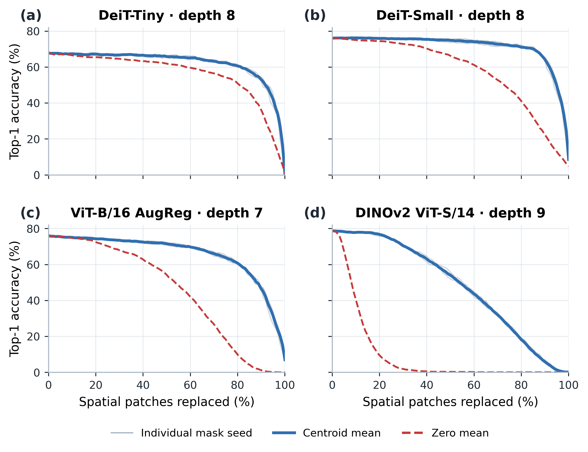

**Supplementary Figure S1. Spatial-mask robustness.** Five independently sampled image-independent spatial permutations are overlaid across the full fraction sweep. The main condition ordering persists across masks.

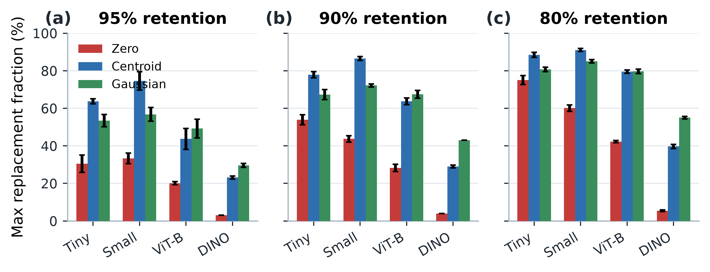

**Supplementary Figure S2. Accuracy-retention thresholds.** Maximum replacement fractions retaining at least 95%, 90%, and 80% of clean accuracy for zero, centroid, and diagonal-Gaussian interventions.

## S5. Causal isolation of token-to-token diversity

Under complete replacement, the shared-versus-independent comparison holds the Gaussian marginal distribution fixed while changing whether one sampled vector is broadcast to every patch or each patch receives an independent sample.

In DeiT-Tiny, shared Gaussian replacement yields 1.02% Top-1 accuracy, compared with 26.34% under independent replacement; in DeiT-Small, the corresponding values are 9.28% and 46.36%. ViT-B/16 AugReg shows the same endpoint contrast (2.94% versus 14.68%). Because the shared and independent conditions use the same per-token marginal distribution, this comparison isolates variation across token positions from the marginal perturbation distribution.

The grouped-K sweep resolves this contrast into a graded relationship. Seed-mean Top-1 increases at every tested K from 1 to 196 in DeiT-Tiny (1.2% to 26.4%) and DeiT-Small (10.4% to 46.5%; three seeds per K). In ViT-B/16 AugReg, it rises from 3.24% at K=1 to 14.58% at K=196 across five seeds; the paired image-level endpoint difference is +11.34 percentage points (95% CI 9.55–13.13; Wilcoxon BH-adjusted q=4.6×10⁻²⁴; N=1,000 paired images). These ordered seed means do not establish that each adjacent K contrast is significant. K counts distinct vectors across positions, not feature-space rank.

For DINOv2, Top-1 stays between 0.06% and 0.18% over K=1 to 256, and the paired endpoint difference is −0.02 percentage points (95% CI −0.16 to 0.12; q=0.828). Its mean true-class logit margin changes from −9.233 to −7.982 (paired change +1.250, 95% CI 1.091–1.410; q=2.0×10⁻⁴³). In the separate shared-versus-independent comparison, the margin changes by +1.124 under independent variation. The official DINOv2 readout combines the normalized CLS representation with mean normalized patch features; this is context for the measured margin, not a tested explanation for the Top-1 floor.

The K=1 and full-diversity endpoints were compared with archived shared- and independent-Gaussian controls. All eight model-by-endpoint-by-metric comparisons fell within two combined standard errors. Evaluation images are the statistical unit; seeds and patch positions are not pooled as additional observations. DeiT uses three grouped-K seeds; ViT-B and DINOv2 use five. Each architecture uses 1,000 evaluation images and disjoint calibration data.

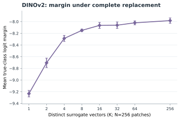

**Supplementary Figure S10. DINOv2 margin across token diversity.** Mean true-class logit margin under complete patch replacement at Block 8 as K varies from 1 to 256; points and error bars show the mean and standard deviation across five seeds.

## S6. Low-dimensional variation and amplitude controls

The low-dimensional variation experiment tests whether replacement must vary across the full feature dimension. Here, PC1 is the leading eigenvector of the centered covariance of calibration activations, not a learned network parameter. The random one-dimensional control matches the target variance associated with this leading component; both conditions use independent scalar coefficients across token positions. Sample sizes and the exact random seeds for these conditions are listed in Table S1.

At 100% replacement at Block 8, mean Top-1 for PC1 versus the energy-matched random direction is 18.64% versus 10.80% for DeiT-Tiny and 28.08% versus 20.78% for DeiT-Small; ViT-B/16 AugReg reaches 40.10% versus 6.70%. DINOv2 remains near the accuracy floor (0.17% versus 0.00%), while its mean true-class margin is −8.438 for PC1 and −8.654 for the random direction. The direction comparison is therefore strongest in Top-1 for ViT-B and in the margin observable for DINOv2.

Amplitude controls show that direction alone is insufficient. DeiT-Tiny exhibits a non-monotonic response to PC1 scale, while DeiT-Small tolerates a broader high-amplitude range; earlier apparent rank-one saturation in DeiT-Small was partly amplitude-confounded. Because coefficients vary independently by token position, a one-dimensional feature direction does not imply a shared surrogate across all tokens. The evidence supports the bounded claim that calibration-derived low-dimensional variation can outperform a matched random direction in tested conditions; it does not establish rank-1 sufficiency or an intrinsically one-dimensional patch stream. Supplementary Figures S3–S5 show the rank comparison, PC1 amplitude response, and effective-rank propagation.

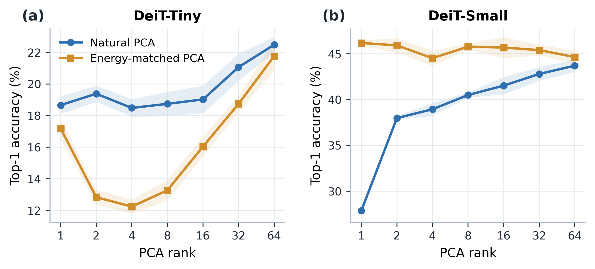

**Supplementary Figure S3. Natural versus energy-matched PCA rank.** Accuracy comparison across the tested low-rank replacement conditions.

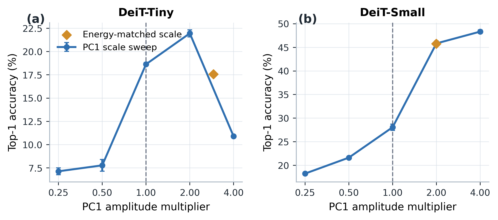

**Supplementary Figure S4. PC1 amplitude sensitivity.** Classification response across the tested amplitudes of the calibration-derived first principal component.

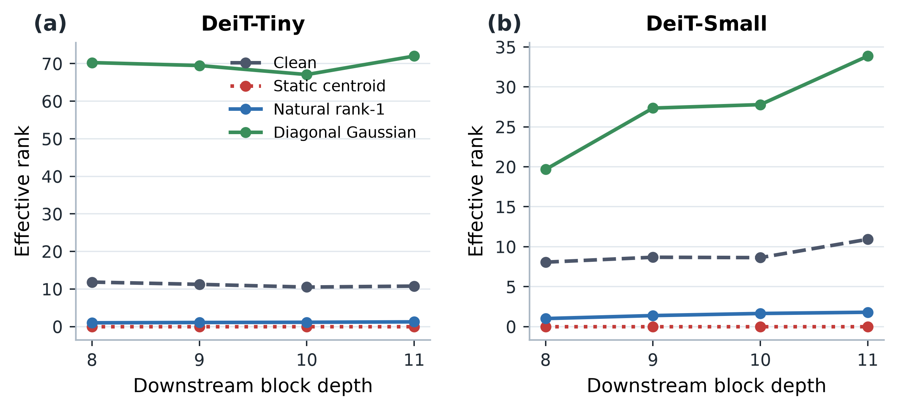

**Supplementary Figure S5. Effective-rank propagation.** Effective-rank measurements across the downstream propagation analysis.

## S7. Cross-model forward-parity and readout controls

For ViT-B AugReg and DINOv2, the intervention implementation requires a manual block-by-block forward path. Before intervention experiments, the manual path was checked against the official model forward implementation. Both models achieved exact prediction agreement in the parity audit, and the intervention code leaves pretrained parameters frozen.

The two families also differ in classifier topology. DeiT and ViT-B read classification from [CLS]. The evaluated DINOv2 linear head consumes normalized [CLS] concatenated with the mean normalized patch representation. This distinction explains why direct corruption of the entire patch stream has a stronger observable effect in DINOv2 and is explicitly accounted for in Sections 6--8 of the main paper.

## S8. Compression boundary: exact collapse does not imply competitive compression

An engineering test asks whether identical centroid tokens can be collapsed into one carrier while preserving downstream model behavior.

For the evaluated downstream ViT blocks, \(m\) identical centroid tokens can be represented by one multiplicity-aware carrier by adding \(+\log m\) to its attention logit and, where necessary, using multiplicity-weighted pooling. The implementation reproduces the uncompressed centroid intervention with 100% prediction agreement and maximum absolute logit discrepancy \(4.49\times10^{-5}\).

Sequence reduction produces real computational savings. At batch size 16 on the evaluated RTX 5070 Laptop GPU, the tested ViT-B operating point reduces end-to-end latency from 72.96 ms to 49.42 ms (32.3%), DeiT-Small from 20.06 ms to 16.36 ms (18.4%), and DINOv2 from 27.97 ms to 25.20 ms (9.9%). DeiT-Tiny becomes slower because implementation overhead dominates at its scale.

The carrier is nevertheless not a competitive compression rule. At matched downstream token budgets, random pruning and an unweighted centroid match or outperform the multiplicity-aware carrier. For example, at the tested ViT-B budget, random pruning reaches 72.48% accuracy versus 68.70% for the weighted carrier; in DINOv2 the corresponding values are 77.40% and 71.48%. The measured latency reduction therefore reflects shorter sequences, not a superior carrier mechanism. Supplementary Figures S6–S8 show the equivalence check and the corresponding accuracy-token and accuracy-latency comparisons.

Other exploratory correction variants also failed to provide a general practical remedy: single-token attempts, scalar layer prediction, out-of-sample dynamic-α prediction, a shared linear envelope with K≤64, and dynamic-operator prediction did not establish consistent classifier or throughput gains. These secondary results do not change the distinction between operator-space performance and held-out classification.

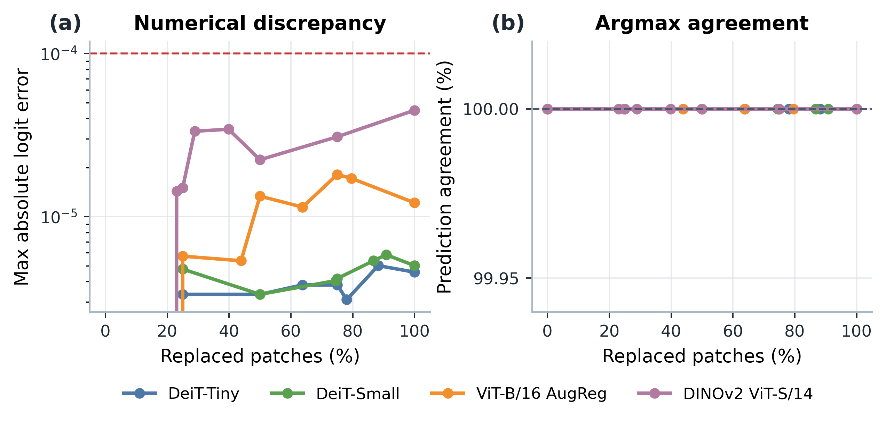

**Supplementary Figure S6. Exact multiplicity-aware carrier equivalence.** Forward-output comparison for the multiplicity-aware representation of identical tokens.

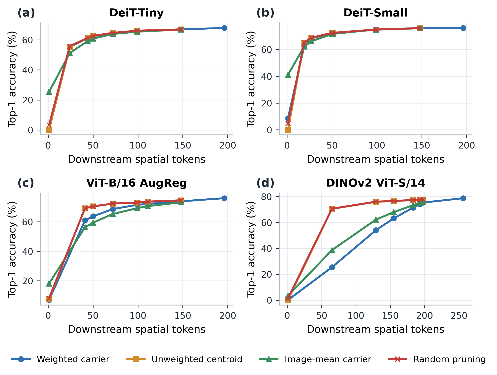

**Supplementary Figure S7. Accuracy versus downstream token count.** Held-out classification accuracy across the tested retained-token budgets.

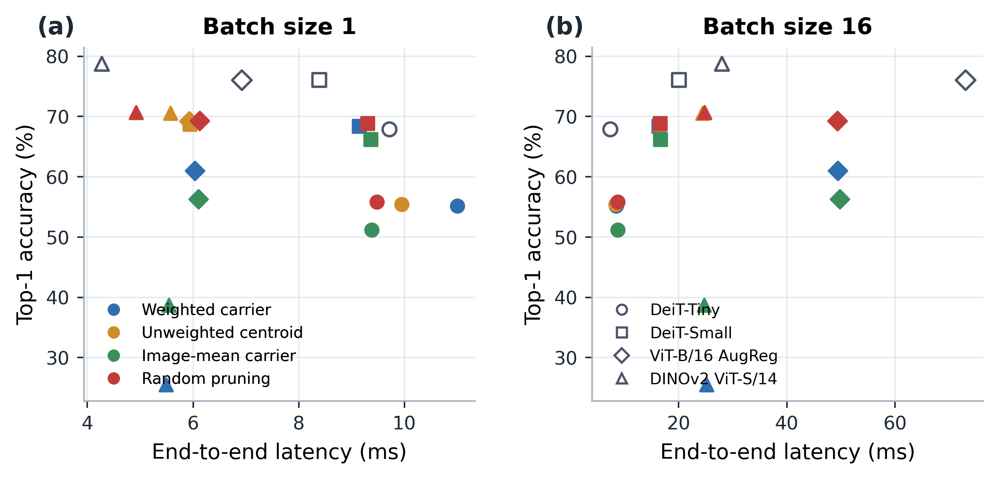

**Supplementary Figure S8. Accuracy versus measured GPU latency.** Held-out classification accuracy against measured end-to-end latency under the reported setup.

## S9. Synthetic carrier banks at matched token budgets

At a fixed downstream token budget \(B\), this analysis tests whether synthetic carriers with added geometry or diversity can match a baseline that retains real image patches. We allocate \(K\in\{4,8,16\}\) slots to generic synthetic carriers and the remaining \(B-K\) slots to real patches. Synthetic banks use calibration PCA directions, K-means centroids, or matched random directions.

Across all four architectures, both tested budgets per architecture, all three bank families, and five spatial masks, no synthetic bank outperforms the \(K=0\) random-pruning baseline. Increasing \(K\) generally reduces accuracy because each synthetic slot displaces one real image-conditioned patch. This is an empirical token-budget tradeoff; we do not claim to have directly measured mutual information.

The result establishes the boundary summarized in the main text: **replaceability under preserved sequence structure is not equivalent to usefulness under scarce token capacity**. Supplementary Figure S9 summarizes these matched-budget comparisons.

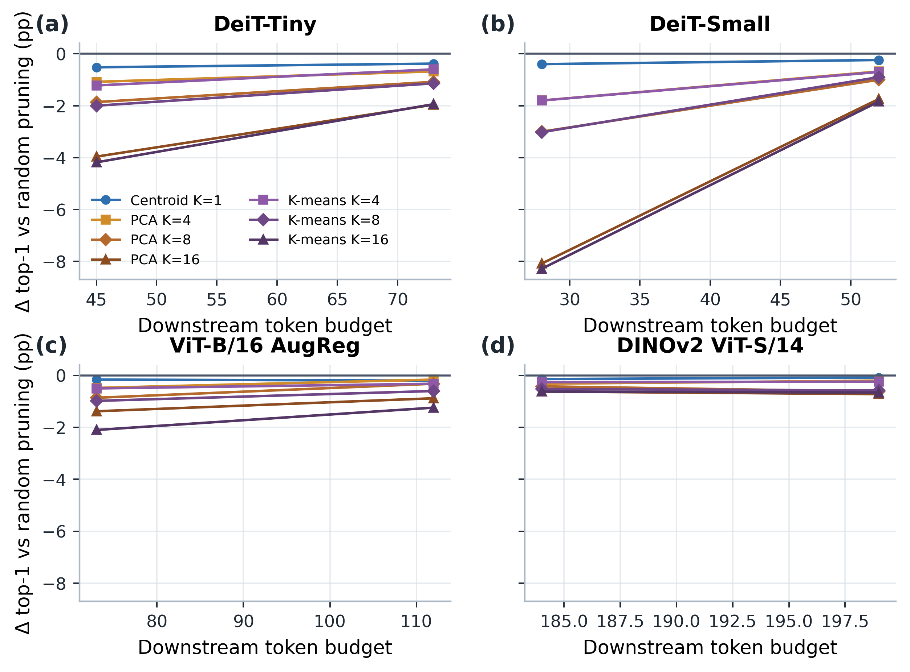

**Supplementary Figure S9. Synthetic geometry-bank delta relative to random pruning.** Accuracy difference for synthetic carrier banks relative to the matched random-pruning baseline.

## S10. Statistical and reproducibility notes

For image-based analyses, the image is the statistical unit and paired comparisons use matched images from the same cohort. Distinct experiments maintain separate cohorts; neither random seeds nor patch positions increase the image sample size. Seeded interventions are summarized by run, with means and sample standard deviations where shown. In the grouped-diversity extension, each image’s outcome is averaged across five seeds before paired tests. Multi-block operator prediction uses held-out perturbations as its unit; operator-space carrier outcomes are separate from classifier-image outcomes.

Inference is protocol-specific. The depth/fraction, geometry, and original diversity protocols use paired Student’s \(t\)-tests and Wilcoxon signed-rank tests for margin contrasts, paired percentile-bootstrap 95% intervals from 10,000 resamples, Cohen’s \(d_z\) where reported, and exact two-sided McNemar tests for Top-1 differences where specified; Benjamini–Hochberg correction is restricted to the comparison families defined in each protocol. Confirmatory compression uses exact McNemar tests, paired \(t\)- and Wilcoxon tests for margin damage, Cohen’s \(d_z\), and 2,000-resample bootstrap intervals for accuracy and margin differences. The grouped-diversity extension tests the per-image seed-averaged outcomes with paired \(t\)- and Wilcoxon tests, reports paired \(t\)-intervals, and applies Benjamini–Hochberg correction within each model/metric family across the 28 K-pairs.

The confirmatory operator-residual correlations summarize 30,000 method/budget/seed rows per architecture evaluated on the same 1,000 held-out images. They describe associations across tested conditions, not 30,000 independently sampled images. The dense-fraction sweep aggregates Gaussian runs within each spatial-mask seed before summarizing over mask seeds. Throughput rows use 50 warm-up and 100 measured full-model calls.

**Table S1. Split and stochastic seeds for the seeded analyses.** Split seeds are calibration/evaluation seeds unless otherwise specified. Sample units and distinct cohort sizes are summarized in Table I of the main text.

| Analysis | Split and mask seeds | Stochastic seeds and aggregation |
|---|---|---|
| Figure 2: DeiT-Tiny/Small depth sweep | Calibration 9101; evaluation 9201; spatial mask 9301 | Gaussian seeds 9401–9405; mean and sample SD across five seeds. |
| Figure 2: ViT-B/16 AugReg and DINOv2 depth sweep | Calibration 9101; evaluation 9201; spatial mask 21001 | Gaussian seeds 22001–22003; mean and sample SD across three seeds. The post hoc depth-6 follow-up uses the same split and intervention seeds. |
| Figure 3(a): DeiT geometry controls | Calibration 9101; evaluation 9201; mask 9601 | Coordinate-permutation seeds 9801–9803; centroid and sign-inversion controls are single-run estimates. |
| Figure 3(a): ViT-B/DINOv2 geometry controls | Calibration 9101; evaluation 9201; mask 21001 | Coordinate-permutation seeds 23001–23003; centroid and sign-inversion controls are single-run estimates. |
| Figure 3(b): DeiT grouped diversity | Calibration 9101; evaluation 9201 | Grouped-Gaussian seeds 15001–15003; means and sample SDs are across seeds. |
| Figure 3(b) and Figure S10: ViT-B/DINOv2 grouped diversity | Calibration 9101; evaluation 9201 | Grouped-Gaussian seeds 26001–26005; means and sample SDs are across seeds; paired tests use per-image means across seeds. |
| Figure 3(c), Section 4.2: PCA-aligned versus random directions | Calibration 9101; evaluation 9201 | DeiT natural-PC1 identity seeds 17001–17005 and matched-random-direction seeds 18001–18005; ViT-B/DINOv2 use seeds 25001–25003. |
| Supplementary dense-fraction sweep | Calibration 9101; evaluation 9201; spatial masks 31001–31005 | Gaussian seeds 32001–32003; average within each mask first, then summarize across five masks. |
| Strict confirmatory compression | Calibration 9101; evaluation 9201 | Random-pruning and random-grouping seeds 31001–31005; paired method comparisons use the shared held-out image cohort. |
| Held-out classifier-carrier evaluation | Calibration 7101 (500 images); evaluation 9201 (1,000 images) | Fixed cohort; no seed-level averaging. |

## S11. Cross-architecture mechanistic evidence

The functional-geometry extension uses the same first 100 images from each model’s calibration split at depths 5, 7, 8, and 10. It differentiates the clean predicted-class margin through the model’s classification readout; for DINOv2 this is the official linear head on normalized CLS and mean-patch features. The metric \(M_\ell\) is accumulated in float64 and checked for positive semidefiniteness. The table reports the depth-8 covariance-PC sensitivity ratio and its bottom-PC eigenvalue gap, plus depth-5-to-10 spectral changes.

**Table S2. Cross-architecture functional-geometry summaries.** The near-null fraction uses λₖ ≤ 10⁻³λₘₐₓ. The final column gives depth-10 near-null counts under the stricter 10⁻⁴ and looser 10⁻² cutoffs, respectively. Effective rank is normalized by feature dimension D. All rows use \(N_{\mathrm{img}}=100\); the image is the sample unit and patch positions are aggregated within images.

| Architecture | D, patches | PC1 / PCbottom sensitivity, depth 8 | Relative bottom-PC eigengap, depth 8 | Near-null fraction, depth 5 → 10 | Effective rank / D, depth 5 → 10 | Depth-10 near-null count, 10⁻⁴/10⁻² |
|---|---:|---:|---:|---:|---:|---:|
| DeiT-Tiny | 192, 196 | 0.0891 | 2.58 × 10⁻³ | 0.52% → 31.77% | 0.541 → 0.125 | 1 / 154 |
| DeiT-Small | 384, 196 | 0.0409 | 3.52 × 10⁻⁴ | 0.26% → 57.03% | 0.467 → 0.114 | 47 / 327 |
| ViT-B/16 AugReg | 768, 196 | 65.2 | 1.53 × 10⁻⁵ | 0.26% → 49.61% | 0.383 → 0.140 | 41 / 641 |
| DINOv2 ViT-S/14 | 384, 256 | 0.199 | 9.75 × 10⁻⁴ | 0.26% → 1.56% | 0.453 → 0.323 | 1 / 249 |

For the PC ratio, the denominator \(v_{\mathrm{bottom}}^\top M_\ell v_{\mathrm{bottom}}\) is compared with \(\lambda_{\max}(M_\ell)\) using a numerical stability threshold of \(10^{-10}\lambda_{\max}\). All denominators exceeded this threshold. The ratio is nevertheless sensitive to the selected sample eigenvector when the activation-covariance bottom eigengap is small; this is most pronounced for ViT-B. At depth 10, DINOv2’s near-null fraction is 0.26%, 1.56%, and 64.84% at relative cutoffs \(10^{-4}\), \(10^{-3}\), and \(10^{-2}\), respectively. The raw spectra, per-direction sensitivities, metric/covariance matrices, and all cutoff rows are retained in the Section 5 extension output directory.

The attention audit includes complete Q/K/V decomposition and coherence-gap attribution for DeiT-Small at Block 8 and ViT-B/16 AugReg at Block 7. DeiT-Tiny and DINOv2 have reduced Block-8 replications only. For the reduced models, full-perturbation signed true-class logit drops across coherent, random-sign, and checkerboard patterns are 0.02437, −0.00105, and −0.00655 for DeiT-Tiny, and 0.10434, −0.00319, and 0.00583 for DINOv2. Under frozen-attention V-only with the residual perturbed, the corresponding drops are 0.02444, −0.00248, and −0.00628 for DeiT-Tiny, and 0.10749, −0.00142, and 0.00516 for DINOv2. These are signed logit outcomes; the main Figure 5 instead reports immediate-readout L2 magnitudes. The coherent frozen/full readout-norm ratios are 100.1% and 100.8%, respectively. Directions were estimated from the first four images, and outcomes use \(N=100\) images per model.

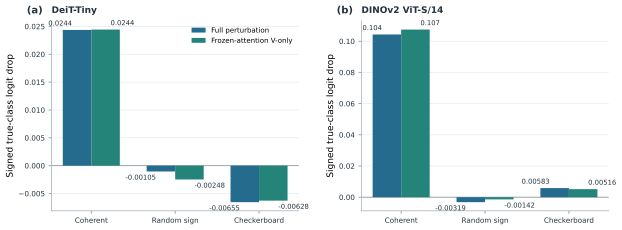

**Supplementary Figure S11.** Signed true-class logit drop (clean target logit minus perturbed target logit) under full perturbation and frozen-attention V-only transmission with the perturbed residual, for coherent, random-sign, and checkerboard patterns at Block 8. Each model uses one fixed \(N=100\)-image outcome cohort; the \(J\)-top feature direction was estimated from the first four images. Bars are cohort means without seed-based error bars. The panels show the reduced replication and do not represent a complete Q/K/V decomposition.

The multi-block prediction extension evaluates 100 perturbation vectors per model at Block 8 and scale \(s=0.4\), with 25 vectors from each of four prescribed families. Each vector is scored on a fixed 20-image reference batch. The bootstrap resamples perturbation vectors within family; it does not treat images or token positions as independent correlation observations.

**Table S3. Model-specific correlation between operator predictions and observed final-logit L₂ damage.** Values are Pearson r and Spearman ρ, each followed by its stratified-bootstrap 95% percentile interval. Each model/operator estimate uses 100 perturbation vectors and 2,000 bootstrap replicates.

| Architecture | Operator | Pearson r (95% CI) | Spearman ρ (95% CI) |
|---|---|---:|---:|
| DeiT-Tiny | Single-block A₈ | 0.806 [0.773, 0.843] | 0.720 [0.681, 0.757] |
| DeiT-Tiny | End-to-end J₈→L | 0.964 [0.955, 0.974] | 0.964 [0.951, 0.973] |
| DeiT-Small | Single-block A₈ | 0.753 [0.719, 0.790] | 0.735 [0.696, 0.772] |
| DeiT-Small | End-to-end J₈→L | 0.975 [0.966, 0.983] | 0.945 [0.932, 0.958] |
| ViT-B/16 AugReg | Single-block A₈ | 0.757 [0.728, 0.786] | 0.725 [0.684, 0.766] |
| ViT-B/16 AugReg | End-to-end J₈→L | 0.954 [0.938, 0.970] | 0.934 [0.911, 0.953] |
| DINOv2 ViT-S/14 | Single-block A₈ | 0.883 [0.861, 0.903] | 0.829 [0.781, 0.869] |
| DINOv2 ViT-S/14 | End-to-end J₈→L | 0.946 [0.941, 0.952] | 0.944 [0.932, 0.956] |

Within-family correlations are retained in the extension output directory. They vary substantially and include weak or negative values; the aggregate result therefore applies to the fixed mixed perturbation distribution. The source manifest records that the local operator averages over the 20-image reference batch while the end-to-end Jacobian is linearized at the first image.

## S12. Primary Q/K/V projection-path comparison

The primary projection-path audit compares V-only and \(K+V\) interventions for DeiT-Small at Block 8 and ViT-B/16 AugReg at Block 7. V-only perturbs \(V\) while keeping \(Q\), \(K\), and the residual clean. \(K+V\) perturbs \(K\) and \(V\) while keeping \(Q\) and the residual clean, and recomputes attention. Both conditions use the same \(N=100\) image cohort and the same mean per-image Euclidean \(L_2\) immediate-readout metric. The coherent V-only/\(K+V\) ratios are 97.4% and 99.4%, with \(K+V\) as the denominator. This primary decomposition is available only for these two architectures.

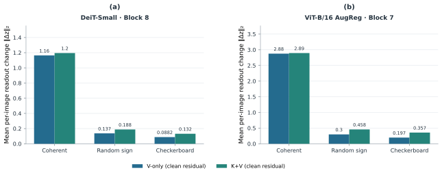

**Supplementary Figure S12.** Mean per-image Euclidean \(L_2\) change in the immediate readout for V-only and \(K+V\) at (a) DeiT-Small, Block 8, and (b) ViT-B/16 AugReg, Block 7. V-only perturbs \(V\) with clean \(Q\), \(K\), and residual; \(K+V\) perturbs \(K,V\) with clean \(Q\) and residual and recomputes attention. Coherent, random-sign, and checkerboard patterns are shown in that order. Each panel uses its own y-axis scale; \(N=100\) outcome images per model.

The signed true-class logit drop is the clean target-class logit minus the perturbed target-class logit, averaged over the same \(N=100\) outcome images. For intervention condition \(c\), define the coherent-minus-random-sign contrast as

\[
\operatorname{Contrast}(c)=\text{Mean true-class logit drop(coherent, }c\text{)}
-\text{Mean true-class logit drop(random-sign, }c\text{)}.
\]

The reported ratio is \(100\times\operatorname{Contrast}(\text{frozen-attention V-only with perturbed residual})/\operatorname{Contrast}(\text{full perturbation})\). The contrasts use `feature_dir=jac_top` and \(s=1.0\). Both ViT-B/16 AugReg contrasts are negative. Its 102.2% ratio is a quotient of two signed contrasts; it does not indicate more than 100% causal contribution because the interventions are not additive causal components.

**Table S4. Signed true-class logit-drop contrasts for the primary Value-path audit.**

| Model | Intervention depth | Full-block coherent-minus-random-sign contrast | Frozen-attention V-only with perturbed-residual contrast | Ratio |
|---|---:|---:|---:|---:|
| DeiT-Small | Block 8 | +0.006282993 | +0.004448350 | 70.8% |
| ViT-B/16 AugReg | Block 7 | −0.247199488 | −0.252697120 | 102.2% |

## S13. Measured classifier-carrier boundary

The held-out classifier-carrier study reports accuracy and measured full-model throughput at batch size 64. The q=16 variant contributes a narrow ViT-B/16 AugReg point to the tested frontier; the figure does not imply a general deployment gain.

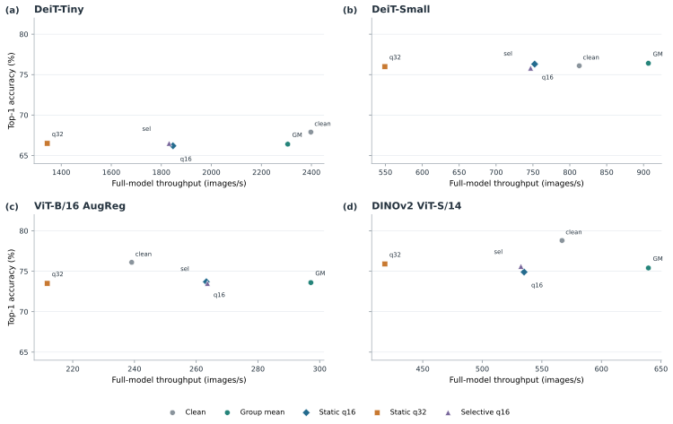

**Supplementary Figure S13.** Held-out classifier-carrier accuracy and measured full-model throughput at batch size 64, shown with architecture-specific throughput axes. q=16 contributes a narrow ViT-B/16 AugReg frontier point.

The joint-stream depth grid covers DeiT-Small at depths 5, 8, and 10 and ViT-B/16 AugReg at depths 5, 7, and 10. DeiT-Tiny and DINOv2 were evaluated only in reduced Block-8 replications and therefore are not included in this six-panel grid. The same (N=100)-image cohort per model supplies feature-direction estimation and outcome scoring.

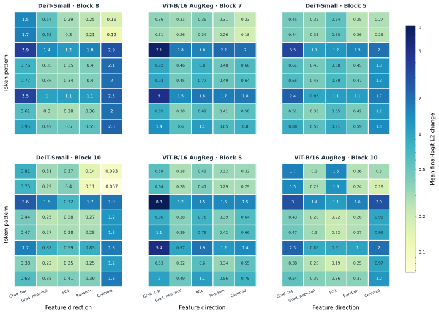

**Supplementary Figure S14.** Mean per-image final-logit (L_2) change at (s=1) across the six model–depth combinations listed above. Every panel shows the same eight token-space patterns by five feature-space directions, with cell values and the shared logarithmic color scale used in Figure 6. “Grad. top” and “Grad. near-null” are the joint-stream audit’s mean patch-margin-gradient directions; PC1, Random, and Centroid have the same definitions as in Figure 6. For each model, the same (N=100)-image cohort is used to estimate directions and score outcomes.

## Code and data availability

The repository provides the experiment protocols, frozen split manifests, per-image results, seed-level summaries, validation manifests, and figure-generation sources. Publication-facing results are traceable through the main-text claims and number maps; experiment-specific seed IDs and statistical procedures are listed in Supplementary Section S10.
