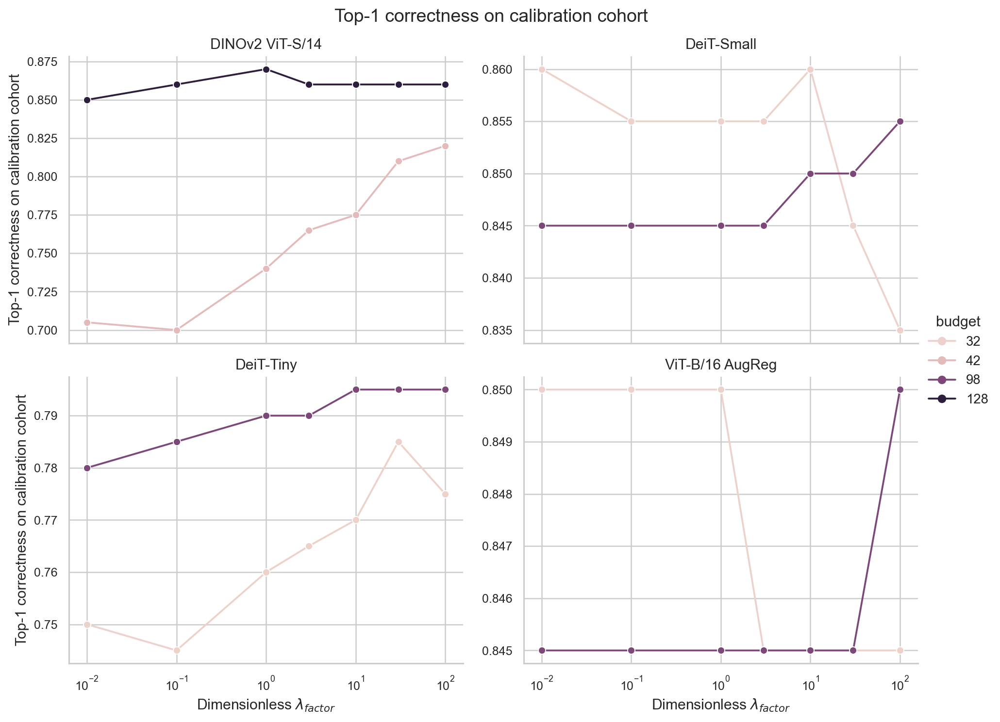
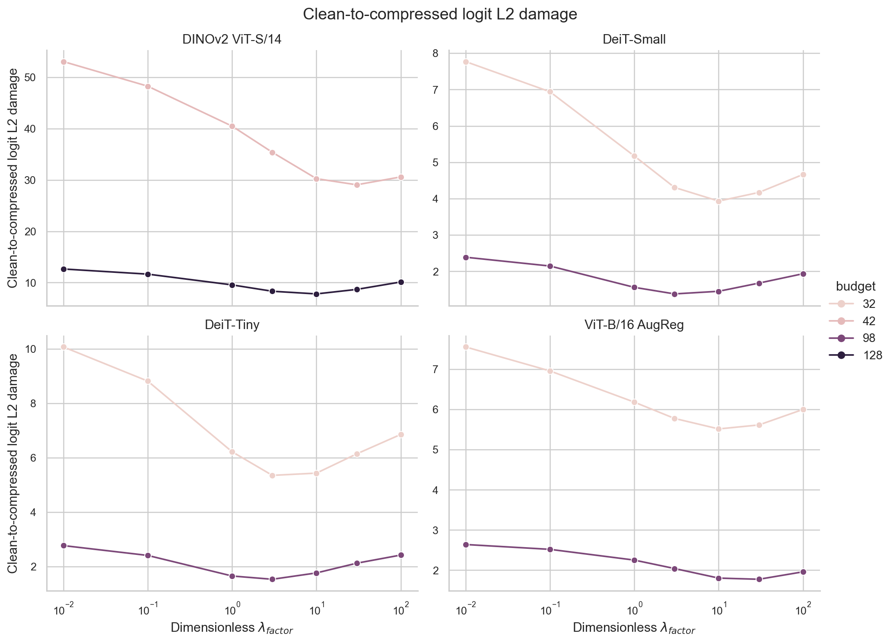
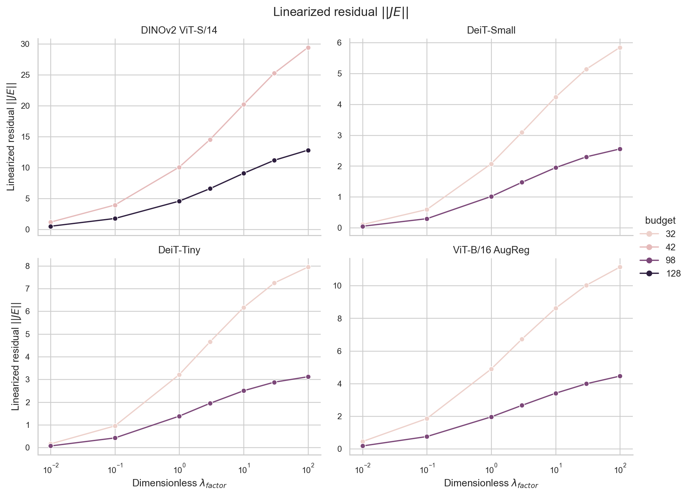
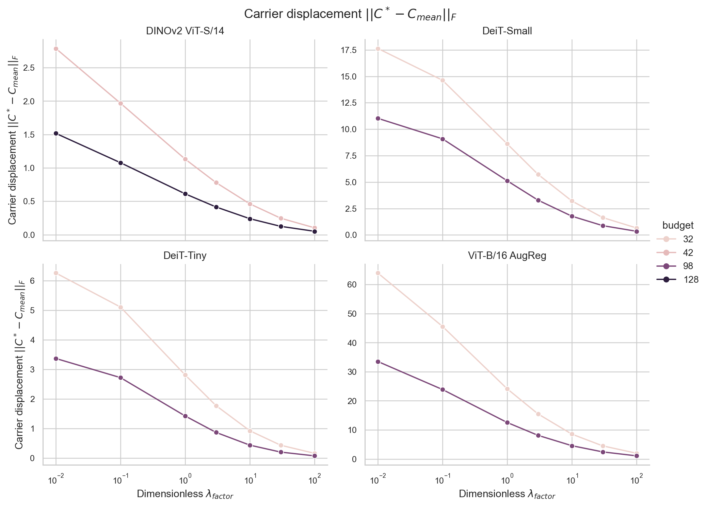

# Exact-Jacobian Regularization Sensitivity (Post-Hoc)

**Status:** Completed calibration-only sensitivity analysis. This is a post-hoc analysis, not the missing historical pilot and not evidence that factor 10 was selected before confirmatory evaluation.

> **Sampling limitation added 2026-10-10:** This original exploratory version selected one image per class and then took the first 200 rows in sorted class-label order. It therefore covered only the first 200 classes, not a class-randomized sample of ImageNet-1k. Keep its results as historical evidence for that subset only; they do not establish representative ImageNet-1k sensitivity. The corrected class-randomized analysis is in [the v2 report](REGULARIZATION_SENSITIVITY_REPORT_CORRECTED.md), with new outputs under [`outputs/fungibility_regularization_sensitivity_v2_class_randomized/`](../outputs/fungibility_regularization_sensitivity_v2_class_randomized/).

## Verdict

The regularization factor materially changes the carrier solution and the linearized residual, but nonlinear Top-1 changes are smaller and model/budget dependent. No single factor is best across all eight architecture-budget cells. Factor 10 is a defensible middle setting in the residual-versus-displacement tradeoff: relative to 3 it consistently reduces carrier displacement while increasing \(\|JE\|\); relative to 30 it consistently lowers \(\|JE\|\) while increasing displacement. Its nonlinear outcomes do not establish a universal advantage. Factor 10 beats 3 in Top-1 in only small fractions of images (and ties nearly all images), while factor 30 is better in some cells, worse in others, and tied in the rest.

In particular, factor 10 is **not** the calibration Top-1 maximum in all cells: it is below the best candidate by 4.5 percentage points for DINOv2 at B=42 (77.5% vs 82.0% at factor 100), by 1.0 point for DINOv2 at B=128 (86.0% vs 87.0% at factor 1), and by 1.5 points for DeiT-Tiny at B=32 (77.0% vs 78.5% at factor 30). Conversely, it matches or nearly matches maxima in the other cells. These are descriptive calibration-cohort maxima, not a factor-selection rule.

## Design and implementation

- **Factors:** dimensionless \(\lambda_{factor}\in\{0.01,0.1,1,3,10,30,100\}\).
- **Data:** exactly 200 fixed calibration images per architecture from seed 9101; the same global image indices were used for all factors, budgets, and architectures. Index SHA-256: `4407ae4cc4807deb41cff6006a10226b9eb4a4a2fd8ff7eeb8955e7cf43c16b1`.
- **Evaluation split:** seed 9201 was not loaded or used. The run manifest explicitly records `evaluation_split_seed_used: null`.
- **Models/budgets:** DeiT-Tiny B=32/98; DeiT-Small B=32/98; ViT-B/16 AugReg B=32/98; DINOv2 ViT-S/14 B=42/128.
- **Shared computation:** for each image, one exact downstream Jacobian was computed and reused at both budgets and all seven factors. Existing confirmatory feature-similarity groupings (seed 42) were computed once per image-budget. The existing carrier solver and multiplicity-aware downstream compressed forward were used. Group Mean is included once per image-budget as the common baseline.
- **Scale:** \(\operatorname{trace}(H_J)/d_s\) is recorded as `trace_HJ_per_ds`; the effective absolute regularization is `lambda_absolute = lambda_factor * trace_HJ_per_ds`. The script computes this trace from the grouped Jacobian blocks used by the solver.
- **Outcomes:** compressed nonlinear Top-1 correctness; clean-to-compressed final-logit L2 distance; true-class margin change (compressed minus clean, where margin is true-class logit minus maximum competing logit); \(\|JE\|\) from the solver's linearized residual; and \(\|C_{opt}-C_{mean}\|_F\). Per-image clean correctness, clean/compressed predictions, target, image index, trace, and absolute lambda are also retained.

The full design has 11,200 candidate-factor rows and 1,600 Group Mean rows (12,800 total). Each model-budget-factor cell contains 200 paired image observations. Group Mean has no lambda; its carrier displacement is zero by definition.

## Cost benchmark

The specified eight-image-per-architecture benchmark was run first on an NVIDIA GeForce RTX 5070 Laptop GPU (7.96 GiB). Timing includes a clean forward, exact Jacobian, feature-similarity grouping, all seven solves at each budget, and compressed downstream forwards. Linear extrapolation from eight images estimated **0.388 GPU-hours** for the full 200-image design, excluding model and dataset loading. The full run completed in approximately **0.39 GPU-hours**, with no scope reduction or out-of-memory event. Peak CUDA allocation/reservation by architecture was:

| Architecture | Estimated 200-image GPU-hours | Peak allocated GiB | Peak reserved GiB |
|---|---:|---:|---:|
| DeiT-Tiny | 0.031 | 0.973 | 1.041 |
| DeiT-Small | 0.049 | 2.093 | 2.258 |
| ViT-B/16 AugReg | 0.207 | 5.486 | 6.285 |
| DINOv2 ViT-S/14 | 0.100 | 3.087 | 3.615 |

The estimate and benchmark rows are saved in `runtime_benchmark8.csv`; the full run timings are in `runtime_by_architecture.csv`. Actual time depends on GPU load and warm-up, so these are run-specific measurements, not hardware-independent performance guarantees.

## Nonlinear Top-1 across every candidate

Percent correct on the fixed calibration cohort. The final column is the Group Mean baseline.

| Architecture | Budget | 0.01 | 0.1 | 1 | 3 | 10 | 30 | 100 | Group Mean |
|---|---:|---:|---:|---:|---:|---:|---:|---:|---:|
| DeiT-Tiny | 32 | 75.0 | 74.5 | 76.0 | 76.5 | 77.0 | 78.5 | 77.5 | 78.0 |
| DeiT-Tiny | 98 | 78.0 | 78.5 | 79.0 | 79.0 | 79.5 | 79.5 | 79.5 | 79.5 |
| DeiT-Small | 32 | 86.0 | 85.5 | 85.5 | 85.5 | 86.0 | 84.5 | 83.5 | 83.0 |
| DeiT-Small | 98 | 84.5 | 84.5 | 84.5 | 84.5 | 85.0 | 85.0 | 85.5 | 85.5 |
| ViT-B/16 AugReg | 32 | 85.0 | 85.0 | 85.0 | 84.5 | 84.5 | 84.5 | 84.5 | 83.5 |
| ViT-B/16 AugReg | 98 | 84.5 | 84.5 | 84.5 | 84.5 | 84.5 | 84.5 | 85.0 | 85.0 |
| DINOv2 ViT-S/14 | 42 | 70.5 | 70.0 | 74.0 | 76.5 | 77.5 | 81.0 | 82.0 | 81.0 |
| DINOv2 ViT-S/14 | 128 | 85.0 | 86.0 | 87.0 | 86.0 | 86.0 | 86.0 | 86.0 | 86.5 |



## Factor 10 versus neighboring factors

Values below are per-cell means on the same 200 images. For each metric triplet, order is **factor 3 / factor 10 / factor 30**. The carrier displacement and residual curves move in opposite directions consistently: higher regularization leaves carriers closer to their group mean but increases the linearized residual.

| Architecture | Budget | Logit L2 damage (3 / 10 / 30) | \(\|JE\|\) (3 / 10 / 30) | Carrier displacement (3 / 10 / 30) |
|---|---:|---:|---:|---:|
| DeiT-Tiny | 32 | 5.350 / 5.433 / 6.140 | 4.654 / 6.167 / 7.245 | 1.773 / 0.922 / 0.432 |
| DeiT-Tiny | 98 | 1.532 / 1.765 / 2.122 | 1.946 / 2.500 / 2.878 | 0.866 / 0.435 / 0.199 |
| DeiT-Small | 32 | 4.308 / 3.933 / 4.171 | 3.091 / 4.232 / 5.137 | 5.726 / 3.210 / 1.641 |
| DeiT-Small | 98 | 1.380 / 1.452 / 1.677 | 1.472 / 1.947 / 2.297 | 3.288 / 1.772 / 0.877 |
| ViT-B/16 AugReg | 32 | 5.778 / 5.517 / 5.616 | 6.724 / 8.615 / 10.023 | 15.488 / 8.544 / 4.502 |
| ViT-B/16 AugReg | 98 | 2.043 / 1.804 / 1.775 | 2.666 / 3.410 / 3.989 | 8.122 / 4.563 / 2.430 |
| DINOv2 ViT-S/14 | 42 | 35.381 / 30.248 / 29.054 | 14.535 / 20.212 / 25.281 | 0.780 / 0.462 / 0.247 |
| DINOv2 ViT-S/14 | 128 | 8.317 / 7.799 / 8.676 | 6.590 / 9.075 / 11.181 | 0.415 / 0.240 / 0.125 |







The Group Mean comparator's Top-1 and mean logit L2 damage respectively are: DeiT-Tiny B=32 78.0% / 7.377 and B=98 79.5% / 2.633; DeiT-Small B=32 83.0% / 5.222 and B=98 85.5% / 2.191; ViT-B/16 B=32 83.5% / 6.777 and B=98 85.0% / 2.356; DINOv2 B=42 81.0% / 33.191 and B=128 86.5% / 11.710. Group Mean's linearized residual is in the aggregate CSV; its displacement is 0 by definition.

### Paired Top-1 comparisons

The comparisons below use image-level paired correctness differences. `wins/losses/ties` counts images where factor 10 is correct and the comparator is wrong / vice versa / both equal. The interval is a paired t interval for the mean binary difference; the p-value is exact two-sided McNemar/binomial on discordant pairs. These are exploratory, unadjusted p-values across the 16 model-budget contrasts.

| Architecture | Budget | 10−3 Top-1 (pp) | Wins/losses/ties | McNemar p | 10−30 Top-1 (pp) | Wins/losses/ties | McNemar p |
|---|---:|---:|---:|---:|---:|---:|---:|
| DeiT-Tiny | 32 | +0.5 | 3/2/195 | 1.000 | −1.5 | 1/4/195 | 0.375 |
| DeiT-Tiny | 98 | +0.5 | 1/0/199 | 1.000 | 0.0 | 0/0/200 | 1.000 |
| DeiT-Small | 32 | +0.5 | 1/0/199 | 1.000 | +1.5 | 3/0/197 | 0.250 |
| DeiT-Small | 98 | +0.5 | 1/0/199 | 1.000 | 0.0 | 0/0/200 | 1.000 |
| ViT-B/16 AugReg | 32 | 0.0 | 0/0/200 | 1.000 | 0.0 | 0/0/200 | 1.000 |
| ViT-B/16 AugReg | 98 | 0.0 | 0/0/200 | 1.000 | 0.0 | 0/0/200 | 1.000 |
| DINOv2 ViT-S/14 | 42 | +1.0 | 6/4/190 | 0.754 | −3.5 | 1/8/191 | 0.039 |
| DINOv2 ViT-S/14 | 128 | 0.0 | 1/1/198 | 1.000 | 0.0 | 0/0/200 | 1.000 |

At DINOv2 B=42, the factor-10 Top-1 difference versus 30 is −3.5 percentage points (paired 95% t interval −6.42 to −0.58 points; exact McNemar p=0.039, unadjusted). This is the only nominally significant exact Top-1 comparison among the 16 displayed contrasts and is exploratory after multiple comparisons. Against factor 3, the Top-1 changes are at most 1 percentage point in magnitude in every cell, with no nominal McNemar p below 0.05. In the ViT-B cells, every image's predicted class is unchanged across factors even though continuous logit damage varies.

Continuous per-image differences and paired 95% t intervals, paired t/Wilcoxon p-values, Top-1 discordance counts, and exact McNemar values are in `paired_factor10_vs_3_30.csv`. The confidence intervals and p-values use images paired within each model-budget cell. The same 200 images are reused across budgets and factors; cells are not independent samples. We do not pool them to claim cross-cell significance. `cross_cell_robustness_descriptive.csv` provides descriptive win/tie/loss counts across cells only.

## Interpretation by scientific question

1. **Linearized residual:** It improves monotonically as the factor decreases in every cell. Factor 3 has lower mean \(\|JE\|\) than 10 in all eight cells; factor 10 has lower residual than 30 in all eight. This alone does not select the factor.
2. **Nonlinear classification:** Top-1 is nonmonotonic and often nearly flat, with changes concentrated in a few images. Factor 10 is close to factor 3 in all cells; factor 30 has a clear calibration advantage at DINOv2 B=42 but is lower at DeiT-Tiny B=32. Higher budget results are also model dependent.
3. **Tradeoff/robustness:** Factor 10 reduces displacement substantially versus 3 and retains smaller displacement than 3 in each cell; 30 reduces it further, at the cost of a larger linear residual. Classification robustness does not follow a common monotone trend. Thus factor 10 is a plausible compromise, not a data-established global optimum or a uniquely robust setting.

The per-image standard deviations and standard errors for every factor are stored in the aggregate table. With 200 images, the maximum binomial standard error for Top-1 is about 3.54 percentage points per cell. Reported Top-1 rates are calibration estimates and are not confirmatory test performance.

## Preregistration provenance and correction

The historical protocol's status line said “PRE-REGISTERED & FROZEN BEFORE EVALUATION.” The report/manifest cited protocol commit `77e694a96e530ee5c9776d11daab8a426de14117`, which is unavailable in the current repository; the archive can verify that factor 10 was the run setting, but it cannot independently verify the claimed freeze-before-evaluation chronology. The prior audit addendum dated 2026-10-10 explicitly withdrew the unsupported claim that factor 10 was optimum and documented this chronology limitation. To avoid erasing history while avoiding an unqualified assertion, the protocol heading now preserves the old wording as a **historical status label** and immediately annotates that chronology as unverified. The old text remains recoverable in Git history. This sensitivity analysis is post-hoc and does not repair or authenticate the missing historical pilot.

The paper DOCX was not regenerated or edited, the manuscript's scientific claims were not changed, and the primary confirmatory solver and archived confirmatory outputs were not modified. Any manuscript change informed by this report should be proposed separately.

## Reproduction and artifact map

Run from the repository root after the local ImageNet validation parquet cache and model weights are available:

```powershell
python scripts/run_regularization_sensitivity_v1_first200_classes.py --benchmark-only
python scripts/run_regularization_sensitivity_v1_first200_classes.py
python scripts/run_regularization_sensitivity_v1_first200_classes.py --postprocess-only
```

The full manifest includes the 200 global indices and cohort hash, model IDs/depths/budgets, factor grid, timing/memory, software versions, and the SHA-256 of the runner. The fixed full-run inputs were seed 9101 and the local cached validation parquet; no seed-9201 evaluation IDs are read by this runner.

- Historical runner: [`scripts/run_regularization_sensitivity_v1_first200_classes.py`](../scripts/run_regularization_sensitivity_v1_first200_classes.py)
- Full per-image CSV, 12,800 rows: [`per_image_results.csv`](../outputs/fungibility_regularization_sensitivity/per_image_results.csv)
- Architecture/budget/factor means, SDs, and SEs: [`aggregated_by_architecture_budget_factor.csv`](../outputs/fungibility_regularization_sensitivity/aggregated_by_architecture_budget_factor.csv)
- Paired factor-10 comparisons: [`paired_factor10_vs_3_30.csv`](../outputs/fungibility_regularization_sensitivity/paired_factor10_vs_3_30.csv)
- Descriptive cross-cell robustness counts: [`cross_cell_robustness_descriptive.csv`](../outputs/fungibility_regularization_sensitivity/cross_cell_robustness_descriptive.csv)
- Cohort, model, run, and reproduction manifest: [`manifest_full.json`](../outputs/fungibility_regularization_sensitivity/manifest_full.json)
- Eight-image cost probe: [`per_image_results_benchmark8.csv`](../outputs/fungibility_regularization_sensitivity/per_image_results_benchmark8.csv), [`runtime_benchmark8.csv`](../outputs/fungibility_regularization_sensitivity/runtime_benchmark8.csv), [`manifest_benchmark8.json`](../outputs/fungibility_regularization_sensitivity/manifest_benchmark8.json)
- Figures: `outputs/fungibility_regularization_sensitivity/figures/` (PNG and SVG for all four panels).
- Exact method sources: [`operator_compression_confirmatory.py`](../patch_fungibility/operator_compression_confirmatory.py) (`compute_fast_downstream_jacobian`, `create_groupings_confirmatory`, `solve_operator_aware_carriers_fast`) and [`compression_models.py`](../patch_fungibility/compression_models.py) (`forward_downstream_compressed`). Frozen checkpoint loading and blockwise reference forwarding are in [`dense_fraction_models.py`](../patch_fungibility/dense_fraction_models.py).
- Historical protocol and annotated status wording: [`FUNGIBILITY_OPERATOR_COMPRESSION_CONFIRMATORY_PROTOCOL.md`](FUNGIBILITY_OPERATOR_COMPRESSION_CONFIRMATORY_PROTOCOL.md); chronology audit: [`REGULARIZATION_FACTOR_AUDIT.md`](REGULARIZATION_FACTOR_AUDIT.md).

## Validation performed

- Full cohort/factor/budget/model grid checks: 200 rows in every architecture-budget-factor cell; 200 Group Mean rows per architecture-budget; identical 200 global indices across all four models.
- Metric completeness and scale identity: all required candidate metrics are non-null; every `lambda_absolute` equals `lambda_factor × trace_HJ_per_ds` within floating-point tolerance; trace is positive.
- Artifact counts: 12,800 per-image rows; 64 aggregate rows; 80 paired-comparison rows.
- Recreated aggregate tables and all eight PNG/SVG figures from the saved raw CSV using `--postprocess-only`, without recomputing Jacobians or model outputs.
- Visual inspection caught and corrected repeated/overlapping figure labels; final figures were regenerated.
- Python 3.11.9, PyTorch 2.11.0+cu128, NumPy 2.4.6, pandas 2.3.3; runner SHA-256 is recorded in `manifest_full.json`.
