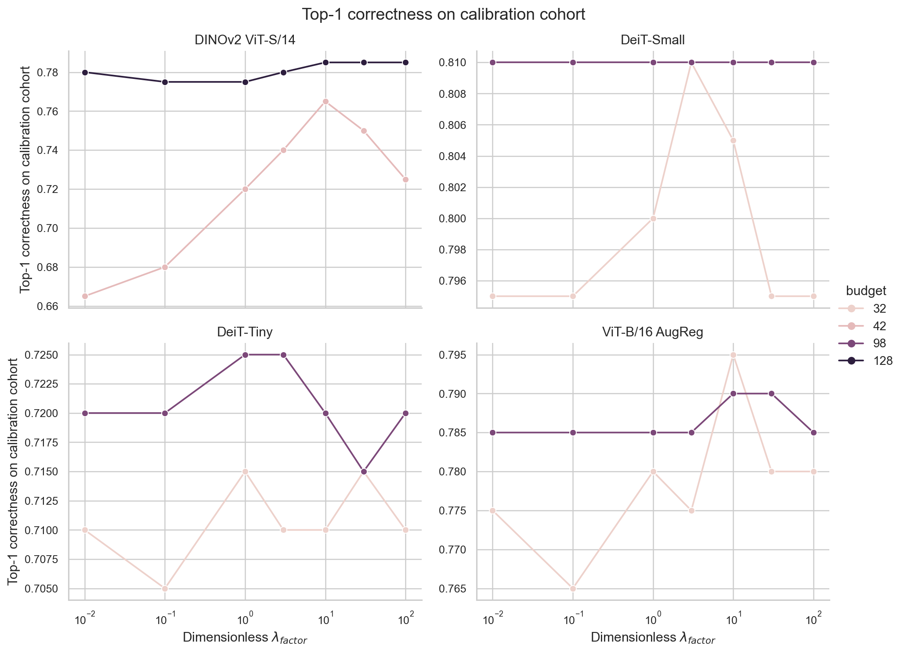

# Corrected Regularization Sensitivity: Class-Randomized Calibration Cohort

**Status:** Corrected post-hoc sensitivity analysis. This fixes the sampling limitation in the original exploratory study; it is not the missing historical pilot and does not establish when the confirmatory factor was chosen.

## Cohort construction and verification

The canonical split was reconstructed with the repository's `get_disjoint_imagenet_splits(calib_seed=9101, eval_seed=9201, n_per_split=1000)` helper. That helper picks one calibration image per each of the 1,000 sorted class labels, using `RandomState(9101)` for calibration selection. From those 1,000 calibration class labels, this corrected study selected **200 distinct labels uniformly without replacement** using a fixed, outcome-independent class sampling seed of **61327**. The selected labels are retained in sampler order; the same exact images were used for every architecture, token budget, and factor.

- Canonical calibration: 1,000 images and 1,000 distinct classes; split seed 9101.
- Class sample: 200 classes, uniform without replacement; class-selection seed 61327.
- Selected-image cohort SHA-256: `5cb7d8429949d486452e6be83281e4f9202d9fe0e4c5ed73e4433a2a9d24cf17`. This is SHA-256 of comma-joined `global_index` values in sampler order.
- Selected class-label SHA-256: stored in `manifest_full.json` alongside every selected class label and global image index.
- Verification: all selected global indices are members of the canonical seed-9101 calibration manifest and have zero intersection with the canonical seed-9201 evaluation manifest. The evaluation split was instantiated only to obtain its canonical IDs for this assertion; no evaluation image was transformed or passed through a model, and no evaluation outcome was used.
- The class sample overlaps the old first-200-class set in **32 of 200 images/classes**. Thus the cohort comparison is not paired; it is descriptive and reflects a different class composition. There are 168 v1-only and 168 v2-only classes.

The machine-readable selected labels and image IDs are in [`selected_cohort.csv`](../outputs/fungibility_regularization_sensitivity_v2_class_randomized/selected_cohort.csv), and the full list, seeds, hashes, disjointness checks, software versions, and runner checksum are also in [`manifest_full.json`](../outputs/fungibility_regularization_sensitivity_v2_class_randomized/manifest_full.json).

## Design retained from the original experiment

The same four frozen pretrained models, intervention depths, grouping rule, exact per-image Jacobian solver, multiplicity-aware downstream forward, two budgets per model, and candidate factors were used. One Jacobian per image was reused for both budgets and all seven factors. No factor was selected using evaluation outcomes, and no factor-10 confirmatory data or outputs were changed.

| Architecture | Token budgets | Candidate \(\lambda_{factor}\) values |
|---|---|---|
| DeiT-Tiny | 32, 98 | 0.01, 0.1, 1, 3, 10, 30, 100 |
| DeiT-Small | 32, 98 | 0.01, 0.1, 1, 3, 10, 30, 100 |
| ViT-B/16 AugReg | 32, 98 | 0.01, 0.1, 1, 3, 10, 30, 100 |
| DINOv2 ViT-S/14 | 42, 128 | 0.01, 0.1, 1, 3, 10, 30, 100 |

The corrected raw file has 12,800 rows: 11,200 factor rows and 1,600 Group Mean rows. It records nonlinear Top-1 correctness, clean-to-compressed final-logit L2 damage, true-class margin change, linearized \(\|JE\|\), carrier displacement \(\|C_{opt}-C_{mean}\|_F\), `trace_HJ_per_ds`, and effective `lambda_absolute` for each image. Group Mean is the shared baseline.

## Corrected cohort results

Top-1 percentage on the corrected, fixed 200-class cohort. Group Mean is shown for reference.

| Architecture | Budget | 0.01 | 0.1 | 1 | 3 | 10 | 30 | 100 | Group Mean |
|---|---:|---:|---:|---:|---:|---:|---:|---:|---:|
| DeiT-Tiny | 32 | 71.0 | 70.5 | 71.5 | 71.0 | 71.0 | 71.5 | 71.0 | 70.5 |
| DeiT-Tiny | 98 | 72.0 | 72.0 | 72.5 | 72.5 | 72.0 | 71.5 | 72.0 | 72.0 |
| DeiT-Small | 32 | 79.5 | 79.5 | 80.0 | 81.0 | 80.5 | 79.5 | 79.5 | 77.5 |
| DeiT-Small | 98 | 81.0 | 81.0 | 81.0 | 81.0 | 81.0 | 81.0 | 81.0 | 80.5 |
| ViT-B/16 AugReg | 32 | 77.5 | 76.5 | 78.0 | 77.5 | 79.5 | 78.0 | 78.0 | 78.0 |
| ViT-B/16 AugReg | 98 | 78.5 | 78.5 | 78.5 | 78.5 | 79.0 | 79.0 | 78.5 | 78.5 |
| DINOv2 ViT-S/14 | 42 | 66.5 | 68.0 | 72.0 | 74.0 | 76.5 | 75.0 | 72.5 | 72.0 |
| DINOv2 ViT-S/14 | 128 | 78.0 | 77.5 | 77.5 | 78.0 | 78.5 | 78.5 | 78.5 | 79.0 |



Factor 10 is at the cell maximum or tied for maximum Top-1 in **5 of 8** cells; in the remaining three cells it is within 0.5 percentage points of the maximum. In this cohort, the maximum occurs at factor 10 for DINOv2 B=42 and ViT-B B=32; factor 10 ties the maximum for DINOv2 B=128, DeiT-Small B=98, and ViT-B B=98. This is a descriptive observation on the calibration sample, not a rule for selecting a new factor.

## Comparison with the original first-200-class cohort

The original cohort is labels 0–199 from the sorted class list. At factor 10, its observed Top-1 was higher than the corrected cohort in all eight model-budget cells, by **1.0–7.5 percentage points**. Group Mean also differed by 5.0–9.0 points, which shows that the original classes were appreciably easier for these models on this sample. The absolute calibration accuracies in the original report therefore should not be treated as representative ImageNet-1k results.

| Architecture | Budget | v1 Top-1 at 10 | Corrected Top-1 at 10 | Change (pp) | Corrected cell maximum (factor) | Corrected 10−3 (pp) | Corrected 10−30 (pp) | Group Mean v1 → corrected |
|---|---:|---:|---:|---:|---|---:|---:|---:|
| DeiT-Tiny | 32 | 77.0 | 71.0 | −6.0 | 71.5 (1, 30) | 0.0 | −0.5 | 78.0 → 70.5 |
| DeiT-Tiny | 98 | 79.5 | 72.0 | −7.5 | 72.5 (1, 3) | −0.5 | +0.5 | 79.5 → 72.0 |
| DeiT-Small | 32 | 86.0 | 80.5 | −5.5 | 81.0 (3) | −0.5 | +1.0 | 83.0 → 77.5 |
| DeiT-Small | 98 | 85.0 | 81.0 | −4.0 | 81.0 (all factors) | 0.0 | 0.0 | 85.5 → 80.5 |
| ViT-B/16 AugReg | 32 | 84.5 | 79.5 | −5.0 | 79.5 (10) | +2.0 | +1.5 | 83.5 → 78.0 |
| ViT-B/16 AugReg | 98 | 84.5 | 79.0 | −5.5 | 79.0 (10, 30) | +0.5 | 0.0 | 85.0 → 78.5 |
| DINOv2 ViT-S/14 | 42 | 77.5 | 76.5 | −1.0 | 76.5 (10) | +2.5 | +1.5 | 81.0 → 72.0 |
| DINOv2 ViT-S/14 | 128 | 86.0 | 78.5 | −7.5 | 78.5 (10, 30, 100) | +0.5 | 0.0 | 86.5 → 79.0 |

Within the corrected cohort, factor 10 differs from factor 3 by at most 2.5 points and from factor 30 by at most 1.5 points. Exact paired McNemar tests of factor 10 versus 3 and versus 30 have no unadjusted \(p<0.05\) among the 16 cell contrasts. Paired continuous comparisons, image-level wins/losses/ties, intervals, and p-values are in [`paired_factor10_vs_3_30.csv`](../outputs/fungibility_regularization_sensitivity_v2_class_randomized/paired_factor10_vs_3_30.csv). The same images are reused across factors and budgets; no independence across these comparisons is assumed.

The old and corrected cohorts share only 32 image IDs. The between-cohort differences in the table are descriptive (not paired tests and not independent-sample tests). The full side-by-side means, standard deviations/errors, and deltas for every endpoint, architecture, budget, and factor are saved in [`cohort_comparison_vs_v1.csv`](../outputs/fungibility_regularization_sensitivity_v2_class_randomized/cohort_comparison_vs_v1.csv).

## What replicated and what was sampling-sensitive

- **Replicated structural tradeoff:** In both cohorts, mean \(\|JE\|\) increases monotonically with factor in all eight model-budget cells, while mean carrier displacement decreases monotonically in all eight. Thus the regularizer's linear-versus-displacement tradeoff is robust to this change in class sampling.
- **Replicated broad compromise:** Factor 10 lies between 3 and 30 on residual and displacement in every cell. In the corrected cohort it is at, or within 0.5 points of, the cellwise best Top-1 in every cell, and factor 10's Top-1 differences from its neighbors are small. This supports factor 10 as a plausible compromise for these measurements, not an optimum proven on held-out data.
- **Sensitive absolute nonlinear performance:** The v1 first-200-class subset gave higher Top-1 for factor 10 and Group Mean in every cell. Its especially high accuracies were class-composition sensitive; the corrected 200-class sample changes the calibration baseline and the apparent room for improvement.
- **Sensitive factor ranking:** The factor achieving maximum Top-1 changed between cohorts in most cells. The v1 cohort favored factors 30/100 in several cells; in v2, factor 10 or a neighbor was usually tied for best, and factor 3 led DeiT-Small B=32 while factor 1 led both DeiT-Tiny cells. Do not infer a universal factor from either 200-image sample.
- **Scientific conclusion:** The corrected cohort strengthens the case that factor 10 is a reasonable middle setting, but does not establish that it is globally optimal, uniquely robust, or historically selected before confirmatory evaluation. The historical factor-10 confirmatory benchmark remains unchanged.

## Reproduction, outputs, and validation

The corrected runner first constructs the canonical seed-9101 / seed-9201 split to verify IDs, then draws classes with `np.random.RandomState(61327).choice(sorted_class_labels, 200, replace=False)`. Run from the repository root with the cached ImageNet parquet and frozen model weights available:

```powershell
python scripts/run_regularization_sensitivity.py --benchmark-only
python scripts/run_regularization_sensitivity.py
python scripts/run_regularization_sensitivity.py --postprocess-only
python scripts/compare_regularization_sensitivity_cohorts.py
```

The complete new versioned output directory is [`outputs/fungibility_regularization_sensitivity_v2_class_randomized/`](../outputs/fungibility_regularization_sensitivity_v2_class_randomized/), containing:

- `selected_cohort.csv` and full/benchmark manifests with exact class labels, global indices, seeds, hashes, and disjointness assertions;
- `per_image_results.csv` (12,800 rows), `aggregated_by_architecture_budget_factor.csv`, `paired_factor10_vs_3_30.csv`, and `cohort_comparison_vs_v1.csv`;
- eight reproducible PNG/SVG figures, plus the eight-image benchmark outputs and runtime records.

The original exploratory results remain in `outputs/fungibility_regularization_sensitivity/`; the original report now carries a prominent sampling limitation and links here. The historical runner was copied to [`run_regularization_sensitivity_v1_first200_classes.py`](../scripts/run_regularization_sensitivity_v1_first200_classes.py) so the old outputs remain reproducible. The corrected implementation uses the existing exact-Jacobian/grouping/solver/forward functions in [`operator_compression_confirmatory.py`](../patch_fungibility/operator_compression_confirmatory.py) and [`compression_models.py`](../patch_fungibility/compression_models.py).

Validation confirmed: exactly 200 unique selected labels and image IDs; all selected IDs in the canonical calibration set and zero overlap with evaluation IDs; shared 200-image cohort across all architectures/budgets/factors; 12,800 raw rows, 64 aggregate rows, 80 paired-comparison rows; all required per-image metrics present; `lambda_absolute = lambda_factor × trace_HJ_per_ds`; and monotone residual/displacement trends in all eight cells. The CSV comparison has 64 one-to-one matched summary rows. Runner uses Python 3.11.9, PyTorch 2.11.0+cu128, NumPy 2.4.6, and pandas 2.3.3. No manuscript or DOCX was changed.
